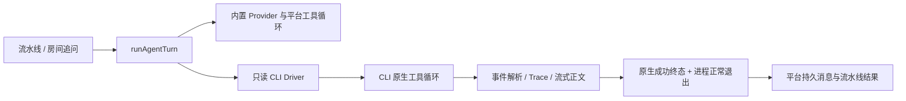

# 外部 Code Agent：阶段 A

状态：已实现只读 CLI 链路，已通过假 CLI 验收；真实模型 smoke 尚未执行。更新日期：2026-10-03。

## 使用

1. 在运行 server 的同一台机器上安装并登录 Claude Code / Codex。平台只调用 CLI，不复制认证文件，不把平台 `LLM_*` 配置转换为 CLI 认证。
2. 在角色管理页选择 Claude Code 或 Codex，填写原生模型名，或使用 `default`。外部角色固定为 readonly，平台工具配置为空；不支持协调能力。
3. 创建聊天室并选择该角色。界面会使用顺序流水线。分析已有仓库时，在工作区管理中注册本机目录并选中它；默认房间目录是空工作区。
4. 在运行页查看分析正文，以及外部执行的 driver、版本、cwd、会话、状态、用量和错误。点击“停止运行”会终止当前外部执行，并阻止后续流水线成员启动。

配置示例（`.agent.md` 文件仍支持现有 frontmatter）：

```yaml
id: claude-reader
name: Claude Reader
description: 只读分析仓库结构和实现
model: default
execution:
  kind: external
  driver: claude-cli # 或 codex-exec
capabilities: [execute]
permissionMode: readonly
tools: []
disallowedTools: []
color: '#7c5cff'
```

正文填写角色系统提示词。内置角色省略 `execution` 时保持原有 Provider + 平台工具循环。

服务端可用 `EXTERNAL_CLAUDE_COMMAND` / `EXTERNAL_CODEX_COMMAND` 指定单个可执行文件路径，`EXTERNAL_AGENT_TIMEOUT_MS` 设置推理进程超时。CLI 需要支持 Driver 的隔离选项；本次离线检测确认本机 Claude Code 2.1.220、Codex CLI 0.159.2 可用。检测可用不代表已认证或模型请求成功。

## 当前契约



- Claude 使用 `-p --output-format stream-json`，开启 partial 消息，按 message/block ID 合并增量与完整正文。结果正文作为最终快照；失败结果不会变成分析正文。
- Codex 使用 `exec --json`，按 item ID 替换文本快照，识别 session、工具、usage 和 turn 终态。事件不支持的版本会失败，不猜测纯文本输出。
- 普通 JSON 拆行和 UTF-8 分段均可处理；未闭合 JSON、非 JSON、超大输出、缺少会话/成功终态、空正文、非零退出均不能产生成功结果。
- 每次 AgentTurn 创建新原生会话，绑定 run、agent、scope、角色版本、driver 版本、宿主及 realpath cwd。平台不传 `--last`、`--continue`、`resume`，不依赖原生会话保存平台历史；聊天室追问由平台显式提供上下文。
- `(runId, agentId, scopeId)` 唯一记录防止重复启动；完成记录可在同一 Run 消费，中断/失败记录拒绝自动重放。角色更新沿用原有版本和 Run 快照机制。
- 原生工具事件仅记 Trace，不交给平台 `executeToolOnce` 再执行。只有流水线控制平台 Run 完成；当前不支持 Supervisor、智能规划/Coordination 和自由协作的外部角色。

## 权限与停止

Claude 固定 `--tools Read,Grep,Glob`、`dontAsk`，使用 safe-mode、空 setting sources、禁用 hooks/skills/Chrome、strict 空 MCP 配置。原生写工具、Bash 和 Agent 不在工具集合中；初始化和调用事件还会检查只读工具名单。这采用 [Claude CLI 官方选项](https://code.claude.com/docs/en/cli-reference)，不是仅靠任务提示词声明只读。

Codex 固定 `read-only` 沙箱、`approval_policy=never`，忽略用户配置和 execpolicy rules，并在本次调用中将 cwd 与祖先标记为 untrusted，以跳过项目配置。禁用 hooks、插件、apps、子 Agent、浏览器和环境安装能力。读取 `mcp list --json` 的配置名单，逐个生成禁用参数，再复查没有启用的服务器；此检查不启动 MCP 服务。空 `mcp_servers={}` 的合并语义不能保证清空，代码没有使用它作为禁用措施。参见 [配置与信任说明](https://developers.openai.com/codex/config-basic) 和 [MCP 配置参考](https://developers.openai.com/codex/config-reference)。Codex 的 `default` 使用此次忽略用户配置后的默认模型；自定义 provider 配置尚未开放。

所有 spawn 使用独立参数数组、stdin 任务文本和显式 cwd，不经 shell。停止先将 Run 置为 cancelled、撤销事件消费，再向拥有的 POSIX 进程组发送 SIGTERM；500 ms 后升级 SIGKILL，并等待关闭。进程正常退出时也清理组内残留。终态后不发布迟到分析消息；服务正常退出时同样清理活动执行。

只读限制针对原生工具的写入/副作用权限。Claude 的读工具配置不是 OS 文件读取沙箱，cwd 也不是宿主文件访问隔离边界；CLI 自身仍会保存认证相关状态、会话或日志。机器管理员的强制策略属于宿主信任边界。本阶段面向可信的单宿主本机 CLI，不作为多租户执行沙箱。Windows、跨宿主仍不支持；[阶段 D](./external-code-agent-phase-d.md)已加入本机 Guardian 恢复，并为双向后端加入可选 resume 和隔离编码，两个只读 CLI 仍每回合新会话。

## 数据与 API

`external_agent_executions` 保存执行状态和原生 session binding，新增表自动创建，不改变现有 Agent JSON 存储格式。中断重启时，未结束的记录标记 `interrupted`；当前不会根据保存的原生 ID 自动恢复。

| API | 用途 |
|---|---|
| `GET /api/execution/drivers` | 重新检测二进制、版本和必需选项 |
| `GET /api/runs/:runId/executions` | 执行状态、会话、用量、错误 |
| `POST /api/runs/:runId/stop` | 停止流水线并等待外部进程清理 |

WS 增加 `execution.updated`、`execution.native` 和替换语义的 `llm.snapshot`，后者与旧的追加语义 `llm.delta` 并存。刷新/重连时由 REST 回补执行记录。usage 缺失值保留 `null`，界面显示“未知”；Claude CLI 报告的成本不被解释为订阅账户的额外账单。

验证与限制见 [阶段 A 验收记录](../reports/external-code-agent-phase-a-acceptance.md)。后续范围见 [接入方案](../plans/external-code-agent-integration-plan.md)。
