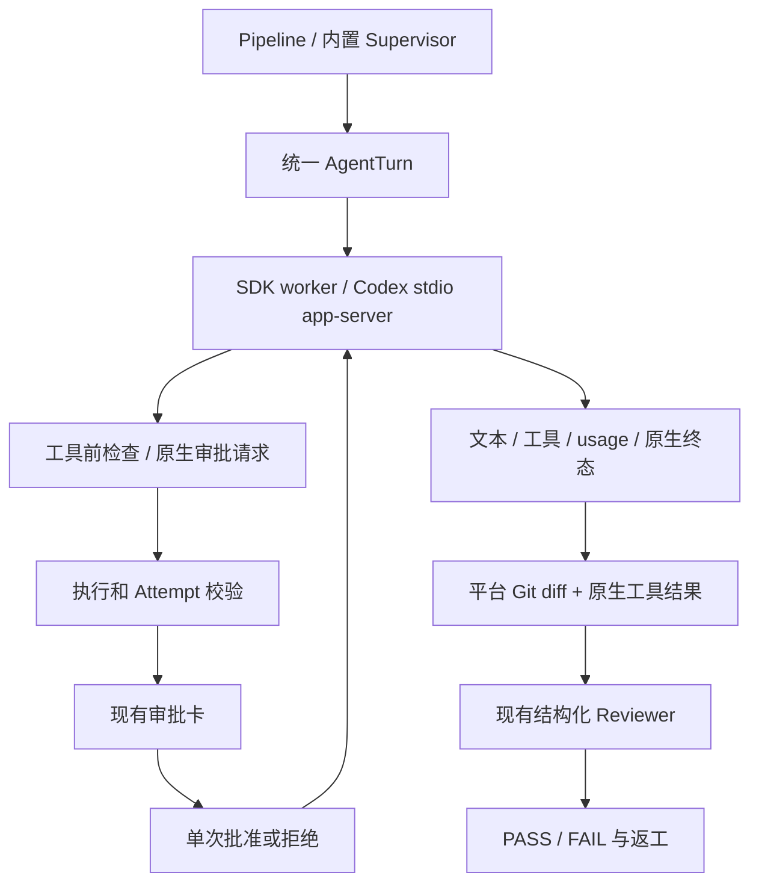

# 外部 Code Agent：阶段 B

状态：双向执行、原生审批和任务审查链路已实现并通过离线验收。真实供应商模型的编码 smoke 尚未执行。更新日期：2026-10-04。

当前还已交付[阶段 C Runtime 协作控制与 MCP](./external-code-agent-phase-c.md)，两个双向后端可加入自由协作，并可显式开放平台业务工具。本文说明阶段 B 引入的认证、原生权限和审查能力。

本阶段在[阶段 A](./external-code-agent-phase-a.md)的统一执行入口上增加 `claude-sdk`、`codex-app-server`。平台继续拥有任务、Attempt、审批和 Run 终态；原生工具由外部 Agent 执行，平台不会根据工具事件重复执行一次。

## 本地配置与使用

Claude 使用随服务端安装的 `@anthropic-ai/claude-agent-sdk@0.3.288`，不要求另行安装 Claude CLI。将 SDK 的 API key 配置到 `apps/server/.env`，然后重启服务：

```dotenv
ANTHROPIC_API_KEY=your-api-key
```

SDK 当前要求该服务端变量；内置 Provider 的 `LLM_ANTHROPIC_API_KEY`、主目录 Claude CLI 的登录状态不会自动成为 SDK 认证。角色文件、Run 快照和上下文不保存 key。

Codex app-server 当前仅准入 `codex-cli 0.159.2`。它使用独立、持久的 `CODEX_HOME`，默认在 SQLite 所在目录下的 `external/codex`。默认开发配置可以从仓库根目录执行一次登录：

```sh
CODEX_HOME="$PWD/apps/server/data/external/codex" codex login
```

如果自定义 `DB_PATH` 或希望指定其他目录，在 `apps/server/.env` 设置：

```dotenv
EXTERNAL_CODEX_HOME=/absolute/path/to/dedicated-codex-home
```

使用同一绝对路径作为 `CODEX_HOME` 完成 `codex login`。平台不会复制 `~/.codex/auth.json`；独立目录负责自己的凭据缓存和刷新。目录必须与日常 Codex 配置目录分开，不能含 `config.toml`、`*.config.toml`、`rules`、`skills`、`plugins` 或 `agents`。平台在每次调用中传入固定策略，并将项目及祖先标为 untrusted；目前不支持在该目录配置自定义模型 Provider、MCP 或免审规则。

这是本项目的执行目录设计。[Codex 认证](https://learn.chatgpt.com/docs/auth)与[环境变量](https://learn.chatgpt.com/docs/config-file/environment-variables)说明原生凭据和状态由 `CODEX_HOME` 管理；保持同一持久目录，避免把刷新中的凭据当作每次执行的临时副本。

界面验收步骤：

1. 在工作区管理中注册一个已有 Git 仓库的根目录，并在新聊天室中选择该工作区。建议用可检查的测试仓库，并保留一次初始提交。
2. 在角色管理中选择“Claude SDK 双向执行”或“Codex app-server 双向执行”，模型使用 `default` 或对应原生模型名，Coder 权限选择“需确认”。仅使用原生工具时，平台 `tools` / `disallowedTools` 为空；可选平台业务工具见阶段 C。
3. 单角色编码可用顺序流水线。需要结构化审查与返工时选择主管模式：主管使用内置 LLM 的 coordinate 角色，Coder 使用 execute 角色，Reviewer 使用 review 角色，并设置默认审查者。主管模型需要已有 Provider 配置，离线演示可用 mock。
4. 发出明确的修改目标和验收标准。在审批卡检查原生操作后批准或拒绝；每张卡仅对应一次操作，不支持修改原生参数或授予整个会话免审。
5. 在运行页展开外部执行记录，检查执行前后实际 diff、工具输出和已知退出码。在任务审查中检查 PASS/FAIL 与返工记录。

流水线只负责顺序执行各角色；结构化 `TaskReview`、FAIL 后返工和 PASS 判定由现有 Supervisor scheduler 执行。外部 Agent 暂不能担当主管或进入 Coordination；两个双向后端可进入阶段 C 的自由协作模式。

Coder frontmatter 示例：

```yaml
id: sdk-coder
name: SDK Coder
description: 实现任务并运行测试
model: default
execution:
  kind: external
  driver: claude-sdk # 或 codex-app-server
capabilities: [execute]
permissionMode: confirm
tools: []
disallowedTools: []
color: '#7c5cff'
```

Reviewer 改为 `capabilities: [review]`、`permissionMode: readonly`。平台在结构化审查回合中强制 readonly，即使角色的常规权限配置更宽也不允许审查回合写入。

## 权限契约

| Driver | readonly | confirm | auto |
|---|---|---|---|
| `claude-cli` / `codex-exec` | 阶段 A 的只读流水线 | 拒绝 | 拒绝 |
| `claude-sdk` | 只提供 Read/Grep/Glob，检查路径 | 读工具直接允许；Write/Edit/Bash 默认审批 | 仅允许 `execution.nativeTools` 白名单内的工具 |
| `codex-app-server` | read-only sandbox + never 原生审批 | read-only sandbox + untrusted，桥接原生审批 | 拒绝 |

SDK 的固定工具集合是 Read/Grep/Glob/Write/Edit/Bash。`nativeTools` 只适用于 SDK：confirm 中白名单工具免审，auto 中名单外工具拒绝。它按工具名授权，`Bash` 代表整个 Bash 工具能力，并非逐条命令白名单。readonly 不能设置该名单。

SDK 不使用 broad allowedTools 或 bypass 模式。每次原生调用都经 `PreToolUse` hook 到服务端策略；Write/Edit 以及有路径的读工具检查 realpath 与仓库边界，写入拒绝 `.git`、`.claude`、`.codex`、`.agents` 元数据目录。待审批后再次检查路径。未准入工具、后台 Bash 和 unsandboxed Bash 参数拒绝。SDK 原生 Bash sandbox 开启且不可用时失败，限制写目录、禁用网络放行和沙箱逃逸选项。SDK settings、插件和 skills 同步关闭；MCP 只允许阶段 C 注入的执行绑定 Bridge，其精确工具名经过门控。[官方权限顺序](https://code.claude.com/docs/en/agent-sdk/permissions)和[hooks](https://code.claude.com/docs/en/agent-sdk/hooks)是这里采用全调用工具前检查的依据。

Codex 原生安全命令可能直接在只读沙箱中运行；confirm 不代表每条命令都会出现平台审批卡。平台只接受本线程、本回合已观察到的 fileChange 或 commandExecution 原生审批请求，检查文件路径、命令与 cwd，并回传单次 accept/decline。拒绝网络授权、目录级 grantRoot、权限扩展、原生用户输入及其他尚未实现的请求；阶段 C 的固定 MCP Bridge 另走执行绑定鉴权和平台工具权限检查，未准入 MCP 仍拒绝。实际 thread/start 返回的 cwd、sandbox、approvalPolicy 和 reviewer 必须与平台策略一致，否则不启动模型 turn。[官方 app-server 协议](https://learn.chatgpt.com/docs/app-server)提供这一请求/通知/响应通道。

Codex 经批准的升级命令可能在沙箱外运行，审批卡会明确提示这一点。cwd 和路径检查不构成 OS 隔离，批准 shell 也不保证命令的所有副作用都限于仓库。本阶段面向可信的单宿主本机执行；多租户和强隔离部署仍需后续容器或 OS 权限边界。

## 执行、审批与停止



`external_agent_executions` 保存 driver、版本、scope、Attempt、实际权限、原生会话、状态、用量和证据。新增 `external_agent_approvals` 把现有 approval ID 绑定 execution、native request 和 Attempt，数据库自动创建表。

审批权威身份来自服务端调用闭包，不采信模型传来的 Run/Agent ID。相同 request ID 和操作共享决定；参数变化不能复用原批准。决定时及回传时检查 execution、Run、Attempt 和 Task 仍有效。Run 停止、超时、执行结束和服务重启会使对应 pending 审批失效；终态后的旧卡不能批准。

会话缺省仍每 AgentTurn 新建；[阶段 D](./external-code-agent-phase-d.md)新增显式 run/conversation 策略，可在绑定与预检通过后恢复完成会话。相同 scope 完成结果可复用，失败和中断不自动重放；Supervisor 的原生执行失败直接失败该任务，防止未知副作用被普通重试再次执行。已完成工作经过 Reviewer FAIL 则可以按现有契约生成明确返工 Attempt。

停止先终止平台 Run 并撤销审批，再请求 SDK abort / Codex turn/interrupt，给予有限宽限期，随后按 POSIX 进程组 TERM/KILL 清理并等待关闭。流水线与主管模式都提供停止按钮；调度器阻止停止后的迟到提交、审查及返工。执行总超时包含审批等待，审批本身仍使用现有 `APPROVAL_TIMEOUT_MS`。

macOS/Linux 进程组覆盖同组子进程；阶段 D 的 Guardian 与持久所有权登记支持服务 SIGKILL 后清理。主动脱离进程组的 daemon、Windows 仍不在保证范围内。

## 实际证据与并发边界

写回合要求已注册的 Git 根目录。平台在执行前后独立调用 Git，禁用 external diff/textconv，保存 HEAD、`beforeDiff`、`afterDiff` 和截断标记；不会从模型摘要推导 diff。当前快照最多 128 KiB、20 个未跟踪文件，不包含 ignored 文件的完整变化，缺少 HEAD 或采集异常标为不完整。

这两个 diff 都是工作区相对 HEAD 的快照。执行前已有修改单独展示，执行后快照不能全部归因于当前 Agent。测试证据来自原生工具返回的输出，Codex 提供退出码时保留数值，SDK 缺少结构化退出码时显示未知；“模型说测试通过”不替代工具证据。失败或取消仍保留能采集到的实际文件变化，不自动回滚。

Reviewer 上下文加入 Coder 对应执行的前后 diff 和工具输出，并沿用当前严格 JSON PASS/FAIL 契约。外部队伍的 Supervisor 任务串行执行，相同 realpath cwd 允许并发只读执行、写执行独占。阶段 D 已升级为持久占用，默认使用隔离 worktree，并将 Coder Reviewer 绑定到固定内容快照；managed 工作区的内置 AgentTurn 也纳入同一占用。外部编辑器和不同数据库的进程不受此占用约束。

CLI/SDK 的“可用”检测只说明本地载体和版本可用，不证明登录、key、sandbox 或模型调用成功。未知 usage/cost 保留未知，订阅账户原生 token 数不被解释成已确认账单。

## 后续范围

[阶段 C](./external-code-agent-phase-c.md)已接入 Runtime MCP、complete/handoff/consult/hold 和持久等待；[阶段 D](./external-code-agent-phase-d.md)已交付工作区隔离、崩溃恢复与会话策略。旧执行在启动恢复时标为 interrupted 并拒绝自动重放，不把数据库记录视作外部副作用 exactly-once 的证明。跨宿主、ACP 与多租户容器仍为后续范围。

测试证据与真实供应商验证边界见[阶段 B 验收记录](../reports/external-code-agent-phase-b-acceptance.md)。
