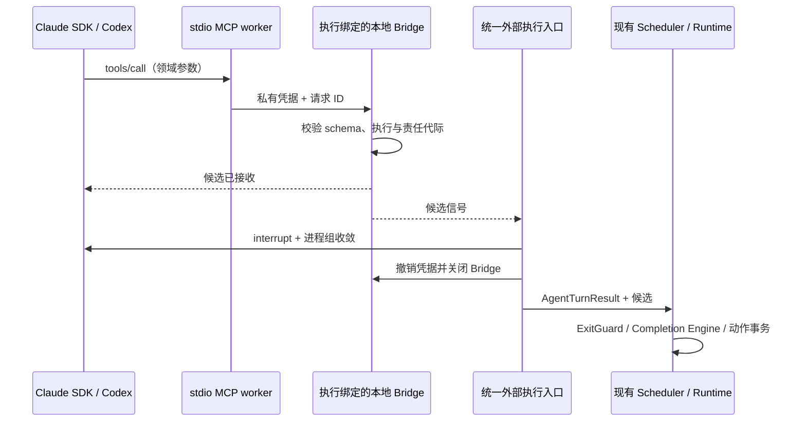

# 外部 Code Agent：阶段 C

状态：Runtime 协作控制已实现并通过专项与协议验收。真实供应商模型的完整协作 smoke 尚未执行。更新日期：2026-10-04。

`claude-sdk` 和 `codex-app-server` 现在可以加入自由协作（Collaboration），与内置 Agent 混合完成交接、咨询、等待和结果提交。认证、原生审批、Git 证据和 Supervisor 审查沿用[阶段 B](./external-code-agent-phase-b.md)。`claude-cli` / `codex-exec` 仍限只读流水线；外部角色不能担当主管或智能规划器，Coordination 暂未开放。

## 本地使用

1. 按阶段 B 配置服务端 `ANTHROPIC_API_KEY`，或在专用 `EXTERNAL_CODEX_HOME` 完成 Codex 登录。当前验证版本为 Claude SDK 0.3.288、Codex CLI 0.159.2。
2. 在角色管理中选择双向后端，填写 `default` 或原生模型名。只读角色可参与全部 Runtime 控制；编码角色选择“需确认”和已注册 Git 根目录。
3. 新建自由协作聊天室，选择外部和内置成员，明确任务和验收要求。Runtime 控制工具自动提供，不需要手工勾选。
4. 可在目标中说明“需要时交接给另一位成员”“咨询其他成员并汇总”“遇到未确定需求时询问我”。具体动作仍由模型选择，再由平台校验。
5. 在聊天室查看交接、咨询结果和用户决策卡；在运行页查看控制候选、纠偏次数、原生执行、diff 和工具证据。停止成员或 Run 的接口返回前会等待其原生执行收敛。

只读完整协作可先验证控制链路；编码任务沿用原生操作审批。需要 PASS/FAIL 与返工的正式任务可用内置 Supervisor，也可由协作成员提出 Supervisor 任务，等待现有用户确认流程。

## 控制工具与冻结契约

桥接使用已有 `collaborationControlTools()` 的当前冻结 schema，没有另建一套控制参数。模型看到的 MCP 名称与平台语义一一对应：

| MCP 工具 | 现有 Runtime 工具 | 作用 |
|---|---|---|
| `agent_complete` | `agent.complete` | 提交当前责任的完成候选 |
| `agent_handoff` | `agent.handoff` | 向当前聊天室成员交接责任 |
| `agent_consult` | `agent.consult` | 创建咨询子工作，按 `all` / `any` 汇合 |
| `agent_hold` | `agent.hold` | 用户、定时或依赖等待，条件以冻结 Contract 为准 |
| `agent_propose_supervisor_task` | `agent.propose_supervisor_task` | 经用户决策提议正式任务 |

工具输入只有目标成员、目标、摘要、理由、等待条件等领域参数。Run、execution、Attempt、Subject、claim token、command key 和 custody generation 都由服务端恢复；模型不能指定或替换这些身份。成员 ID 是允许的领域目标，内部责任和派发 ID 不由模型选择。



MCP 回调只调用现有领域解析器，保存内存中的动作候选。它不直接创建 Dispatch、提交 Hold、转移 custody 或把 Run 标为 completed。原生进程收敛后，结果回到现有 Scheduler，再进入 ExitGuard、完成义务检查和幂等动作事务。

普通原生终态和 stdout 仍不能自行完成协作责任。有合法 MCP 候选时可以主动中断原生 turn，而不要求被中断 turn 返回自然成功终态；此时成功依据是经过绑定校验的候选及后续平台裁决。执行记录 `completed` 表示原生执行结果已交付，业务 Run 是否完成由 Runtime 判定。

## Bridge 权限与生命周期

每个原生执行片段启动独立 stdio MCP worker 和 `127.0.0.1` 临时 callback listener，签发随机 256 位凭据。凭据只通过受控子进程环境传递，不进入 prompt、执行记录或 trace。worker 没有数据库访问，也不能选择执行上下文。

每次 tools/list、tools/call 与审批决定均检查 execution 和 Run 仍有效。Collaboration 还要求冻结 contract revision、active Subject、owned custody、当前 holder、无 pending holder、相同 generation，以及属于该角色的 running Attempt 和有效 lease。原生执行期间也轮询此授权；Attempt/Run 终态事件触发取消，失效回调立即拒绝。

回调拒绝 Origin，比较凭据使用恒定时间比较，验证 JSON schema，并限制请求大小和次数。MCP transport 从连接 UUID 与协议请求 ID 生成回调请求 ID。相同 ID 和相同参数复用同一结果 Promise；相同 ID 替换操作、后续矛盾动作和候选后的新工具调用均拒绝。

一个片段只能接收一个最终控制候选。业务工具仍在执行时不能提交控制动作；执行关闭时撤销凭据、使等待审批失效，并等待桥拥有的业务操作返回。交接和 Hold 的提交发生在原生进程组清理之后。[阶段 D](./external-code-agent-phase-d.md)已补齐服务 SIGKILL 后的同组进程恢复；主动脱离进程组的 daemon 仍不在本地保证内。

## 可选平台业务工具

角色可通过 `execution.platformTools` 显式开放平台业务工具；默认不开放。工具通过 `platform_` 加原始名称的 UTF-8 十六进制编码映射到 MCP，描述中保留原名，避免不同名称折叠到同一别名。

```yaml
model: default
execution:
  kind: external
  driver: claude-sdk # 或 codex-app-server
  platformTools: [fs.read, fs.write]
capabilities: [execute]
permissionMode: confirm
tools: [fs.read]
disallowedTools: []
```

`platformTools` 决定暴露范围；原有 `tools` 是权限白名单，`disallowedTools` 明确禁用。两者只能引用已经暴露的工具。上例 `fs.write` 在 confirm 下需要审批，即使它已出现在 MCP 列表。readonly 拒绝平台写工具；auto 只自动执行平台白名单。SDK 的 `execution.nativeTools` 单独管理原生工具免审，不能替代平台名单；Codex 不支持该原生白名单或 auto。

业务回调依次进入 `checkPermission()`、执行/Attempt 绑定审批和 `executeToolOnce()`，使用 execution + request ID 的幂等键，传入当前 workspace context。业务工具沿用平台工具自己的路径和副作用契约，包括 `shared/`、`archive/` 虚拟路径；不能把原生工具的元数据目录保护或原生 sandbox 推断成所有平台工具的隔离保证。原生工具事件仅用于观测，不再次执行。

## 同一 Attempt 内有限纠偏

ExitGuard 要求纠偏时，外部执行保留同一 execution、scope 和 Attempt，按冻结 Contract 的上限启动新的原生片段。每个片段使用新 native session 和新 Bridge，携带先前结果和平台反馈；它不是原生 resume，也不会重跑普通编码工具。

- Claude SDK：纠偏 `tools: []`，MCP 只暴露控制工具；精确 MCP allow list 与 `PreToolUse` 门控保留，普通工具拒绝。另传输出上限和 `maxTurns: 2`。
- Codex：纠偏关闭 shell、view image、image generation、sleep 等能力，使用 read-only + never 策略；收到 commandExecution / fileChange 事件直接失败。当前版本没有经过验证的“仅暴露这些原生工具”通用开关，因此不声明其原生目录完全为空；残留写能力不能得到沙箱升级批准。

默认最多纠偏一次，耗尽后继续由现有 Runtime 处理失败或用户介入，不能靠普通 stdout 跳过完成义务。执行总超时覆盖所有片段、工作区等待和审批等待。

平台保守地把冻结 `correctionMaxTokens` 数值用于可见文本与 MCP 参数的字节限制，SDK 还发送上游输出配置。这是本地接受/停止边界，**不是供应商精确 token 计费上限**；Codex 当前没有已验证的上游输出 token 硬限制。中断可能先于最终 usage，未知 token/cost 保留 `null`。多片段只有所有片段用量均已知时才累计展示。

## 并发、恢复与观测

相同 realpath cwd 允许多个 readonly 回合并发，写回合独占。Collaboration 在占用冲突时等待并接受取消/总超时；Pipeline 与 Supervisor 沿用冲突拒绝。阶段 D 已替换为 SQLite 持久占用，managed 工作区的内置 AgentTurn 也纳入，且默认使用隔离 worktree 和固定 Reviewer 快照。外部编辑器与不同数据库的服务不受此占用约束。

执行记录增加 `runtimeBinding`、`controlAction`、`exitCorrectionAttempts`，运行页同步展示。原生 item ID 加片段前缀，避免新会话重用 ID 时覆盖既有 span。实际 Git 前后快照和原生工具证据沿用阶段 B。

过期 Attempt 如果存在任何对应原生 execution，恢复流程会按可能发生外部副作用处理，拒绝自动重新派发。服务重启把未收敛执行标为 interrupted；同 Run 不自动重放。持久 Hold/Wake 使用已有 Runtime 账本，用户重复回答、定时唤醒和 loser 取消沿用现有幂等机制。

跨进程持久租约、worktree、SIGKILL 后同组子进程所有权恢复和可选热会话已由[阶段 D](./external-code-agent-phase-d.md)实现；多租户容器仍为后续范围。本阶段控制协议的历史验收证据见[阶段 C 验收记录](../reports/external-code-agent-phase-c-acceptance.md)。

实现入口：[统一 runner](../../apps/server/src/execution/runner.ts)、[执行授权](../../apps/server/src/execution/authority.ts)、[callback bridge](../../apps/server/src/execution/bridge.ts)、[stdio MCP worker](../../apps/server/src/execution/bridgeWorker.ts)、[原生适配](../../apps/server/src/execution/nativeDrivers.ts)。协议配置参考 [Codex MCP](https://learn.chatgpt.com/docs/extend/mcp)、[Codex app-server](https://learn.chatgpt.com/docs/app-server)、[Claude SDK MCP](https://code.claude.com/docs/en/agent-sdk/mcp)。
