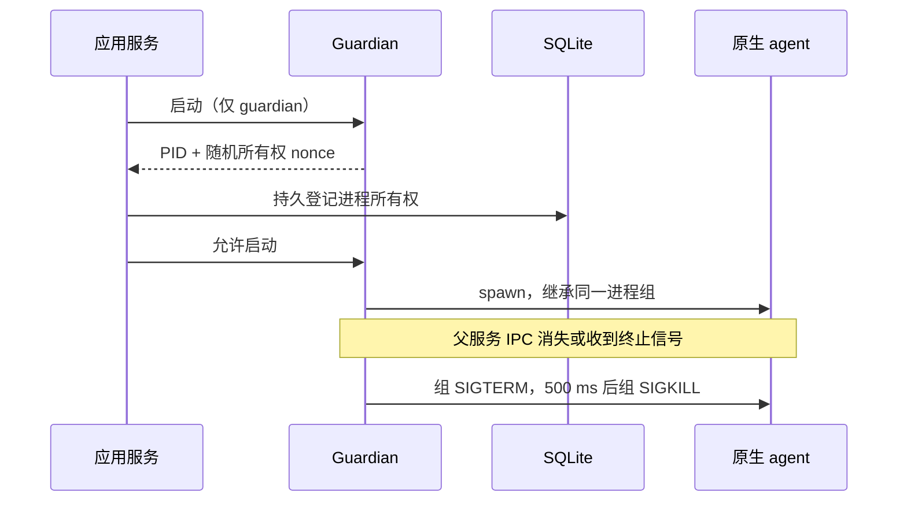

# 外部 Code Agent：阶段 D

状态：单宿主持久恢复、编码 worktree、固定审查快照和可选原生会话已实现。更新日期：2026-10-04。真实供应商模型编码验收仍需配置账户后进行；自动验证不消费真实推理额度。

本阶段延续[阶段 B](./external-code-agent-phase-b.md)的审批与[阶段 C](./external-code-agent-phase-c.md)的 Runtime/MCP 契约。`claude-sdk` 与 `codex-app-server` 支持以下能力；只读 CLI 后端保持每回合新会话。外部主管、Coordination、远程 worker 和 ACP 尚未开放。

## 本地验收

1. 配置 `ANTHROPIC_API_KEY`，或在独立 `EXTERNAL_CODEX_HOME` 登录 Codex。Claude SDK 使用独立 `EXTERNAL_CLAUDE_HOME` 保存会话；不会复制个人登录信息。当前验证版本为 SDK 0.3.288、Codex CLI 0.159.2。
2. 在角色管理选择双向后端、原生模型名和权限模式。新选择双向后端时，会话策略默认“同一 Run 内复用”；需要跨轮续接时，显式选择“同一聊天室内复用”。
3. 选择已注册、有 HEAD 的 Git 仓库根目录。默认 `EXTERNAL_WORKSPACE_MODE=isolated`；系统自动准备完整的源码工作区，包含执行开始时已有的未提交变更。
4. 使用流水线、内置主管的 worker/reviewer 或自由协作运行任务。混合队伍的内置文件工具和外部原生工具解析到同一 managed cwd。
5. 运行页查看隔离目录、会话恢复原因、diff、工具证据和固定快照。完成步骤后出现“下载变更补丁”；补丁来自已记录快照，不读取后来手工修改的文件。
6. 在原仓库检查后应用下载的补丁：

```sh
git apply --check /path/to/agent-gand.patch
git apply /path/to/agent-gand.patch
```

没有自动写回、合并或提交用户分支的步骤。下载补丁后如果原仓库已继续变化，`--check` 可能失败，应先核对差异。中断执行保留实际文件与 diff，但没有成功步骤快照时不能下载补丁；可在显示的隔离目录检查文件。

## 工作区与审查

默认每个 Run 使用独立 detached Git worktree。显式启用 conversation 策略的队伍共享该聊天室的 managed worktree，前轮必须 completed 且没有失败或不确定的外部执行。不同聊天室、不同普通 Run 使用不同目录。

准备顺序为：记录 preparing 意图 → 从注册根 HEAD 创建 worktree → 应用二进制 diff 并复制未忽略的未跟踪文件 → 再次验证源指纹 → 创建私有 baseline commit → 标记 ready。私有 baseline 包含用户已有的脏文件，下载补丁只包含随后 agent 的变更。Git HEAD/index 重置仅发生在新 worktree，不移动原分支或改动原目录的文件与 index。worktree 的管理记录和 Git 对象存储与源仓库共享。

Git 子命令使用参数数组、禁用 hooks/fsmonitor、禁用自定义 clean/smudge/process filters，不运行仓库自定义转换。复制期间源目录变化时拒绝该准备结果；preparing/attention 状态不会自动再次覆盖目录。

编码步骤收敛后创建私有 commit，并检出到独立快照 worktree。外部 Coder 的 Reviewer 由服务端绑定对应 execution 快照路径、强制 readonly；内置 Reviewer 使用相同路径 resolver。它不会随着后续 Coder 工作区变化而切换待审内容。系统不设置文件系统 immutable 标记：它是平台固定的 Git 内容快照，仍要求用户与外部进程不手工编辑快照目录。

平台 `fs.write` 在 managed worktree 禁止写 `.git` 元数据，原生文件策略也禁止配置目录写入，包括大小写别名；快照 resolver 始终只读，realpath 检查防止符号链接越界。原生工具权限继续由 SDK hook、SDK sandbox 或 Codex 原生审批执行；cwd/worktree 本身不是 OS 多租户沙箱。批准的 Codex 沙箱外 shell 命令仍须按阶段 B 的实际风险审核。

隔离复制暂不支持 submodule、嵌套未跟踪 Git 仓库、无 HEAD 的目录；限制未跟踪文件最多 2000 个、单个 8 MiB、合计 64 MiB，Git diff/patch 8 MiB。忽略文件（例如 node_modules、.env、构建缓存）不复制，需要在 managed 工作区按权限策略安装依赖或单独配置环境。准备和等待接受 Stop/超时；已发出的 Git 子命令最长等待 15 秒再检查取消。

`EXTERNAL_WORKSPACE_MODE=registered` 是兼容模式，直接使用注册目录；仍有进程和持久占用检查，但不会获得隔离 baseline、固定快照或补丁导出。

## 原生进程与持久围栏

每个 SQLite 数据库允许一个活动服务进程。宿主、PID、启动身份与随机 owner 保存在数据库；另一服务发现旧进程仍活着就拒绝启动。不能单靠 TTL 或心跳过期抢占。外部编辑器和使用不同数据库的应用不受此围栏约束。

每个原生进程先由一个独立 POSIX 进程组内的 guardian 接管：



服务在首个原生 spawn 前已经记录执行意图和 guardian 身份。服务 SIGKILL 导致 IPC 断开，guardian 负责同组清理。所有正常退出、Stop、异常和超时路径也清理进程组。nonce 只是进程所有权标记，不是 API key 或 MCP 凭据。

工作区、准备、快照、Git 仓库元数据与 session 占用存入 SQLite，写占用独享、读占用可并发。同一源仓库的 worktree add 串行，避免 Git 读取未完成的 commondir 登记；各 worktree 中的模型任务仍可并行。旧 owner 活着时即使过期仍不可抢占；旧 owner 死亡但存在活动原生进程或 attention 恢复状态时仍保留围栏。managed 工作区的内置 AgentTurn 也进入相同工作区占用。未主动脱离进程组的子进程由 guardian 收敛；主动 setsid 的 daemon、Windows Job Object 和远程宿主不在本阶段保证内。

## 崩溃恢复

启动时先获取服务 owner，再恢复原生执行，之后才调用现有 Attempt/Run 恢复。恢复只检查和清理，不发模型请求：

- 通过 PID 命令行的 guardian 路径和 nonce 确认所有权；PID 重用或外来宿主不会获得终止授权。
- 只有确认整个进程组没有活动成员后才标记 quiesced 并释放占用。无法检查、旧进程无登记、残留组无法验证时标记 attention，保留该 cwd 的围栏；需要操作者核对和处理，系统不会自行清除。
- 未完成执行变为 interrupted，读取真实工作区的执行后 diff；首个写入前保存的 evidence 用作比较基线，缺失时明确标记证据不完整。
- 已保存 completed 结果可复用，平台终态事务尚未发生时不重复启动原生 agent；失败/取消/中断执行不会通过普通任务重试再次编码。
- 旧 pending 原生审批过期；inflight session 失效，ready session 保留但下次仍需预检。现有 Runtime 控制候选没有绕过 Completion Engine 的恢复路径。

attention 不是“安全收敛”。界面显示具体诊断；旧版本无 guardian 登记的运行不会被标记为已清理。当前没有自动解除 attention 围栏或自动合并中断变更的接口。

数据库事务不包住文件系统副作用：写入发生但未收到原生终态时，平台保留现场并禁止自动重放，不宣称原生 shell/file-change exactly-once。

## 会话和增量上下文

```yaml
model: default
execution:
  kind: external
  driver: claude-sdk # 或 codex-app-server
  sessionPolicy: run # turn / run / conversation
permissionMode: confirm
```

| 策略 | 当前语义 |
|---|---|
| turn | 每 AgentTurn 新 native session；旧角色缺省保持此行为 |
| run | 同 Run、同角色、相同绑定的完成回合可续接 |
| conversation | 同聊天室复用 managed cwd，并续接相同绑定的完成回合 |

绑定包含 scope、角色/版本、driver/版本、cwd/来源、权限、模型配置、execution 配置、角色 system prompt、控制工具 schema、输出种类、账户摘要和宿主。只保存账户摘要，不落 API key；SDK 摘要包含 API key/base URL/私有目录，Codex 来自私有 auth.json 的 account_id 或 API key。未知账户身份时 session 不进入 ready 池。模型名按配置绑定；供应商对模型别名的更新不属于可验证的身份保证。

session 投递意图先存为 inflight。非 system 平台上下文按保留换行的文本块编码：每个文档保存有序块引用，冷启动发送所有原文块；恢复仅发送新增或变化的原文块，旧块以 hash 引用，移除的引用不再属于当前文档。role/顺序/重复引用仍保留。系统指令独立更新，平台不再向原生历史重复灌入整段消息原文；这种文档引用仍依赖模型遵循当前上下文说明，不是供应商级“删除模型记忆”能力。

只有自然 completed、无控制候选、无纠偏的原生 turn 才提交投递游标并进入 ready 池。handoff/hold/complete 候选中断、失败与纠偏会使绑定失效；纠偏仍使用新会话、新 Bridge 和受限控制工具，不热恢复普通编码工具。

SDK 使用私有 `CLAUDE_CONFIG_DIR/projects/<平台 projectDir>/<sessionId>.jsonl`，新会话指定 UUID 与 persistSession。恢复前确认常规文件/真实路径，再由真实 worker `getSessionInfo()` 校验 sessionId/cwd。Codex 恢复前 `thread/read(includeTurns=true)` 校验 id/cwd/末回合 completed，然后 `thread/resume` 再验证策略回执。两个后端每次恢复均启动新进程、发新执行凭据，不复用旧 Bridge。

会话不存在、文件缺失或恢复 RPC 在 model turn 前失败时，可以在同一逻辑 execution 冷启动。模型 turn 开始后的超时/错误不冷重试，避免重复外部副作用。SDK 恢复 usage/cost 暂标未知；Codex 对累计 total 减去上次已保存的累计基线，缺失或倒退时未知。它们都不是供应商精确预算硬上限。

## 实现与验证

入口：[工作区](../../apps/server/src/workspaces/isolated.ts)、[Guardian](../../apps/server/src/execution/guardian.mjs)、[进程登记](../../apps/server/src/execution/host.ts)、[持久占用](../../apps/server/src/execution/leases.ts)、[恢复](../../apps/server/src/execution/recovery.ts)、[会话](../../apps/server/src/execution/sessions.ts)、[阶段 D 专项](../../scripts/verify-external-agents-d.mjs)。

验收证据见[阶段 D 验收](../reports/external-code-agent-phase-d-acceptance.md)。会话协议依据：[Claude SDK sessions](https://code.claude.com/docs/en/agent-sdk/sessions)、[Codex app-server](https://learn.chatgpt.com/docs/app-server)，字段以本机验证版本的 SDK 类型和生成协议 schema 为准。
