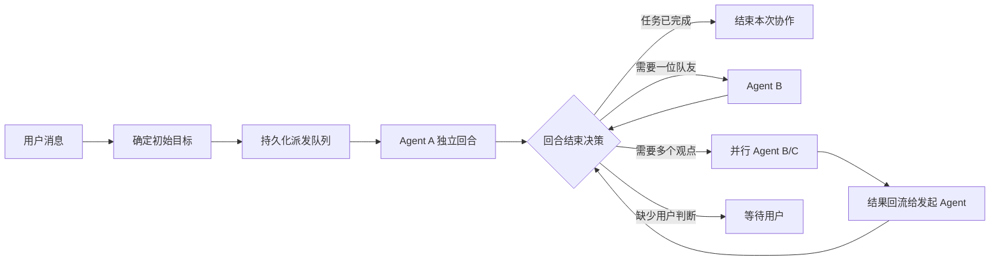

# Clowder AI Agent 交互模式调研报告

更新时间：2026-09-16

调研对象：[zts212653/clowder-ai](https://github.com/zts212653/clowder-ai)

代码基线：[`22385b60e01aee9d8691b6a867836ff0e94fa77f`](https://github.com/zts212653/clowder-ai/commit/22385b60e01aee9d8691b6a867836ff0e94fa77f)

## 1. 调研结论

Clowder AI 的多 Agent 交互并不是让所有 Agent 无约束地群聊，而是让 Agent 自主选择下一位参与者，同时由平台控制消息投递、并发、球权和终止条件。

它的核心可以概括为：

> 共享线程承载共同上下文，显式路由决定谁被唤醒，Agent 可以动态交接，运行时负责持久化、并发隔离、去重和熔断。

这套模式比 agent-gand 当前“主管一次拆解全部任务”的方式更自由，也比简单地让全部 Agent 自动回复更可控。对 agent-gand 最有价值的不是 Clowder 的角色包装，而是以下四个运行时能力：

1. 动态交接；
2. 每 Agent 独立执行槽；
3. 持久化派发队列；
4. 深度、重复和乒乓熔断。

## 2. Clowder 的交互模型



### 2.1 共享 Thread 与显式路由

Clowder 把共享 Thread 作为协作空间。用户和 Agent 看到同一条时间线，但真正唤醒谁由显式路由决定。

Agent 可以通过行首 `@handle` 或结构化协作工具把工作交给另一位 Agent。普通文本中提到名字不会触发执行。这个规则使路由行为可预测，也避免模型只是在叙述中提到某位 Agent 就意外启动任务。

关键行为包括：

- 行首 `@handle` 才是路由指令；
- 代码块、行内代码、URL 等内容中的 `@` 不参与路由；
- 自我提及会被过滤；
- 最长 handle 优先匹配，避免名称前缀冲突；
- 明确目标不可用时返回结构化错误，不静默换人；
- 无明确目标时才使用最近回复者、线程偏好 Agent 或系统默认 Agent 回退。

参考：

- [A2A 协议](https://github.com/zts212653/clowder-ai/blob/22385b60e01aee9d8691b6a867836ff0e94fa77f/docs/architecture/a2a-protocol.zh-CN.md)
- [@mention 路由系统](https://github.com/zts212653/clowder-ai/blob/22385b60e01aee9d8691b6a867836ff0e94fa77f/docs/architecture/at-mention-routing-system.md)
- [A2A Mention 解析实现](https://github.com/zts212653/clowder-ai/blob/22385b60e01aee9d8691b6a867836ff0e94fa77f/packages/api/src/domains/cats/services/agents/routing/a2a-mentions.ts)

### 2.2 Agent 的出口检查与球权

Agent 每次响应结束前需要判断：

1. 当前问题是否已经完成；
2. 是否需要另一位 Agent 采取行动；
3. 是否正在等待外部条件；
4. 是否缺少用户才能做出的价值判断。

如果需要队友行动，就明确交接；如果能自行解决，就继续处理；只有确实需要用户判断时才升级给用户。

Clowder 用“球权”描述责任归属：谁接到消息，谁就负责推进、明确转交或结束。Agent 不能只说“我会处理”然后退出，也不能把用户当作隐性路由器。

参考：

- [交接决策树](https://github.com/zts212653/clowder-ai/blob/22385b60e01aee9d8691b6a867836ff0e94fa77f/assets/prompt-templates/handoff-decision-tree.md)
- [A2A 球权检查](https://github.com/zts212653/clowder-ai/blob/22385b60e01aee9d8691b6a867836ff0e94fa77f/assets/prompt-templates/a2a-ball-check.md)
- [A2A 出口检查](https://github.com/zts212653/clowder-ai/blob/22385b60e01aee9d8691b6a867836ff0e94fa77f/docs/features/F064-a2a-exit-check.md)

### 2.3 串行接力与并行征询

Clowder 支持两类协作方式。

#### 串行接力

Agent A 完成当前阶段后点名 Agent B，B 可以继续点名 C。目标列表不是启动时固定，而是在运行过程中动态增长。

每一跳独立结束，只负责关闭自己的 `输入 → 目标 Agent` 关系。后续 Agent 再次交接时，不会重新打开已经结束的前序调用。

#### 并行征询

一个 Agent 可以同时向多个 Agent 征询意见。当前共享类型规定最多三个目标，并使用以下状态机：

```text
pending → running → partial → done
                  ├────────→ timeout
                  └────────→ failed
```

并行结果最终回流给发起者，由发起者综合判断是否继续、结束或升级。

参考：

- [Multi-Mention 类型](https://github.com/zts212653/clowder-ai/blob/22385b60e01aee9d8691b6a867836ff0e94fa77f/packages/shared/src/types/multi-mention.ts)
- [Multi-Mention 状态机](https://github.com/zts212653/clowder-ai/blob/22385b60e01aee9d8691b6a867836ff0e94fa77f/packages/api/src/domains/cats/services/agents/routing/multi-mention-state-machine.ts)
- [多 Agent 编排设计](https://github.com/zts212653/clowder-ai/blob/22385b60e01aee9d8691b6a867836ff0e94fa77f/docs/features/F086-cat-orchestration-multi-mention.md)

### 2.4 每 Thread、每 Agent 的独立执行槽

Clowder 允许同一 Thread 中的不同 Agent 并行运行，但同一个 Agent 在同一 Thread 内仍保持单执行槽。

这意味着：

- Coder 修复代码时，Reviewer 可以同时分析设计问题；
- 给 Reviewer 发送旁路消息不会中断 Coder；
- 同一个 Reviewer 不会并发处理两份互相冲突的 Thread 上下文；
- 用户可以单独停止某个 Agent，而不是停止整个 Thread。

这种锁粒度比“每 Thread 一把锁”更适合聊天室式协作，同时仍保留角色内部的顺序一致性。

参考：

- [InvocationTracker](https://github.com/zts212653/clowder-ai/blob/22385b60e01aee9d8691b6a867836ff0e94fa77f/packages/api/src/domains/cats/services/agents/invocation/InvocationTracker.ts)
- [Side-Dispatch 设计](https://github.com/zts212653/clowder-ai/blob/22385b60e01aee9d8691b6a867836ff0e94fa77f/docs/features/F108-side-dispatch-concurrent-invocation.md)

### 2.5 持久化投递内核

Clowder 没有把一条聊天消息直接等同于一次模型调用，而是区分三个对象：

| 对象 | 用途 |
|---|---|
| Queue Entry | 持久化待处理输入、目标意图、优先级和恢复信息 |
| Chat History Message | 用户和 Agent 看到的公共时间线消息 |
| Active Run | 当前进程中某个 Agent 正在处理某个输入的临时执行事实 |

队列条目只有被准入后才物化为公共历史消息和固定回复气泡。流式输出持续更新同一个气泡，最终在原位进入 completed、failed 或 canceled 状态。

队列采用事件驱动排空。入队、完成、取消、重排和进程恢复都会触发排空，并使用 dirty bit 避免排空期间到达的新事件被遗漏。

这个设计的重要意义是：

- 排队不等于已读；
- 已派发不等于已完成；
- 展示状态可以从持久化事实重新投影；
- 重启后可以恢复未完成的工作；
- 不需要根据聊天文本猜测当前执行状态。

### 2.6 防止自由交流失控

Clowder 的自由建立在运行时硬约束之上：

- 单条 Agent 消息最多点名两位 Agent；
- 并行征询最多三个目标；
- A2A 链存在最大深度，当前代码默认值为 15；
- 尚未执行的相同目标会合并；
- A、B 连续互相转交时，第 2 次开始警告，第 4 次阻断；
- 真正执行工具或输出较长实质内容会重置乒乓计数；
- 用户发送新消息后重置当前乒乓链；
- 显式目标失败不会无声地改派给其他 Agent；
- 每次调用只能进入一个最终状态；
- 失败返回给谁由显式前驱关系决定，不从消息作者等字段猜测。

其中一个重要经验是：提示词只负责鼓励正确协作，深度、去重、并发和熔断必须由代码执行。

参考：

- [WorklistRegistry](https://github.com/zts212653/clowder-ai/blob/22385b60e01aee9d8691b6a867836ff0e94fa77f/packages/api/src/domains/cats/services/agents/routing/WorklistRegistry.ts)
- [A2A Chain Quality](https://github.com/zts212653/clowder-ai/blob/22385b60e01aee9d8691b6a867836ff0e94fa77f/docs/features/F167-a2a-chain-quality.md)

## 3. 与 agent-gand 当前实现的差距

| 维度 | agent-gand 当前实现 | Clowder |
|---|---|---|
| 初始调度 | 一条用户消息生成一个 Run，交给完整团队 | 一条消息确定一个或少量初始目标 |
| `@Agent` | 公开接收提示，不改变完整团队执行 | 真正的执行路由 |
| Agent 顺序 | Pipeline 固定顺序；Supervisor 先规划再执行 | Agent 在运行过程中动态决定下一位 |
| Agent 主动通信 | 消息结构已存在，但 Agent 没有主动发送工具 | Agent 可主动交接或并行征询 |
| 并发单位 | Conversation 一次只排空一个 Run | Thread 内按 Agent 分槽并行 |
| 结束条件 | 流水线全部跑完，或主管任务全部完成 | 每一跳结束后决定结束、转交、并行或等待 |
| 防循环 | 任务最大重试次数 | 深度、去重、乒乓检测、球权和显式前驱 |
| 可视化 | 展示消息和任务结果 | 展示路由、运行成员、排队状态和部分完成 |

当前最关键的限制位于 `apps/server/src/conversations/dispatcher.ts`：`recipientIds` 只生成“由被提及成员优先回应”的文本提示，之后仍把完整成员列表传给编排器。

`apps/server/src/orchestration/pipeline.ts` 会遍历所有成员；`apps/server/src/orchestration/supervisor.ts` 则必须先由主管生成任务 DAG。因此用户虽然在聊天室中点名某位 Agent，执行模型仍然是固定编排。

现有工程已经具备可复用基础：

- Conversation 和稳定递增的消息序号；
- `from`、`to`、`replyTo`、`messageType` 和 `payload`；
- Agent 收件箱；
- Task、Attempt、Review 和返工闭环；
- Run、Trace、工具权限和审批；
- `agent.send_message` 已在设计文档中作为后续能力预留。

因此引入自由协作模式无需推倒现有系统。

## 4. 对 agent-gand 的建议

### 4.1 新增第三种 `collaboration` 模式

Pipeline 和 Supervisor 应继续保留：

- Pipeline 适合固定加工流程；
- Supervisor 适合可审计、可验收的任务执行；
- Collaboration 用于分析、讨论、质疑、动态交接和多人协商。

自由协作不应替代正式任务和 Reviewer 返工闭环。

### 4.2 用户决定第一棒

建议采用以下初始路由顺序：

1. 用户显式选择或 `@` 的 Agent；
2. 当前引用消息的作者；
3. 最近一个成功回复的 Agent；
4. Conversation 首选 Agent；
5. 默认协调 Agent。

普通广播进入公共时间线，但不应自动唤醒全部成员。

### 4.3 Agent 使用结构化内部工具交接

建议增加以下内部工具：

```text
agent.send_message(target, body, reason)
agent.ask_many(targets, question, returnToSelf)
agent.finish(summary)
agent.wait_for_user(question)
```

Agent 回复中的行首 `@name` 可以作为兼容入口，但调度应优先使用工具调用产生的结构化目标。这样可以避免模型格式、Markdown、引用文本或名称歧义导致误路由。

### 4.4 让 Dispatch 成为调度单元

建议新增持久化 `dispatch_entries`：

```text
id
conversationId
runId
sourceMessageId
senderAgentId
targetAgentId
parentDispatchId
status
depth
priority
idempotencyKey
reason
createdAt
admittedAt
finishedAt
```

每次 Agent 交接生成新的 Dispatch，而不是重新创建一套固定任务 DAG。

建议状态至少包含：

```text
queued → admitted → running → completed
                           ├→ failed
                           └→ canceled
```

### 4.5 Conversation + Agent 单执行槽

建议锁粒度为 `(conversationId, agentId)`：

- 不同 Agent 可并行；
- 同一个 Agent 在同一 Conversation 内串行；
- 用户向空闲 Agent 发消息时可旁路执行；
- 不打断正在工作的其他 Agent；
- 每个 Agent 可以被单独停止。

### 4.6 Task 与自由讨论分层

自由交流负责：

- 分析问题；
- 提出异议；
- 协商方案；
- 请求第二意见；
- 动态交接。

正式 Task 继续负责：

- 修改代码；
- 产生外部副作用；
- Reviewer 验收；
- 失败返工；
- 重试和恢复；
- 最终交付状态。

Agent 可以在讨论中创建或建议创建 Task，但普通聊天消息不能绕过权限审批和验收流程。

### 4.7 第一版运行时护栏

建议首版采用：

| 护栏 | 建议值 |
|---|---|
| 单次点对点交接目标 | 最多 2 个 |
| 并行征询目标 | 最多 3 个 |
| 动态协作链 | 最多 12 跳 |
| 同一目标重复排队 | 合并 |
| 同一对 Agent 乒乓 | 第 2 次提醒，第 4 次终止 |
| 单个 Agent 并发 | 同一 Conversation 内最多 1 个 |
| 单轮动态派发 | 最多 1 次 |
| 资源预算 | 限制总 Token、总时长和总 Agent turn |
| 无显式交接 | 默认结束，不猜测下一位 |

### 4.8 路由过程进入聊天室主时间线

建议在气泡之间显示紧凑路由条：

```text
Coder → Reviewer · 请求检查登录逻辑
Reviewer → Coder · 发现 2 个问题，需要修订
Coder → Planner、Reviewer · 并行确认方案
```

同时展示每位 Agent 的状态：

- 排队；
- 思考；
- 使用工具；
- 等待审批；
- 等待用户；
- 已完成；
- 失败。

用户应能查看队列、取消尚未执行的派发，并单独停止某位 Agent。

## 5. 不建议直接照搬的部分

Clowder 是长期生产使用后逐步演化的系统，已经包含大量跨 Thread、回调、恢复、球权和兼容路径。agent-gand 不适合一次性复制全部复杂度。

首版不建议直接引入：

- 跨 Thread 自动投递；
- 完整球权事件账本；
- 私密 Whisper；
- Agent 自主创建 Thread；
- 长期记忆驱动路由；
- 复杂的 hold/wake 外部条件恢复；
- 根据文本长度判断是否属于“实质工作”的高级乒乓豁免。

也不建议让所有 Agent 收到广播后都自动回复。这会造成重复回答、Token 成本失控、消息顺序混乱和互相触发。

## 6. 推荐实施顺序

### 阶段一：点对点动态接力

- 新增 `collaboration` 模式；
- 用户 `@Agent` 成为真实路由；
- 实现 `agent.send_message` 和 `agent.finish`；
- 新增持久化 Dispatch；
- 实现深度、去重和单 Agent 执行槽；
- 聊天室展示 A→B 路由条。

### 阶段二：多人并行征询

- 实现 `agent.ask_many`；
- 增加 partial/timeout 状态；
- 结果回流给发起 Agent；
- 支持不同 Agent 并行和逐 Agent 停止。

### 阶段三：可靠性和用户控制

- 加入乒乓检测；
- 增加进程恢复；
- 支持取消排队项、追加和 steer；
- 增加 Token、时长和 turn 预算；
- 完善队列和活跃 Agent 可视化。

## 7. 建议验收场景

1. 用户只 `@Coder`，只有 Coder 被唤醒。
2. Coder 主动将结果交给 Reviewer，Reviewer 自动开始。
3. Reviewer 指出问题并交回 Coder，现有返工证据继续保留。
4. Planner 同时询问 Coder 和 Reviewer，两者并行，结果回流 Planner。
5. Coder 工作时，用户可旁路询问 Reviewer而不打断 Coder。
6. 同一 Agent 不会在同一 Conversation 中并发两次。
7. 重复目标被合并，不产生两次模型调用。
8. A/B 连续短文本互相转交时出现警告并最终熔断。
9. Agent 没有显式交接时正常结束，不自动唤醒其他成员。
10. 服务重启后，排队 Dispatch 可以恢复，运行中 Dispatch 有明确中断状态。
11. 聊天主时间线能区分普通消息、路由、工具、审批、等待和终态。
12. Collaboration 模式不能绕过工具权限、人工审批和正式 Reviewer 验收。

## 8. 最终建议

agent-gand 应把“自由交流”定义为：

> Agent 可以自主决定下一位协作者，但每一次唤醒都有明确来源、目标、责任和预算，并由持久化调度器执行。

首版应集中实现动态交接、每 Agent 执行槽、持久化派发和运行时熔断。Pipeline 与 Supervisor 继续服务于固定流程和正式任务；Collaboration 则承担更自然的团队讨论和动态协作。
