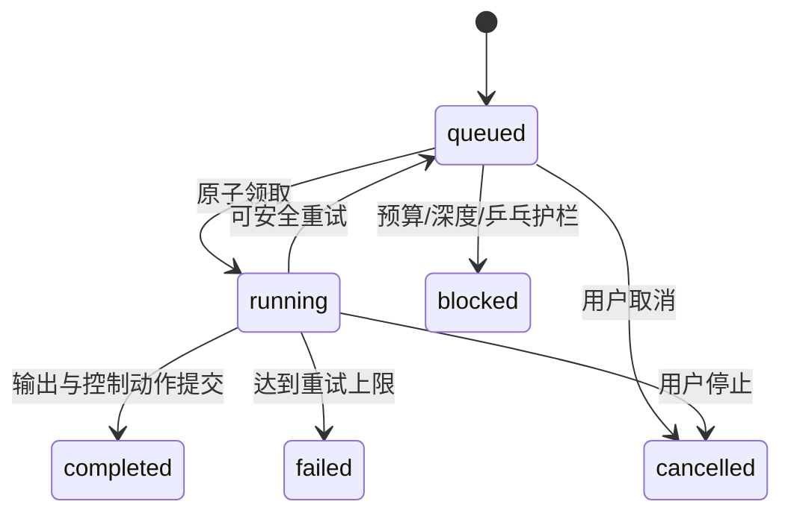

# agent-gand Collaboration 模式实施计划

> 状态：已实施
>
> 更新时间：2026-09-16
>
> 评审结论：2026-09-16 已确认 6 项产品决策，详见第 20 节。
>
> 前置调研：[Clowder AI Agent 交互模式调研报告](../research/clowder-agent-interaction-research.md)
>
> 目标：在保留顺序流水线和主管委派模式的基础上，增加由 Agent 动态交接、受控并行、可恢复且可观测的自由协作模式。

## 1. 背景

agent-gand 当前支持两种运行模式：

- `pipeline`：按成员列表固定顺序依次执行；
- `supervisor`：主管先生成任务 DAG，再由 Scheduler 执行、审查和返工。

这两种模式适合确定性流程和正式交付，但不适合以下场景：

- 用户只想和一位 Agent 开始讨论，后续由该 Agent 自主邀请队友；
- Coder 希望临时请 Reviewer 检查一个局部问题；
- Planner 需要同时征询多个成员的不同观点；
- 用户希望在某个 Agent 工作时旁路询问另一位 Agent；
- 团队需要经过数轮质疑和回应后自然收敛，而不是启动时就固定完整流程。

当前 `recipientIds` 只作为 Prompt 提示，并不会改变执行目标。`pipeline` 仍遍历全部成员，`supervisor` 仍必须由主管预先拆解任务。因此现有聊天室在视觉上支持 `@Agent`，运行时仍是固定编排。

## 2. 目标与非目标

### 2.1 实施目标

新增 `collaboration` 模式，完成以下闭环：

```text
用户选择一位或多位起始 Agent；无显式目标时交给最近回复者
    ↓
目标 Agent 独立处理并输出结果
    ↓
Agent 选择一个终态动作
    ├─ finish：本轮完成
    ├─ handoff：交给一位队友
    ├─ ask_many：并行征询多位队友，结果回流
    ├─ wait_user：暂停并等待用户回复
    └─ propose_task：提议创建正式 Supervisor Run
    ↓
平台持久化并调度后续 Dispatch
    ↓
队列耗尽或进入终止条件后结束 Run
```

交付后应满足：

- 用户 `@Agent` 会真正决定初始执行者；
- 用户首版可显式选择最多三位初始 Agent 并行执行；
- 新聊天室默认使用 Collaboration，用户仍可主动选择 Pipeline 或 Supervisor；
- Agent 可以在运行过程中动态选择下一位协作者；
- 不同 Agent 可以在同一聊天室中并行，同一个 Agent 保持串行；
- 每次路由都有明确来源、目标、原因和状态；
- Agent 交接不会绕过工具权限、人工审批和 Reviewer 验收；
- 路由深度、目标数量、总轮次、Token、成本和时长均有上限；
- 达到可扩展预算时暂停执行，由用户终止或按比例增加预算；
- 重复路由、乒乓交接和进程中断可以被识别；
- 服务重启后能恢复尚未执行的 Dispatch，并如实终结失去执行进程的 Attempt；
- 聊天室直接展示 Agent 之间的交接、并行征询、排队和终态；
- Agent 可以提出结构化 Supervisor Task 建议，经用户确认后创建正式 Supervisor Run；
- Pipeline 与 Supervisor 的行为及现有回归测试不退化。

### 2.2 本次不包含

第一版不实现：

- 跨 Conversation 或跨项目自动投递；
- Agent 自主创建聊天室；
- 私密 Whisper 消息；
- 跨机器分布式队列；
- 长期记忆参与路由决策；
- 基于语义模型自动猜测下一位 Agent；
- Agent 自主批准敏感工具调用；
- 未经用户确认自动创建或执行正式 Supervisor Task；
- 可编辑的可视化编排图。

## 3. 核心设计决策

### 3.1 Collaboration 是第三种模式

扩展共享类型：

```ts
export type RunMode = 'pipeline' | 'supervisor' | 'collaboration';
```

三种模式的职责保持清晰：

| 模式 | 调度方式 | 适合场景 |
|---|---|---|
| pipeline | 启动时固定顺序 | 内容加工、固定阶段流程 |
| supervisor | 主管规划 DAG，Task 驱动 | 正式开发、审查、返工和交付 |
| collaboration | 消息驱动，运行中动态交接 | 讨论、探索、质疑、临时协作和多人会诊 |

不得通过修改 Supervisor 的 Prompt 来模拟自由交流，否则固定任务调度和自由对话会继续耦合。

### 3.2 新目标创建 Run，等待回复恢复原 Run

保留“一个新目标对应一个 Run”的计量、Trace 和工作区边界；对阻塞型问题的回答视为原目标的继续：

- Run 记录本次用户目标、参与成员快照、用量和最终状态；
- Collaboration Run 内部可以产生多个动态 Dispatch；
- 同一 Conversation 可以出现多个 Run，多个 Collaboration Run 可在不同 Agent 上同时推进；
- 普通新用户消息创建新 Run，不修改历史 Run；
- 用户对 `waiting_for_user` 问题作答时恢复原 Run，不另建 Run；
- 同一 Conversation 的命名工作区继续复用，Agent 可以看到已有产物；
- 不同 Run 的模型用量、失败和终止原因保持独立。

这使现有用量统计、Agent 快照、Trace 和会话历史可以继续复用，同时让一次协作在等待用户后保持同一条证据链。Conversation Dispatcher 在 Collaboration 模式下只串行完成“用户消息落库、创建或恢复 Run、创建初始或恢复 Dispatch”这段接纳事务，不等待整个 Run 结束；后续执行由 Agent Slot 控制。Pipeline 和 Supervisor 继续保持整轮串行。

### 3.3 Dispatch 是自由协作的调度单元

Run 表示一次用户发起的协作目标，Dispatch 表示其中一次明确的 Agent 唤醒。

消息负责展示和上下文，Dispatch 负责调度。禁止根据普通消息内容推断 Dispatch 状态。

```text
Run
 ├─ Dispatch A：user → planner
 │    └─ Dispatch B：planner → coder
 │         ├─ Dispatch C：coder → reviewer
 │         └─ Dispatch D：coder → researcher
 │              └─ Aggregation E：reviewer/researcher → coder
 └─ 最终结果
```

### 3.4 Agent 路由使用结构化控制工具

第一版不把解析 Agent 正文中的 `@name` 作为主要控制协议。为 Collaboration Turn 注入服务端内部工具：

```ts
agent.send_message({
  target: string;
  message: string;
  reason: string;
})

agent.ask_many({
  targets: string[];
  question: string;
  reason: string;
})

agent.wait_for_user({
  question: string;
  reason: string;
})

agent.propose_supervisor_task({
  title: string;
  goal: string;
  acceptanceCriteria: string[];
  suggestedAssigneeIds: string[];
  suggestedReviewerId?: string;
  reason: string;
})
```

没有调用控制工具并正常输出正文，等价于 `finish`。

控制工具具有以下约束：

- 只在 Collaboration Turn 中下发；
- 不进入 Agent 的普通工具白名单；
- 不能由角色配置自动授权或禁用；
- 只允许目标为当前 Conversation 的启用成员；
- `runId`、`conversationId`、发送者和父 Dispatch 由服务端上下文提供，模型不能填写；
- 一次 Agent Turn 最多产生一个终态控制动作；
- 终态控制动作不能和普通工具调用处于同一批次；
- 如果模型混合调用，服务端拒绝控制动作并注入一次纠正提示；第二次仍不合法则本次 Dispatch 失败。

这样可以保留模型自主选择队友的能力，同时避免自由文本、引用、代码块或名称歧义改变控制状态。

### 3.5 每 Conversation、每 Agent 一个执行槽

执行互斥键为：

```text
(conversationId, targetAgentId)
```

规则：

- 不同 Agent 可以并行；
- 同一 Agent 在同一 Conversation 内只能有一个 running Attempt；
- 同一 Agent 的后续 Dispatch 按优先级和创建时间排队；
- Agent 在不同 Conversation 中可以并行；
- Pipeline 和 Supervisor 暂时继续沿用现有调度，不进入 Collaboration Slot；
- 用户停止某位 Agent 时只取消该 Agent 当前 Attempt，不影响其他 Agent。

当前 `ConversationRunDispatcher.active` 的语义需要调整：Pipeline 和 Supervisor 仍表示“该 Conversation 正在执行完整 Run”，Collaboration 只表示“正在接纳一条新用户消息”。接纳完成即释放锁，因此后续用户消息可以在已有 Agent 工作时启动新的 Collaboration Run。

### 3.6 公共聊天与正式任务分层

Collaboration 负责：

- 分析与讨论；
- 提出异议；
- 动态交接；
- 请求第二意见；
- 形成实施建议；
- 决定是否需要创建正式 Task。

Supervisor Task 继续负责：

- 正式代码实现；
- 验收标准；
- Reviewer PASS/FAIL；
- 返工次数；
- 任务失败传播；
- 最终交付状态。

Collaboration Agent 可以调用内部控制工具 `agent.propose_supervisor_task`，提交标题、目标、验收标准、建议执行者和 Reviewer。该动作只创建待用户决策的 Proposal，不直接创建 Task，也不绕过 Supervisor 的拆解、调度和 Reviewer 验收。

用户确认 Proposal 时，服务端在同一 Conversation 和工作区中创建一个关联的 `supervisor` Run，并把 Proposal 内容作为目标和约束交给主管；随后由现有 Supervisor Orchestrator 创建正式 Task DAG。用户可以在确认面板中修改主管、执行成员和 Reviewer。拒绝 Proposal 只终结该提议，不启动 Supervisor Run。

## 4. 领域模型

### 4.1 CollaborationDispatch

在 `packages/shared/src/collaboration.ts` 新增：

```ts
export type CollaborationDispatchStatus =
  | 'queued'
  | 'running'
  | 'completed'
  | 'failed'
  | 'cancelled'
  | 'blocked';

export type CollaborationDispatchKind =
  | 'initial'
  | 'handoff'
  | 'fanout'
  | 'aggregate';

export interface CollaborationDispatch {
  id: string;
  runId: string;
  conversationId: string;
  sourceMessageId: string;
  parentDispatchId: string | null;
  batchId: string | null;
  kind: CollaborationDispatchKind;
  from: string;                 // user | agent id | system
  targetAgentId: string;
  reason: string | null;
  status: CollaborationDispatchStatus;
  priority: 'urgent' | 'normal';
  depth: number;
  idempotencyKey: string;
  outputMessageId: string | null;
  error: string | null;
  createdAt: string;
  startedAt: string | null;
  finishedAt: string | null;
}
```

### 4.2 CollaborationAttempt

Dispatch 是逻辑工作项，Attempt 保存每次实际执行证据：

```ts
export type CollaborationAttemptStatus =
  | 'running'
  | 'completed'
  | 'failed'
  | 'interrupted'
  | 'cancelled';

export interface CollaborationAttempt {
  id: string;
  dispatchId: string;
  runId: string;
  conversationId: string;
  agentId: string;
  attemptNo: number;
  status: CollaborationAttemptStatus;
  inputContext: string | null;
  output: string | null;
  controlAction: CollaborationControlAction | null;
  error: string | null;
  leaseOwner: string | null;
  leaseExpiresAt: string | null;
  createdAt: string;
  startedAt: string | null;
  endedAt: string | null;
}
```

第一版最大 Attempt 数为 2。模型调用失败可以重试；已经执行成功的普通工具不会自动重放。重试上下文必须注明前一次可能已产生的副作用。

### 4.3 CollaborationBatch

用于并行征询和结果回流：

```ts
export type CollaborationBatchStatus =
  | 'pending'
  | 'running'
  | 'partial'
  | 'completed'
  | 'timeout'
  | 'failed';

export interface CollaborationBatch {
  id: string;
  runId: string;
  conversationId: string;
  initiatorAgentId: string;
  sourceDispatchId: string;
  question: string;
  targetAgentIds: string[];
  resultDispatchId: string | null;
  status: CollaborationBatchStatus;
  timeoutAt: string;
  createdAt: string;
  completedAt: string | null;
}
```

每个目标使用独立 Dispatch。全部目标结束或超时后，创建一个 `aggregate` Dispatch 回给发起 Agent。聚合上下文必须标明每位 Agent 的状态和原始结果，不把失败或超时伪装成成功意见。

### 4.4 ControlAction

```ts
export type CollaborationControlAction =
  | { type: 'finish' }
  | { type: 'handoff'; targetAgentId: string; message: string; reason: string }
  | { type: 'ask_many'; targetAgentIds: string[]; question: string; reason: string }
  | { type: 'wait_user'; question: string; reason: string }
  | {
      type: 'propose_task';
      title: string;
      goal: string;
      acceptanceCriteria: string[];
      suggestedAssigneeIds: string[];
      suggestedReviewerId?: string;
      reason: string;
    };
```

该结构写入 Attempt，作为调度依据。聊天正文只负责向用户解释，不能替代 ControlAction。

工具名与内部动作名的映射固定为：`agent.send_message → handoff`、`agent.ask_many → ask_many`、`agent.wait_for_user → wait_user`、`agent.propose_supervisor_task → propose_task`。服务端按工具 schema 生成动作，禁止模型直接提交任意 ControlAction JSON。

### 4.5 Message 扩展

扩展 `AgentMessageType`：

```ts
export type AgentMessageType =
  | ...
  | 'collaboration_result'
  | 'collaboration_handoff'
  | 'collaboration_question'
  | 'collaboration_wait_user'
  | 'collaboration_routing';
```

消息 `meta` 统一写入：

```ts
{
  dispatchId?: string;
  parentDispatchId?: string;
  batchId?: string;
  routeFrom?: string;
  routeTo?: string[];
  reason?: string;
}
```

### 4.6 Run 状态

扩展共享 `RunStatus`：

```ts
export type RunStatus =
  | 'pending'
  | 'running'
  | 'awaiting_approval'
  | 'waiting_for_user'
  | 'completed'
  | 'failed';
```

状态规则：

- 存在 queued/running Dispatch：`running`；
- 普通工具等待审批：`awaiting_approval`；
- 存在阻塞本 Run 的待处理用户决策：`waiting_for_user`；
- 队列耗尽且至少有一个有效结果：`completed`；
- 无可恢复 Dispatch 且必要路径失败：`failed`。

`wait_user`、预算扩容确认和 Supervisor Task Proposal 都会创建待处理用户决策并把 Run 置为 `waiting_for_user`。普通新消息没有关联待处理 Decision 时仍创建新 Run。各类决策的终态不同：

| Decision | 用户动作 | 原 Collaboration Run |
|---|---|---|
| agent_question | 回复问题 | 写入用户 Message，创建回给提问 Agent 的恢复 Dispatch，转回 `running` |
| budget_exhausted | 增加预算 | 写入 BudgetRevision，保留原队列，转回 `running` |
| budget_exhausted | 按已有结果终止 | 取消剩余 queued Dispatch，标记 `completed`，展示“接受部分结果” |
| supervisor_task_proposal | 批准 | 原 Run 标记 `completed`，创建并启动唯一的关联 Supervisor Run |
| supervisor_task_proposal | 拒绝 | 写入拒绝原因，创建回给提议 Agent 的恢复 Dispatch，转回 `running` |

一个 Run 同时只允许一个阻塞型待处理 Decision。重复提交使用 Decision ID 和期望状态做条件更新；第一个有效响应生效，其余请求返回已经解决的对象。

进入 `waiting_for_user` 时释放 Agent Slot。Scheduler 只领取 `running` Run 的 Dispatch；预算等待期间 queued Dispatch 原样保留，问题和 Proposal 等待期间不提前创建后续 Agent Dispatch。

### 4.7 UserDecision 与 BudgetRevision

三类需要用户判断的动作使用统一结构：

```ts
export type CollaborationDecisionKind =
  | 'agent_question'
  | 'budget_exhausted'
  | 'supervisor_task_proposal';

export type CollaborationDecisionStatus =
  | 'pending'
  | 'accepted'
  | 'rejected'
  | 'cancelled';

export interface CollaborationUserDecision {
  id: string;
  runId: string;
  conversationId: string;
  dispatchId: string | null;
  idempotencyKey: string;
  kind: CollaborationDecisionKind;
  status: CollaborationDecisionStatus;
  promptMessageId: string;
  payload: Record<string, unknown>;
  resolution: Record<string, unknown> | null;
  linkedRunId: string | null;
  createdAt: string;
  resolvedAt: string | null;
}

export interface CollaborationBudgetLimits {
  maxDispatches: number;
  maxTokens: number;
  maxCostUsd: number;
  maxDurationMs: number;
}

export interface CollaborationBudgetRevision {
  id: string;
  runId: string;
  decisionId: string;
  increasePercent: number;
  previousLimits: CollaborationBudgetLimits;
  newLimits: CollaborationBudgetLimits;
  createdAt: string;
}
```

预算修订保存修改前后的绝对值、增加比例和关联 Decision。调度器只读取已提交的最新绝对值，不能根据聊天文字临时计算预算。

## 5. SQLite 数据结构

在 `apps/server/src/db/schema.sql` 新增：

```sql
CREATE TABLE IF NOT EXISTS collaboration_dispatches (
  id TEXT PRIMARY KEY,
  run_id TEXT NOT NULL,
  conversation_id TEXT NOT NULL,
  source_message_id TEXT NOT NULL,
  parent_dispatch_id TEXT,
  batch_id TEXT,
  kind TEXT NOT NULL,
  from_actor TEXT NOT NULL,
  target_agent_id TEXT NOT NULL,
  reason TEXT,
  status TEXT NOT NULL,
  priority TEXT NOT NULL DEFAULT 'normal',
  depth INTEGER NOT NULL DEFAULT 0,
  idempotency_key TEXT NOT NULL,
  output_message_id TEXT,
  error TEXT,
  created_at TEXT NOT NULL,
  started_at TEXT,
  finished_at TEXT,
  UNIQUE(run_id, idempotency_key)
);

CREATE TABLE IF NOT EXISTS collaboration_attempts (
  id TEXT PRIMARY KEY,
  dispatch_id TEXT NOT NULL,
  run_id TEXT NOT NULL,
  conversation_id TEXT NOT NULL,
  agent_id TEXT NOT NULL,
  attempt_no INTEGER NOT NULL,
  status TEXT NOT NULL,
  input_context TEXT,
  output TEXT,
  control_action TEXT,
  error TEXT,
  lease_owner TEXT,
  lease_expires_at TEXT,
  created_at TEXT NOT NULL,
  started_at TEXT,
  ended_at TEXT,
  UNIQUE(dispatch_id, attempt_no)
);

CREATE TABLE IF NOT EXISTS collaboration_batches (
  id TEXT PRIMARY KEY,
  run_id TEXT NOT NULL,
  conversation_id TEXT NOT NULL,
  initiator_agent_id TEXT NOT NULL,
  source_dispatch_id TEXT NOT NULL,
  question TEXT NOT NULL,
  target_agent_ids TEXT NOT NULL,
  result_dispatch_id TEXT,
  status TEXT NOT NULL,
  timeout_at TEXT NOT NULL,
  created_at TEXT NOT NULL,
  completed_at TEXT
);

CREATE TABLE IF NOT EXISTS collaboration_user_decisions (
  id TEXT PRIMARY KEY,
  run_id TEXT NOT NULL,
  conversation_id TEXT NOT NULL,
  dispatch_id TEXT,
  idempotency_key TEXT NOT NULL UNIQUE,
  kind TEXT NOT NULL,
  status TEXT NOT NULL DEFAULT 'pending',
  prompt_message_id TEXT NOT NULL,
  payload TEXT NOT NULL,
  resolution TEXT,
  linked_run_id TEXT,
  created_at TEXT NOT NULL,
  resolved_at TEXT
);

CREATE TABLE IF NOT EXISTS collaboration_budget_revisions (
  id TEXT PRIMARY KEY,
  run_id TEXT NOT NULL,
  decision_id TEXT NOT NULL UNIQUE,
  increase_percent INTEGER NOT NULL,
  previous_limits TEXT NOT NULL,
  new_limits TEXT NOT NULL,
  created_at TEXT NOT NULL
);
```

索引：

```sql
CREATE INDEX IF NOT EXISTS idx_collab_dispatch_run_status
  ON collaboration_dispatches(run_id, status, priority, created_at);

CREATE INDEX IF NOT EXISTS idx_collab_dispatch_agent_status
  ON collaboration_dispatches(conversation_id, target_agent_id, status, created_at);

CREATE INDEX IF NOT EXISTS idx_collab_attempt_lease
  ON collaboration_attempts(status, lease_expires_at);

CREATE INDEX IF NOT EXISTS idx_collab_batch_status
  ON collaboration_batches(run_id, status, timeout_at);

CREATE INDEX IF NOT EXISTS idx_collab_decision_status
  ON collaboration_user_decisions(conversation_id, status, created_at);

CREATE INDEX IF NOT EXISTS idx_collab_budget_run
  ON collaboration_budget_revisions(run_id, created_at);
```

旧数据库通过 `CREATE TABLE IF NOT EXISTS` 和幂等索引升级。已有 Conversation 和 Run 不需要回填 Dispatch。

## 6. 初始路由规则

创建 Collaboration Run 时按以下优先级确定第一棒：

1. 本次消息的 `recipientIds`；
2. `replyTo` 指向的 Agent 消息作者；
3. Conversation 中最近一次成功回复的 Agent；
4. Conversation 的第一个启用成员。

约束：

- 显式 `recipientIds` 最多 3 个；
- 首版支持一次显式选择 1～3 位初始 Agent，分别创建并行 Dispatch；
- 非成员、停用成员或不存在成员直接返回 400；
- 显式目标不可用时不得自动换人；
- 没有可用目标时 Run 直接失败并生成可见系统消息；
- 多个显式目标生成同一 Batch 下的并行初始 Dispatch；
- 无 `recipientIds` 时只选择一个回退目标，不广播唤醒全部成员。

“最近回复者”只统计该 Conversation 中最后一条成功落库的 Agent 正式消息；系统消息、路由条、失败 Attempt 和仍在流式生成的内容不参与。该 Agent 已停用或不再属于成员列表时，再回退到首位启用成员。

初始路由前必须先持久化用户 Message。首条消息和后续消息都在接纳事务中依次完成：分配 Conversation `seq`、写入用户 Message、创建 Run、创建初始 Dispatch。Dispatch 的 `input_message_id` 指向已提交的用户 Message，避免 Scheduler 先运行却读不到输入。

首个 Dispatch 创建后，用户 Message 的投递状态更新为 `sent`；目标校验失败时更新为 `failed` 并写入原因；排队等待 Agent Slot 不视为投递失败。

前端继续从输入文本提取 `@agent-id`，但应改为行首或显式选择器路由。句中提及只作为正文，避免误触发。

## 7. Collaboration Scheduler

新增目录：

```text
apps/server/src/collaboration/
  dispatches.ts
  attempts.ts
  batches.ts
  router.ts
  scheduler.ts
  context.ts
  controlTools.ts
  guards.ts
  recovery.ts
```

### 7.1 事件驱动调度

`kickCollaboration(conversationId)` 在以下事件后触发：

- 初始 Dispatch 落库；
- 一个 Dispatch 完成或失败；
- 一个 Batch 收到结果；
- 一个 Agent Slot 被释放；
- 审批完成；
- 用户回答问题、调整预算或处理 Task Proposal；
- Batch 超时；
- 服务启动恢复。

Scheduler 不使用持续轮询作为正常推进方式。内部使用 `activeConversations` 和 dirty flag，确保调度过程中新增的 Dispatch 会再触发一轮 drain。一次 drain 从该 Conversation 的全部非终态 Collaboration Run 中选择候选 Dispatch，从而允许不同 Run 唤醒不同 Agent，同时统一维护 Agent Slot。

### 7.2 原子领取

每次领取需要在 `BEGIN IMMEDIATE` 中完成：

1. 选择 queued Dispatch；
2. 验证 Run 仍可执行；
3. 验证目标 Agent 仍属于 Run 快照；
4. 检查 `(conversationId, agentId)` 是否已有 running Attempt；
5. 创建 Attempt 和租约；
6. 将 Dispatch 置为 running；
7. 提交后才启动模型调用。

“Run 仍可执行”要求状态为 `running`；`waiting_for_user`、`awaiting_approval` 和终态 Run 均不得领取 Collaboration Dispatch。

候选 Dispatch 按 `priority DESC、用户消息 seq ASC、depth ASC、created_at ASC` 稳定排序。对同一个 `(conversationId, targetAgentId)`，普通优先级的新 Run 不得越过旧 Run 中更早创建的 Dispatch；只有用户显式标记的高优先级操作才允许插队，并在 Trace 中记录原因。

并发上限：

```text
COLLAB_MAX_CONCURRENCY=3
COLLAB_MAX_PER_AGENT=1
COLLAB_ATTEMPT_LEASE_MS=300000
```

### 7.3 Dispatch 生命周期



完成 Dispatch 的单个事务必须：

1. 终结 Attempt；
2. 更新或创建输出 Message；
3. 保存 ControlAction；
4. 按控制动作创建子 Dispatch、Batch 或 UserDecision；
5. 更新当前 Dispatch；
6. 更新 Batch；
7. 计算 Run 是继续、等待用户还是结束；
8. 提交后发出 WebSocket 事件并触发下一轮 drain。

### 7.4 消息物化规则

每个 Agent Turn 最多生成一个正式 Agent 气泡，保证聊天记录与执行轮次一一对应：

- `finish`：正文保存为该 Agent 的正式回复；
- `send_message`：正文保存为发给目标 Agent 的交接消息，并创建一个子 Dispatch；
- `ask_many`：保存一个公开问题气泡，各目标 Dispatch 共享该 Message，不复制多份相同内容；
- `wait_for_user`：问题保存为 Agent 气泡，Run 转为等待用户；
- `propose_supervisor_task`：保存 Agent 提议气泡和确认卡片，Run 转为等待用户；
- 预算达到上限：保存系统决策卡片，显示已用值、当前上限和扩容后的预估上限；
- Batch 汇总：各目标的独立回复保持原作者，Aggregate Dispatch 只读取引用，不复制正文；
- 路由条、状态徽标和“正在输入”由 Dispatch、Attempt、ControlAction 投影，不额外写入普通 Message。

### 7.5 不自动重放副作用

模型调用失败前可能已经执行普通工具。恢复规则：

- 尚未进入模型调用的 running Attempt 可以安全重排；
- 模型调用开始后进程退出，Attempt 标记 `interrupted`；
- 若 Trace 表明执行过非只读工具，不自动重试，Dispatch 标记 failed 并提示用户；
- 只有没有工具副作用证据的 Attempt 才允许自动重试一次；
- MCP、文件写入、Shell 和外部 HTTP 副作用均按现有 Trace 判断；
- 人工审批仍沿用现有 Approval，不由 Collaboration Scheduler代替。

## 8. Collaboration Turn 执行

### 8.1 复用 runAgentTurn

重构 `runAgentTurn`，增加可选扩展点：

```ts
interface AgentTurnExtension {
  tools: ToolSchema[];
  handleControlCalls(calls: LlmToolCall[]): Promise<ControlResolution>;
}
```

普通工具仍走现有：

```text
schema → checkPermission → Approval → runTool → tool span
```

Collaboration 控制工具走：

```text
schema → 结构校验 → scope/预算/路由护栏 → ControlAction
```

控制工具不是普通 Tool，不进入 `checkPermission`，也不能访问文件、网络或 Shell。

### 8.2 Prompt 结构

每次 Collaboration Turn 注入：

1. Agent 自身 systemPrompt；
2. Conversation 成员名册、能力和当前状态；
3. Collaboration 行为规则；
4. 当前 Dispatch 的发送者、原因和深度；
5. 精确 sourceMessage；
6. `replyTo` 因果链摘要；
7. 最近已准入的 Conversation 消息；
8. 相关 Task、Review 和工作区信息；
9. 剩余深度、轮次、Token、成本和时间预算。

明确禁止把尚未准入的 queued Dispatch 内容暴露给 Agent。

上下文预算建议：

```text
最近消息：最多 20 条
因果链：最多 8 跳
总上下文：按 Provider 最大上下文的可配置比例裁剪
单条长消息：保留头部 40% 和尾部 60%
```

### 8.3 Agent 出口规则

Prompt 要求 Agent 在结束前判断：

- 我能否直接完成？
- 是否确实需要另一位 Agent 行动？
- 目标 Agent 是否具备所需能力？
- 我是否只是把决定推给队友？
- 是否必须由用户作出价值判断？

运行时只接受五种结果：finish、handoff、ask_many、wait_user、propose_task。Prompt 负责帮助模型选择，代码负责校验选择是否合法。`propose_task` 只生成 Proposal，用户确认前不得创建 Supervisor Run 或正式 Task。

## 9. 防失控机制

### 9.1 配置

新增环境变量：

```text
COLLAB_MAX_DEPTH=12
COLLAB_MAX_DISPATCHES=20
COLLAB_MAX_TARGETS=3
COLLAB_MAX_CONCURRENCY=3
COLLAB_MAX_ATTEMPTS=2
COLLAB_BATCH_TIMEOUT_MS=300000
COLLAB_RUN_TIMEOUT_MS=1800000
COLLAB_MAX_TOKENS=100000
COLLAB_MAX_COST_USD=5
COLLAB_MAX_BUDGET_MULTIPLIER=4
COLLAB_PINGPONG_WARN=2
COLLAB_PINGPONG_BLOCK=4
```

0 或负数不表示无限；配置解析必须设置安全下限和上限。

### 9.2 深度与数量

- 初始 Dispatch 深度为 0；
- handoff 子 Dispatch 深度为父级 +1；
- fanout 每个子 Dispatch 深度为父级 +1；
- aggregate Dispatch 深度不额外增加；
- 超过最大深度时不创建子 Dispatch，当前输出仍保留，并生成系统提示；
- Run 内 Dispatch 总数达到上限后拒绝新增路由。

### 9.3 去重

以下条件全部相同视为重复：

- 同一 Run；
- 同一父 Dispatch；
- 同一目标 Agent；
- 同一标准化 message/question 摘要；
- 已存在 queued 或 running Dispatch。

重复请求复用已有 Dispatch，并在当前 Attempt 中记录 `deduplicatedTo`，不再次调用模型。

### 9.4 乒乓检测

第一版采用简单、可解释的规则，不使用文本长度或语义模型判断“实质工作”：

- 统计当前 Run 中连续的无第三方介入 A↔B handoff；
- 第 2 次往返向接收方 Prompt 注入警告；
- 第 4 次阻止新 Dispatch；
- 用户新消息、第三位 Agent 介入或正式 Task 状态变化会重置 streak；
- 被阻止的路由产生可见系统消息和 error Trace。

后续可以结合工具调用证据优化误判，但不纳入首版。

### 9.5 预算

每次创建子 Dispatch 前检查：

- Dispatch 数量；
- 累计 Token；
- 累计模型成本；
- Run 墙钟时间；
- 当前并发数；
- Batch 目标数。

Token、成本、Dispatch 数和 Run 时长属于可扩展预算；并发数、Batch 目标数、最大深度、Attempt 次数和乒乓阈值属于安全护栏，不能通过预算扩容绕过。

达到任一可扩展预算后，调度器必须先停止领取新 Dispatch，保留已有结果，创建 `budget_exhausted` Decision，并将 Run 改为 `waiting_for_user`。该过程不再调用模型，避免在询问用户前继续消耗预算。决策卡片提供：

- “按当前结果终止”：Run 标记 `completed`，界面明确显示“用户在预算边界接受部分结果”；
- “增加 25% / 50% / 100%”：基于当前绝对上限同比例增加所有可扩展预算；
- “自定义比例”：允许输入 10%～200% 的整数比例，并预览新上限；

每次扩容写入不可变 BudgetRevision，恢复 Run 为 `running` 并重新触发 Scheduler。累计预算上限不得超过初始预算的 `COLLAB_MAX_BUDGET_MULTIPLIER` 倍；达到平台上限时只允许按已有结果终止。两个并发扩容请求只有第一个可从 `pending` 转为 `accepted`，防止重复增加预算。

整数预算（Dispatch、Token、毫秒）按增加后的结果向上取整，成本预算保留六位小数。Decision 卡片和服务端响应都返回修改前、修改后绝对值，避免“增加 50%”的计算基准产生歧义。

## 10. REST API

扩展现有接口：

```text
POST /api/conversations
  mode 支持 collaboration；省略 mode 时默认 collaboration

POST /api/conversations/:id/messages
  collaboration 模式下 recipientIds 是真实初始路由
```

新增：

```text
GET  /api/runs/:runId/collaboration
GET  /api/conversations/:conversationId/collaboration
GET  /api/collaboration/dispatches/:id
POST /api/collaboration/dispatches/:id/cancel
POST /api/collaboration/agents/:agentId/stop
POST /api/collaboration/runs/:runId/stop
POST /api/collaboration/decisions/:decisionId/resolve
```

Decision 解决请求使用可判别联合类型：

```ts
type ResolveCollaborationDecision =
  | { action: 'answer'; message: string }
  | { action: 'terminate_at_budget' }
  | { action: 'increase_budget'; increasePercent: number }
  | {
      action: 'approve_task';
      supervisorId: string;
      agentIds: string[];
      defaultReviewerId?: string;
    }
  | { action: 'reject_task'; reason?: string };
```

服务端必须按 Decision `kind` 校验允许的 action，不能让前端通过任意组合恢复 Run、扩容或创建 Supervisor Run。`increasePercent` 只接受 10～200 的整数，`approve_task` 重新执行团队成员与能力校验。

Decision 解决必须在单个数据库事务中以 `WHERE id=? AND status='pending'` 领取。`approve_task` 在同一事务内创建 Supervisor Run 并回填 `linked_run_id`；请求重试直接返回已关联的 Run。`answer` 在同一事务内写入用户 Message 和恢复 Dispatch；`increase_budget` 在同一事务内写入 BudgetRevision 和 Run 状态。事务提交后再触发 Scheduler 或 Supervisor Orchestrator。

`GET /api/runs/:runId/collaboration` 返回：

```ts
{
  dispatches: CollaborationDispatch[];
  attempts: CollaborationAttempt[];
  batches: CollaborationBatch[];
  decisions: CollaborationUserDecision[];
  activeAgents: Array<{
    agentId: string;
    dispatchId: string;
    startedAt: string;
  }>;
  budget: {
    dispatches: { used: number; initialLimit: number; currentLimit: number };
    tokens: { used: number; initialLimit: number; currentLimit: number };
    costUsd: { used: number; initialLimit: number; currentLimit: number };
    durationMs: { used: number; initialLimit: number; currentLimit: number };
    cumulativeMultiplier: number;
    maxMultiplier: number;
    revisions: CollaborationBudgetRevision[];
  };
}
```

Run 级接口用于查看单条用户消息形成的协作树；Conversation 级接口合并返回当前聊天室所有非终态 Run、Agent Slot 和等待队列，供聊天室状态栏与右侧面板 hydrate。两类接口均只返回当前 Conversation 可见的数据。

取消操作必须使用数据库条件更新，终态 Dispatch 重复取消返回当前对象，保持幂等。

## 11. WebSocket 事件

扩展 `ServerEvent`：

```ts
| { type: 'collaboration.dispatch.updated'; dispatch: CollaborationDispatch }
| { type: 'collaboration.attempt.updated'; attempt: CollaborationAttempt }
| { type: 'collaboration.batch.updated'; batch: CollaborationBatch }
| { type: 'collaboration.decision.updated'; decision: CollaborationUserDecision }
| {
    type: 'collaboration.scheduler.updated';
    conversationId: string;
    runIds: string[];
    activeAgentIds: string[];
    queued: number;
    blocked: number;
  }
```

事件只做增量通知，REST hydrate 仍是重连后的权威数据源。前端全部按 ID upsert，不依赖事件不丢失。

## 12. 聊天室界面

### 12.1 创建聊天室

模式选择增加：

```text
自由协作
Agent 根据讨论动态邀请队友；适合探索、评审和多人会诊。
```

Collaboration 模式：

- 新建聊天室时默认选中，Pipeline 和 Supervisor 保留为可选模式；
- 不要求 supervisorId；
- 至少选择 1 位成员；
- 没有历史 Agent 回复时使用成员列表第一位作为最终回退；
- 保留默认 Reviewer，仅在正式 Task 中使用；
- 明确展示预算与最大动态轮次。

### 12.2 输入框

改进 Agent 选择：

- 输入 `@` 显示成员选择器；
- 只有行首或选中 Chip 的 Agent 才进入 `recipientIds`；
- 句中 `@` 只保留文本，不触发路由；
- 无目标时显示“发送给最近回复者”；
- 多目标时显示“并行发送给 N 位成员”；
- 回复 Agent 消息时提示“默认交给该 Agent”。

用户可在发送前选择最多三位成员 Chip；前端提交其稳定 Agent ID 列表，展示名只用于显示。未选择 Chip 时不伪造 `recipientIds`，由服务端按最近成功回复者规则路由。

### 12.3 路由条

在消息气泡之间展示：

```text
Planner → Coder · 请验证数据模型
Coder → Reviewer · 请求独立检查
Planner → Coder、Reviewer · 并行征询
Reviewer → 用户 · 需要确认兼容策略
```

路由条必须来自 Dispatch，不从正文重新解析。

### 12.4 Agent 状态

聊天室头部为每位成员显示：

- 空闲；
- 排队；
- 思考；
- 使用工具；
- 等待审批；
- 等待用户；
- 已完成；
- 失败。

点击活跃 Agent 可查看当前 Dispatch、运行时长和停止按钮。

### 12.5 队列与预算

在右侧 Trace 面板增加“协作”标签：

- 动态路由图；
- queued/running/blocked Dispatch；
- Batch 部分完成状态；
- 当前深度和总 Dispatch；
- Token、成本和时间预算；
- 失败、去重和熔断原因。

### 12.6 用户决策卡片

`waiting_for_user` Run 在对应消息下展示结构化卡片：

- Agent 问题：文本输入与“回复并继续”；
- 预算达到上限：终止、增加 25% / 50% / 100%、自定义比例和扩容后预估；
- Supervisor Task Proposal：标题、目标、验收标准、主管、成员、Reviewer，以及确认或拒绝按钮。

提交后按钮立即进入 pending，最终状态以 REST/WS 返回为准。重复点击不重复恢复、扩容或创建 Supervisor Run。聊天室顶部和轮次分隔线将 `waiting_for_user` 显示为“等待你的决定”，不能显示为完成或失败。

## 13. Trace 与可观测性

每个 Collaboration Run 创建顶层编排 Span：

```text
collaboration:<runId>
```

每个 Dispatch 创建：

```text
dispatch:<dispatchId>
  └─ agent:<agentId>
       ├─ llm:<provider/model>
       ├─ tool:<name>
       └─ control:<finish|handoff|ask_many|wait_user|propose_task>
```

用户决策另建 orchestration Span，记录 Decision ID、类型、状态变化和预算修订或关联 Supervisor Run ID；用户自由文本只记录 Message ID 和裁剪摘要，不在 Span 中复制敏感正文。

Span input 至少包含：

- dispatchId；
- sourceMessageId；
- parentDispatchId；
- targetAgentId；
- depth；
- 预算快照；
- 实际下发的工具名称。

Span output 至少包含：

- outputMessageId；
- ControlAction；
- 新建或复用的子 Dispatch ID；
- 去重、深度、预算或乒乓判定；
- 终止原因。

不得在 Trace 中记录 API Key、完整敏感环境变量或未裁剪的大型二进制结果。

## 14. 崩溃恢复

启动时执行 `recoverCollaborationRuns()`：

1. 查找 running Attempt；
2. 将租约过期且没有活动执行者的 Attempt 标记为 interrupted；
3. 检查其工具 Span 是否出现可能的副作用；
4. 可安全重试的 Dispatch 恢复为 queued；
5. 不可安全重试的 Dispatch 标记 failed，并生成可见诊断；
6. queued Dispatch 保持原顺序；
7. running Batch 根据成员 Dispatch 重算为 running、partial、completed、timeout 或 failed；
8. 收集仍有可执行工作量的 Conversation，并按 `conversationId` 去重调用 `kickCollaboration`；
9. 保留未解决 Decision，并把对应 Run 纠正为 `waiting_for_user`，不得自动选择、扩容或批准 Proposal；
10. 对没有可执行 Dispatch 且没有待处理 Decision 的 Run 重新计算终态。

恢复过程必须幂等。连续启动两次不能创建重复 Attempt、Message 或 Aggregate Dispatch。

## 15. 文件改动范围

| 文件或目录 | 计划改动 |
|---|---|
| `packages/shared/src/run.ts` | RunMode 增加 collaboration，RunStatus 增加 waiting_for_user |
| `packages/shared/src/message.ts` | 增加 Collaboration 消息类型 |
| `packages/shared/src/collaboration.ts` | Dispatch、Attempt、Batch、Decision、BudgetRevision、ControlAction 类型 |
| `packages/shared/src/events.ts` | Collaboration WS 事件 |
| `apps/server/src/db/schema.sql` | 新增 Dispatch、Attempt、Batch、Decision、BudgetRevision 表和索引 |
| `apps/server/src/collaboration/` | 路由、存储、Scheduler、上下文、控制工具、护栏和恢复 |
| `apps/server/src/orchestration/agentStep.ts` | 支持受控的额外工具与终态控制动作 |
| `apps/server/src/runs/trace.ts` | 支持 waiting_for_user 状态流转和恢复 |
| `apps/server/src/conversations/dispatcher.ts` | Collaboration 只串行接纳事务，提交后进入 Conversation 级 Scheduler；移除只提示不路由的行为 |
| `apps/server/src/conversations/service.ts` | 模式兼容与首位 Agent 回退查询 |
| `apps/server/src/api/routes.ts` | 默认模式、Collaboration 查询、停止与用户决策接口 |
| `apps/server/src/index.ts` | 启动恢复与关闭清理 |
| `apps/web/src/services/api.ts` | Collaboration API 类型与调用 |
| `apps/web/src/store.tsx` | Dispatch、Attempt、Batch、Decision hydrate 与事件 upsert |
| `apps/web/src/components/views/RunView.tsx` | 默认模式、真实 @ 路由、waiting 状态、决策卡片与路由条 |
| `apps/web/src/components/RightPanel.tsx` | 协作队列、预算和动态路由图 |
| `apps/web/src/components/TopBar.tsx`、`SessionSidebar.tsx` | waiting_for_user 标签、颜色和状态提示 |
| `apps/server/.env.example` | Collaboration 限制配置 |
| `README.md` | 三种模式说明和验证命令 |
| `scripts/verify-collaboration.mjs` | 端到端验收脚本 |

## 16. 分阶段实施

### 阶段 A：共享契约与持久化

- 扩展 RunMode；
- 扩展 RunStatus，新增 Collaboration、Decision 和 BudgetRevision 类型；
- 新增数据库表、索引和 repository；
- REST detail 可读取空的 Collaboration 数据；
- 保证旧数据库幂等升级。

完成标志：创建 Collaboration Conversation 和 Run 成功，初始 Dispatch 可以落库并通过 API 查询，但暂不调用模型。

### 阶段 B：点对点动态接力

- 实现初始路由；
- 实现 Conversation 级 Scheduler、跨 Run drain 和每 Agent 单槽；
- 扩展 `runAgentTurn`；
- 实现 `agent.send_message`、隐式 finish 和 `agent.wait_for_user`；
- 实现 `waiting_for_user → running` 的同 Run 恢复；
- 增加深度、Dispatch 数量和重复目标限制；
- 输出路由 Message 和 Trace。

完成标志：`用户 → Planner → Coder → Reviewer → finish` 可以动态完成；Agent 提问后 Run 进入 `waiting_for_user`，用户回复可恢复同一 Run。

### 阶段 C：可靠性与恢复

- 增加 Attempt、租约和重试；
- 增加启动恢复；
- 区分可安全重试和可能有副作用的中断；
- 实现 Dispatch、Agent 和 Run 三级停止；
- 实现乒乓警告与阻断；
- 加入 Token、成本和时间预算；
- 实现预算达到上限后的 Decision、比例扩容和并发幂等。

完成标志：在 Agent 执行前、模型调用中和工具调用后三个位置终止进程，重启后均得到正确且不重复的状态；达到预算后可等待用户、按比例扩容并继续执行。

### 阶段 D：并行征询与回流

- 实现 `agent.ask_many`；
- 新增 Batch 状态机；
- 支持最多三个目标并行；
- 支持 partial、timeout 和 failed；
- 创建唯一 Aggregate Dispatch 回流发起者；
- 防止聚合重复执行；
- 实现 `agent.propose_supervisor_task`、确认界面所需 API 和关联 Supervisor Run 创建。

完成标志：Planner 并行征询 Coder、Reviewer 后收到聚合上下文并完成总结；Agent 的正式任务提议经用户确认后只创建一个关联 Supervisor Run。

### 阶段 E：前端体验

- 新建聊天室支持 Collaboration 模式；
- 将 Collaboration 设为新建聊天室默认模式；
- 实现成员选择器和真实 `@` 路由；
- 展示路由条、Agent 实时状态和并行分支；
- 增加停止、取消排队和预算查看；
- 增加问题、预算和 Supervisor Task Proposal 决策卡片；
- 重连后 REST hydrate 恢复完整视图。

完成标志：用户只看聊天主界面即可理解谁叫了谁、谁正在工作、为什么停止以及本轮是否完整结束。

### 阶段 F：回归、文档与灰度

- 新增领域单测、数据库集成测试和 Stub E2E；
- 运行现有 Agent、Scheduler、MCP 和 135 项 Provider 回归；
- 更新 README 和架构文档；
- 保留 Pipeline 和 Supervisor 显式模式选择；
- Collaboration 随首版默认向所有新聊天室开放。

完成标志：所有新增验收和现有回归通过，Pipeline/Supervisor 的响应、调度和 UI 无行为变化。

## 17. 测试矩阵

### 17.1 领域测试

1. RunMode 接受 collaboration，旧模式不变；
2. Dispatch 状态转换只允许合法边；
3. 同一 Run 和 idempotencyKey 只能创建一个 Dispatch；
4. 同一 Agent Slot 不能并发领取；
5. 不同 Agent 可以并行领取；
6. 深度、Dispatch 数和目标数正确限制；
7. 乒乓第 2 次警告、第 4 次阻断；
8. 第三位 Agent 介入后 streak 重置；
9. Batch 状态按子 Dispatch 正确计算；
10. Aggregate Dispatch 只创建一次。
11. 同一 Conversation 的不同 Run 可以同时领取不同 Agent；
12. 同一 Agent 的普通优先级 Dispatch 按用户消息顺序执行，不被较新的 Run 越过。
13. 待处理 Decision 使 Run 进入 waiting_for_user，解决后恢复同一 Run；
14. 同一个 Decision 只能成功解决一次；
15. BudgetRevision 从当前绝对上限计算并受累计倍数限制。

### 17.2 路由测试

1. 显式 recipientIds 优先；
2. replyTo Agent 作者作为回退；
3. 最近成功回复者作为回退；
4. 首位成员作为最终回退；
5. 未知、停用和非成员目标被拒；
6. 句中 `@` 不触发 recipientIds；
7. 显式目标失败不自动改派；
8. 无目标可用时生成可见失败消息。
9. 一次可显式路由给最多三位初始 Agent；
10. 无显式目标时优先最近成功回复者；
11. 没有历史回复时回退首位启用成员。

### 17.3 Agent Turn 测试

1. 无控制工具调用时 finish；
2. send_message 创建单个子 Dispatch；
3. ask_many 创建 Batch 和多个子 Dispatch；
4. wait_for_user 创建 Decision 并暂停 Run；
5. 控制工具不能指定 runId 或 conversationId；
6. 控制工具和普通工具混合调用时纠正一次；
7. 第二次仍非法时 Attempt 失败；
8. 普通工具继续遵守 readonly/confirm/auto 和人工审批；
9. MCP 工具在 Collaboration Turn 中保持相同权限与 Trace。
10. propose_supervisor_task 只创建 Proposal，不直接创建 Task；
11. Proposal 获批后创建唯一的关联 Supervisor Run；
12. Proposal 拒绝后不创建 Run 或 Task。

### 17.4 恢复测试

1. queued Dispatch 重启后继续；
2. 模型调用前中断可以安全重试；
3. 只读工具后的中断可以重试；
4. 写工具后的中断不自动重放；
5. 重启不会重复消息或 Aggregate Dispatch；
6. Batch 超时后缺失目标如实标记；
7. 重复恢复不会修改已完成终态。
8. 重启后 pending Decision 和 waiting_for_user 状态保持一致；
9. 重启不会重复应用 BudgetRevision 或创建关联 Supervisor Run。

### 17.5 前端测试

1. Collaboration 模式可创建；
2. `@` 选择器只提交合法成员；
3. 路由条按 Dispatch 显示；
4. 多 Agent 并行状态独立显示；
5. WS 重复事件按 ID upsert；
6. 断线重连后队列、Batch 和预算恢复；
7. 停止一位 Agent 不影响其他 Agent；
8. 小屏下路由条和状态不破坏气泡方向。
9. 新建聊天室默认选中 Collaboration；
10. 多初始 Agent Chip 提交稳定 ID；
11. waiting_for_user 显示问题、预算或 Proposal 决策卡片；
12. 预算扩容前展示比例和新的绝对上限。

### 17.6 完整回归

```bash
pnpm typecheck
pnpm --filter @agent-gand/web build
pnpm verify:p0-tools
pnpm verify:agents
pnpm verify:scheduler
pnpm verify:collaboration
node scripts/verify-llm-stubs.mjs
```

## 18. 最终验收场景

使用 Planner、Coder、Reviewer 创建“自由协作”聊天室，发送：

```text
@planner 分析登录模块偶发 401 的原因，并让团队给出修复建议。
```

预期过程：

1. 只有 Planner 被初始唤醒；
2. Planner 判断需要实现分析和风险审查，调用 `ask_many`；
3. Coder 与 Reviewer 并行执行，聊天室显示两个活跃状态；
4. 两个结果分别形成独立消息和 Dispatch 终态；
5. Batch 进入 completed，并创建一个 Aggregate Dispatch 回给 Planner；
6. Planner 综合结果，决定是否 `finish` 或 `send_message` 给 Coder；
7. 如果 Coder 和 Reviewer 连续互相短文本转交，系统先警告后熔断；
8. 所有普通工具仍经过原有权限审批；
9. Run 结束后 Trace 可以还原完整动态路由图；
10. 浏览器刷新后，消息、路由、Agent 状态、Batch 和预算保持一致。

补充验收场景：

1. 新建聊天室不操作模式选择器，创建结果为 Collaboration；
2. 用户同时选择 Coder、Reviewer 两个 Chip，两者并行收到初始 Dispatch；
3. 无 `@` 发送下一条消息，只唤醒最近成功回复的 Agent；
4. Agent 调用 `wait_for_user` 后 Run 显示“等待你的决定”，用户回复后原 Run 恢复执行；
5. Token 或成本达到上限后不再调用模型，显示预算决策卡片；
6. 用户增加 50% 后各可扩展绝对上限正确更新，Run 从 `waiting_for_user` 恢复为 `running`；
7. 用户在下一次预算边界选择终止，界面显示“接受部分结果”，不显示完整成功；
8. Agent 提出 Supervisor Task，用户修改 Reviewer 后批准，只创建一个关联 Supervisor Run；
9. 关联 Supervisor Run 继续使用现有任务 DAG、Reviewer PASS/FAIL 和返工机制；
10. 重复点击预算扩容或 Proposal 批准不会重复扣加预算或创建 Run。

## 19. 预期实现结果

实施完成后，用户感知应从：

```text
选择一组 Agent → 系统按固定规则让所有人依次或按主管计划工作
```

变为：

```text
选择一个或几个起始 Agent → Agent 根据实际进展邀请队友 →
平台展示和约束每次交接 → 团队自然收敛或明确请求用户判断
```

最终体验应具备：

- 聊天室中每位 Agent 都是独立发言者；
- 用户可以直接和任意 Agent 对话；
- Agent 能主动请求队友帮助；
- 多位 Agent 可以并行，但不会重复抢同一角色；
- 讨论过程自由，执行权限和正式验收仍受控；
- 用户不再充当 Agent 之间的人工消息路由器；
- 系统不会因为自由交流而无限循环或失去审计能力。

## 20. 已确认的评审决策

2026-09-16 方案评审确认以下产品决策，实施时作为验收约束，不再作为待定项：

1. 无 `@` 或显式成员 Chip 时，优先路由给最近成功回复的 Agent；
2. 首版允许用户一次显式选择多位初始 Agent，上限为三位；
3. Collaboration 默认向所有新聊天室开放，Pipeline 和 Supervisor 保留为显式选择；
4. RunStatus 新增 `waiting_for_user`，用户回答后恢复原 Run；
5. 达到可扩展预算时暂停并询问用户，用户可终止或按比例增加预算投入；
6. Agent 可以提议创建正式 Supervisor Task，但必须由用户确认，确认后创建关联 Supervisor Run 并沿用正式任务状态机。

## 21. 实施结果

2026-09-16 已按本计划完成首版实现：

- 新增 Collaboration 共享契约、SQLite 持久化、Conversation 级 Scheduler 和 Agent 单槽；
- 实现动态交接、并行征询、Batch 聚合、等待用户、预算扩容和 Proposal；
- 新聊天室默认使用 Collaboration，支持最多三位初始 Agent；
- 增加聊天室决策卡片、动态路由状态、预算信息和停止操作；
- 增加重启恢复、Attempt 租约、幂等 Decision、预算修订和副作用恢复保护；
- 增加 `pnpm verify:collaboration` 端到端验收，覆盖交接、多目标、最近回复者、等待恢复、预算扩容/终止和 Supervisor Proposal 幂等。
