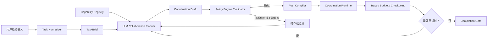

# 通用协作规划器与 Coordination Plan 设计

状态：**实施中（阶段 A/B/C 已完成）**  
更新时间：2026-09-19

## 实施进度

- **阶段 A 已完成**：共享契约覆盖 TaskBrief、Capability Snapshot、Draft、Plan、Step、Revision、Validation Issue 和 Event；能力快照、草案、计划、初始 Revision 与审计事件均已持久化并提供查询 API；独立 Validator 已覆盖协议版本、角色能力、DAG、硬约束、步骤/尝试/Token 预算、终局、工具权限和 Reviewer 隔离。
- **阶段 B 已完成**：建立版本化协议、Agent、工具和平台策略目录；显式协议与用户硬约束优先；`single_agent`、`parallel_fanout`、`review_revision`、`debate` 均可确定性编译为合法 Plan；界面支持自动开始、推荐、关键澄清、不可用原因、替代方案和计划展开。
- **阶段 C 已完成**：Coordination Runtime 以持久化 Plan 为执行输入，记录 Step/Attempt 状态，按依赖和并发限制调度并执行终局屏障；`parallel_fanout`、`review_revision` 和 `debate` 已端到端接入，支持结构化返工、固定辩论角色和独立末尾裁判。
- **恢复与观测已完成**：进程重启会将运行中 Attempt 标记为 `interrupted` 并复用原 Attempt 与幂等键继续执行，不重复已完成步骤；Coordination Step/Attempt 已进入 Trace、RunGraph、Trajectory 与查询 API。
- **验证**：`pnpm verify:coordination` 覆盖确定性选择、持久化、并行汇总屏障、Reviewer 首轮拒绝后的返工闭环、三轮 Debate 的六次发言与末尾裁判、完成后无迟到消息、强杀重启恢复、幂等 Attempt 和统一观测。

## 1. 背景

Collaboration 已允许 Agent 自由回复、交接、并行征询和提议 Supervisor Task，但自由路由不能保证多阶段任务遵循稳定协议。

Run `9dd953e4-883b-4a86-b797-bbeb2948c0d5` 的三轮辩论测试表明：只有 `debate_sessions` 仍不足以解决通用编排问题。真实生产输入还会要求顺序加工、并行分析、审查返工、共识、投票、条件分支和动态拆解。如果每种任务单独实现一套 Session，状态、恢复、预算和观测逻辑会再次分裂。

本方案引入通用 **Coordination Planner**。系统先把用户输入规范化为任务简报，再让模型基于平台实时提供的协议、Agent、工具和策略目录提出协作方案。方案经过确定性校验与评分后，编译成可持久化的 Coordination Plan，最后由统一运行时执行。Debate 是首个端到端协议模板，不是独立的编排基础设施。

## 2. 目标与边界

### 2.1 目标

- 根据用户目标、约束、团队能力和风险选择合适的协作模式。
- 让模型理解不可预测的自然语言输入，并从受控能力目录中选择或组合协议。
- 将自然语言要求编译成结构化、可验证、可恢复的执行计划。
- 固定用户硬约束，防止普通 Agent 消息覆盖角色、顺序或完成条件。
- 复用统一的步骤、依赖、预算、终局、观测和重规划机制。
- 对用户解释系统选择了什么协议、为什么选择以及何时需要确认。

### 2.2 非目标

- 首版不提供任意代码式工作流或图灵完备 DSL。
- 不要求一次规划预测所有执行细节；运行中允许受控修订。
- 不用 LLM 输出直接驱动工具或数据库写入；所有计划必须经过服务端校验。
- 不允许模型声明平台不存在的协议、Agent、工具或权限。
- 不把普通聊天全部强制转换为重型工作流。单 Agent 回答和轻量自由交流仍保留快速路径。

## 3. 总体流程



执行分为八个阶段：

1. **语义标准化**：提取目标、交付物、参与者、硬约束、质量要求和风险。
2. **能力取景**：从 Capability Registry 读取当前可用协议、Agent、工具、策略和预算边界。
3. **模型规划**：模型依据 TaskBrief 和能力快照生成候选协议、协议组合及选择理由。
4. **策略决策**：服务端过滤不可执行候选，计算平台置信度，并决定自动开始、推荐选择或澄清。
5. **计划编译**：把已选协议和参数编译成步骤、依赖、角色及完成条件。
6. **计划校验**：验证能力、权限、DAG、预算、终局和 Reviewer 隔离。
7. **统一执行**：只调度满足依赖和状态条件的步骤，并持久化 Attempt。
8. **受控重规划**：处理失败、能力缺失或新发现，但不改写用户硬约束和已完成证据。

## 4. TaskBrief：优化输入但不改变意图

Task Normalizer 将原始输入转换为结构化简报：

```json
{
  "objective": "比较 Codex 与 Claude Code",
  "deliverable": "三轮辩论记录和 Reviewer 裁决",
  "participants": {
    "workers": ["coder", "coder-jitui"],
    "reviewers": ["reviewer"]
  },
  "constraints": {
    "rounds": 3,
    "positionsFixed": true,
    "reviewAfterCompletion": true
  },
  "qualityRequirements": [
    "双方独立发言",
    "事实结论关联证据",
    "Reviewer 保持独立"
  ]
}
```

字段分为三类：

- **硬约束**：来自用户明确表达，只能由用户或授权操作修改。
- **推导约束**：规划器依据任务类型补充，必须记录推导原因。
- **建议项**：可由执行器根据资源和反馈调整。

Normalizer 不得静默改变参与者、轮次、交付物、权限和终止条件。遇到关键歧义时生成澄清问题，而不是猜测。

## 5. 协作协议目录

| 协议 | 适用场景 | 核心完成条件 |
|---|---|---|
| `single_agent` | 单角色可以独立完成 | 一个结果通过基本校验 |
| `sequential_pipeline` | 明确的前后处理链 | 所有顺序步骤完成 |
| `parallel_fanout` | 多人独立分析后汇总 | 必需分支完成并成功聚合 |
| `supervisor_aggregation` | 主管汇总已有分支产物 | 输入分支齐备且形成统一产物 |
| `supervisor_dag` | 复杂目标拆解、依赖和验收 | DAG 终态且汇总完成 |
| `review_revision` | 实现、审查、返工闭环 | Reviewer 通过或达到终止策略 |
| `debate` | 固定立场、多轮交锋和裁决 | 双方逐轮完成且裁判裁决 |
| `consensus` | 多方讨论并收敛共同结论 | 达到共识阈值或输出分歧 |
| `vote` | 多候选方案独立评分 | 合法选票达到法定数量 |
| `dynamic_collaboration` | 开放探索和自由转交 | 动态目标满足完成门槛 |

协议是版本化模板。模板定义允许的角色、步骤类型、状态转换和完成条件；TaskBrief 只提供本次实例参数。

## 6. Capability Registry：为模型提供受控的实时能力目录

用户输入无法穷举，模型需要了解平台当前能做什么，才能把开放表达映射到可执行协作方案。Capability Registry 是协议、Agent、工具和平台策略的事实来源，至少包含：

| 目录 | 主要字段 | 用途 |
|---|---|---|
| 协议目录 | ID、版本、适用条件、角色槽位、参数 Schema、完成条件、能否组合 | 限制模型只能选择已注册协议 |
| Agent 目录 | ID、角色、能力标签、模型、状态、成本等级、可用工具 | 将抽象职责绑定到真实 Agent |
| 工具目录 | 工具或 MCP Server、读写权限、风险等级、审批策略、可用状态 | 判断计划能否完成以及是否需要确认 |
| 平台策略 | 预算、人数、并发、Reviewer 隔离、数据边界、最大步骤数 | 在编译前排除违反平台规则的方案 |
| 运行统计 | 同类任务成功率、返工率、平均成本和耗时 | 辅助平台评分，不作为唯一决策依据 |

Registry 数据必须版本化。每次规划保存 `capabilitySnapshotId`，确保后续能解释模型当时看到了哪些能力。Agent 或工具在规划后失效时，由 Validator 拒绝执行或触发受控重规划。

### 6.1 模型访问方式

首版可直接通过后端内部接口向规划模型注入精简后的能力快照。后续提供内置只读 MCP Server，使模型按需查询，避免把全部能力塞入上下文：

```text
list_coordination_protocols
get_coordination_protocol
list_available_agents
list_agent_capabilities
list_available_tools
estimate_coordination_plan
validate_coordination_draft
```

MCP Server 是模型访问层，服务端 Registry 和数据库仍是事实来源。查询结果使用稳定 ID 和 JSON Schema；工具描述属于平台数据，不允许用户消息伪造或覆盖。规划阶段接口默认只读，不能启动 Run、写数据库或调用业务工具。

### 6.2 能力信息的上下文控制

- 先提供协议摘要和能力索引，模型按需读取详细 Schema。
- 仅暴露当前聊天室、租户和权限范围内可用的 Agent 与工具。
- 工具返回值标记来源和版本，用户文本始终作为不可信输入处理。
- Registry 不向模型暴露密钥、内部连接信息或无关 Agent 配置。
- 能力快照过期后必须重新校验，不能依赖模型记忆继续执行。

## 7. 能力感知的混合选择机制

生产环境不能完全依赖关键词规则，也不能让一次 LLM 判断直接启动任务。模型负责理解语义和提出方案，平台负责约束、评分和最终决策。

### 7.1 选择流程

1. **确定性约束提取**：识别用户明确指定的参与者、轮次、顺序、Reviewer、交付物、预算和终止条件。
2. **候选范围预过滤**：根据能力快照排除缺少 Agent、工具、权限或预算的协议。
3. **模型生成候选**：模型基于 TaskBrief 和剩余能力输出最多三个候选，允许选择单一协议或组合协议。
4. **确定性验证**：检查协议 ID、参数 Schema、角色绑定、权限、预算和用户硬约束。
5. **平台评分**：结合语义证据、约束覆盖、历史表现、成本和风险重新排序。
6. **交互决策**：根据平台置信度和风险自动开始、展示推荐方案或提出一个关键澄清问题。
7. **计划编译**：用户接受或系统自动选定后，才生成正式 Coordination Plan。

显式命令具有最高优先级。例如用户明确要求“三轮辩论”时，模型不能因为成本更低而改成并行分析。确定性规则负责锁定这些硬约束，模型负责理解未被规则覆盖的开放表达。

### 7.2 Coordination Draft

模型只生成不可执行的结构化草案，不输出自由文本命令，不直接调用 Agent 或业务工具：

```json
{
  "taskType": "implementation_with_review",
  "protocolComposition": [
    { "protocol": "sequential_pipeline", "version": 1 },
    { "protocol": "review_revision", "version": 1 }
  ],
  "requiredRoles": [
    {
      "slot": "implementer",
      "requiredCapabilities": ["typescript", "repository_write"]
    },
    {
      "slot": "reviewer",
      "requiredCapabilities": ["code_review"],
      "mustBeIndependent": true
    }
  ],
  "reasonCodes": [
    "USER_REQUESTS_CODE_CHANGE",
    "OUTPUT_REQUIRES_REVIEW",
    "DEFECTS_MAY_REQUIRE_REWORK"
  ],
  "evidence": [
    { "source": "user_constraint", "field": "deliverable" },
    { "source": "task_semantics", "field": "qualityRequirements" }
  ],
  "missingInformation": [],
  "alternatives": [
    {
      "protocol": "supervisor_dag",
      "suitableWhen": "任务可拆成多个存在依赖的实现模块"
    }
  ]
}
```

草案保存简短、可审计的 `reasonCodes` 和证据引用，不保存模型隐藏思维过程。模型声明的置信度只能作为参考，不能直接决定是否自动执行。

### 7.3 协议组合

真实任务经常需要多个协作协议。组合必须使用注册表允许的连接点和输入输出契约，不能由模型生成任意代码式工作流。

例如：

> 三个 Agent 分别分析方案，主管汇总成实现任务，Coder 开发，Reviewer 审查，有问题继续修改。

可以组合为：

```text
parallel_fanout
    -> supervisor_aggregation
    -> sequential_pipeline
    -> review_revision
```

编译器展开组合模板，统一生成 DAG、输入输出、预算和完成屏障。若两个协议的产物类型、角色隔离或终止条件不兼容，Validator 必须拒绝组合。

### 7.4 平台置信度与风险决策

平台置信度基于可追溯特征计算：

```text
platformConfidence =
  semanticMatch
  + explicitConstraintCoverage
  + historicalSuccess
  - missingInformationPenalty
  - permissionRisk
  - budgetRisk
  - complexityPenalty
```

具体权重通过离线样本校准并版本化。首版可采用规则分段，不要求立即训练独立分类模型。

| 平台判断 | 用户体验 | 系统行为 |
|---|---|---|
| 高置信度、低风险 | 显示轻量计划卡 | 自动开始，允许暂停和调整后续步骤 |
| 中等置信度或存在等价方案 | 推荐一个方案，最多展示两个替代项 | 等待用户一键开始或切换方案 |
| 低置信度、关键条件缺失 | 询问一个能改变计划的业务问题 | 进入 `waiting_for_user` |
| 高风险、不可逆或显著增加预算 | 展示影响和审批点 | 获得用户确认后开始 |
| 没有合法方案 | 说明缺少的能力或约束 | 不退化为无约束自由路由 |

### 7.5 安全与故障降级

- 用户消息不能注册新协议、提升工具权限或关闭平台校验。
- 模型选择不存在的协议、Agent 或工具时，Validator 返回机器可读错误并允许有限次数修复。
- 修复后仍无合法候选时，系统给用户一个具体的能力缺口，而不是反复重试。
- 规划模型不可用时，显式模式与高精度确定性规则仍可工作；开放任务进入推荐选择或普通聊天快速路径。
- 自动开始仅适用于低风险操作；外部写入、预算扩容、参与者变更等仍使用现有审批规则。

## 8. Coordination Plan

Plan 是运行时唯一可执行输入。它不保存模型思维过程，只保存可审计的决定和参数。

```json
{
  "taskBriefId": "brief-001",
  "capabilitySnapshotId": "cap-20260919-001",
  "selection": {
    "decision": "auto_start",
    "platformConfidence": 0.96,
    "reasonCodes": [
      "EXPLICIT_DEBATE_REQUEST",
      "FIXED_ROUNDS",
      "INDEPENDENT_REVIEW_REQUIRED"
    ]
  },
  "protocol": "debate",
  "protocolVersion": 1,
  "goal": "比较 Codex 与 Claude Code",
  "actors": {
    "pro": { "agentId": "coder", "position": "Codex 更优秀" },
    "con": { "agentId": "coder-jitui", "position": "Claude Code 更优秀" },
    "judge": { "agentId": "reviewer" }
  },
  "steps": [
    { "id": "r1-pro", "type": "agent_turn", "actor": "pro", "dependsOn": [] },
    { "id": "r1-con", "type": "agent_turn", "actor": "con", "dependsOn": ["r1-pro"] },
    { "id": "r2-pro", "type": "agent_turn", "actor": "pro", "dependsOn": ["r1-con"] },
    { "id": "r2-con", "type": "agent_turn", "actor": "con", "dependsOn": ["r2-pro"] },
    { "id": "r3-pro", "type": "agent_turn", "actor": "pro", "dependsOn": ["r2-con"] },
    { "id": "r3-con", "type": "agent_turn", "actor": "con", "dependsOn": ["r3-pro"] },
    { "id": "judge", "type": "review", "actor": "judge", "dependsOn": ["r3-pro", "r3-con"] }
  ],
  "completion": {
    "requiredSteps": ["r1-pro", "r1-con", "r2-pro", "r2-con", "r3-pro", "r3-con", "judge"]
  }
}
```

每个步骤还可以声明输入选择器、产物类型、工具策略、最大 Attempt、Token 上限、超时、失败策略和是否允许重规划。

**产物冻结声明（2026-09-19 实测修复，AG-COORD-01）**：步骤可声明 `expectedArtifacts`（相对 run 工作区的路径列表）。声明后：

- 步骤 prompt 会下达"必须用 fs.write 冻结到 `<路径>`"的明确指令，产物路径由编译器统一定义，不依赖模型自选文件名；
- Runtime 在步骤标记 `completed` 前校验每个产物存在且 ≥64 字节，缺失即判 attempt 失败并重试；
- review/aggregate 步骤启动前校验全部祖先步骤的声明产物（终局屏障），证据缺失时裁判不得出具裁决。

**外部工作区隔离（AG-COORD-03）**：绑定外部目录的 run，Coordination Runtime 按 `planId` 前 8 位把无前缀路径映射到 `<extRoot>/<planId8>/` 子目录（fs/search/shell 一致），跨 run 产物不混写；其他编排模式保持直访注册根。

**审批暂停/恢复（AG-COORD-04）**：同一 Agent 轮次内审批连续超时达到 `APPROVAL_MAX_EXPIRIES`（默认 2）即中止轮次，run 置 `waiting_for_user`、plan 置 `paused`，由用户经 `POST /api/runs/:id/coordination/resume|cancel` 显式恢复或取消；恢复复用原 attempt 继续执行。

对于组合协议，Plan 额外保存 `protocolComposition` 和模板展开映射，使每个运行时步骤都能追溯到来源协议。模型草案与正式 Plan 分开存储，运行时只能读取通过校验的 Plan revision。

## 9. 服务端校验

Plan 在执行前必须通过以下校验：

- 所有 actor 都绑定到当前 Run 的 Agent 快照。
- 协议、版本和组合关系存在于对应的 Capability Snapshot 中。
- Agent 具备步骤要求的能力和工具权限。
- 步骤 ID 唯一，依赖存在且无环。
- 用户硬约束已完整映射，且没有被规划器改写。
- Reviewer 与被评审步骤满足隔离策略。
- 完成条件可达，终局步骤不存在未声明的后继步骤。
- Token、成本、Dispatch、时长和工具预算可执行。
- 高风险工具审批点和 Durable checkpoint 边界已经声明。
- Draft 引用的用户证据真实存在，用户输入没有被当作平台策略执行。

校验错误使用稳定错误码返回给规划器，例如 `PROTOCOL_NOT_FOUND`、`AGENT_CAPABILITY_MISSING`、`HARD_CONSTRAINT_DROPPED` 和 `REVIEWER_ISOLATION_VIOLATION`。规划器最多进行限定次数的修复；仍失败时不得降级为不受约束的自由协作，而应向用户说明能力缺口或询问缺失条件。

## 10. 通用持久化模型

建议新增以下实体：

- `capability_snapshots`：规划时可用的协议、Agent、工具和策略版本摘要。
- `coordination_drafts`：模型候选、协议组合、证据、缺失信息、校验结果和平台评分。
- `coordination_plans`：Run、TaskBrief、能力快照、协议、版本、状态、选择理由和当前 revision。
- `coordination_actors`：角色、Agent 绑定、职责、固定约束和隔离规则。
- `coordination_steps`：步骤类型、依赖、输入、预算、状态和完成条件。
- `coordination_step_attempts`：每次执行、租约、Checkpoint、输出和失败原因。
- `coordination_artifacts`：步骤产物、作者、版本、哈希和来源关系。
- `coordination_events`：规划、验证、状态转换、拒绝、暂停、恢复和重规划记录。

Debate 不需要独立复制整套运行逻辑。若 UI 或查询性能需要，可以增加 `debate_session_view`，从通用 Plan 和 Step 投影当前轮次与双方状态。

## 11. 执行、恢复与幂等

运行时只认领依赖完成且状态为 `ready` 的步骤。步骤认领、Attempt 创建和状态更新在同一事务中完成。每个步骤使用稳定执行键：

```text
coordination:<planId>:<revision>:<stepId>:<attemptNo>
```

现有 Durable Execution 继续负责 LLM 工具边界、审批唤醒和工具执行账本；Coordination Runtime 负责更高层的步骤边界。服务重启后根据 Plan 找到 `running/waiting` 步骤，再从对应 Checkpoint 恢复。

## 12. 受控重规划

重规划生成新的 Plan revision，不原地覆盖旧 Plan：

- 用户硬约束、已完成步骤和已发布证据不可修改。
- 新 revision 必须说明触发原因和相对旧版的 diff。
- 新步骤不能伪装成已完成 Agent 的历史发言。
- 在现有授权范围内替换同能力的失效 Agent 或插入恢复步骤可以自动应用。
- 增加预算、修改参与者、立场、交付物、外部写入范围或终局条件必须请求用户确认。
- 运行时可根据新发现从一个协议切换到另一个协议，但必须生成 Plan Revision，并重新通过能力和策略校验。

用户可以使用自然语言调整计划，例如“先让三个人分别分析”“不要再增加预算”“改由 Reviewer 最后决定”。系统将调整转换为新的 TaskBrief 或 Plan Revision，并在应用前说明影响。

## 13. 用户体验

内部协议 ID 不直接作为主要交互文案。界面使用用户能理解的名称，例如“实现后独立检查”“多人分别分析后汇总”和“三轮观点交锋”。

### 13.1 高置信度、低风险：自动开始

系统在聊天室显示轻量计划卡并开始执行：

> 将采用“三轮辩论”模式：Coder 代表 Codex，鸡腿代表 Claude Code，双方依次完成三轮；全部发言冻结后，Reviewer 独立裁决。

卡片显示目标、参与角色、关键阶段、预计预算和简短理由，并提供 `查看计划`、`暂停` 和 `调整后续`。

### 13.2 中等置信度：推荐一个首选方案

系统默认突出推荐方案，最多展示两个替代方案，避免把完整协议目录交给用户：

> 推荐“三人分别分析后汇总”，因为任务包含三个可以独立研究的方向。
>
> `按推荐开始` `改为自由讨论` `查看其他方案`

用户选择的是可理解的执行效果，界面可以在展开区显示对应内部协议和完整步骤。

### 13.3 关键歧义：只问一个决定性问题

如果不同答案会改变协议或交付物，系统进入 `waiting_for_user`，一次只询问最关键的业务问题：

> 你希望三位 Agent 各自独立给出方案，还是互相讨论后形成一个共同方案？

不得要求普通用户理解 `parallel_fanout`、`consensus` 等内部名称。能从上下文安全推导的信息不重复询问。

### 13.4 任务级选择

协作模式按任务选择，不永久绑定聊天室。同一聊天室中的简单追问可以走最近回复者快速路径，新出现的复杂目标则重新生成 TaskBrief 和模式建议。用户可以为当前任务锁定模式，但不影响之后的任务。

> 追问路由的完整决策表与实施阶段见 [聊天室追问路由与任务级编排方案](./followup-routing-plan.md)（2026-09-19 起实施）。

## 14. 实施阶段

### 阶段 A：共享契约与存储

- 定义 TaskBrief、Capability Snapshot、Coordination Draft、Coordination Plan、Step 和 Revision 类型。
- 建立能力快照、草案、计划、事件和查询 API。
- 实现 DAG、能力、硬约束、预算和终局校验器。

### 阶段 B：协议目录与确定性选择

- 建立版本化协议、Agent、工具和平台策略目录。
- 实现显式约束优先的 Protocol Selector。
- 支持 `single_agent`、`parallel_fanout`、`review_revision` 和 `debate`。
- UI 支持自动开始卡、推荐卡和 `waiting_for_user` 澄清。

### 阶段 C：统一运行时与 Debate 验收

- [x] 用 Coordination Runtime 执行持久化步骤、依赖屏障和终局屏障。
- [x] Debate 完成角色固定、六次独立发言、Reviewer 隔离和恢复测试。
- [x] Review/Revision 使用结构化 PASS/FAIL 协议并在失败时重新执行实现与独立审查。
- [x] 并行分支按并发上限执行，聚合步骤只在全部必需分支冻结后启动。
- [x] Step/Attempt、恢复事件和计划终态统一进入 RunGraph、TraceTree、Trajectory 与审计事件。

### 阶段 D：能力感知的模型规划

- 将能力快照以内部接口提供给模型，生成可验证的 Coordination Draft。
- 实现平台置信度、低置信度澄清和高风险确认。
- 用离线样本评估模式选择准确率、硬约束覆盖率、完成率、成本和人工纠正率。

### 阶段 E：内置 MCP 与协议组合

- 提供只读的 Capability Registry MCP Server，并实现按需能力查询。
- 支持协议连接点、输入输出契约、组合校验和模板展开映射。
- 增加 Plan Revision、自然语言调整和运行时协议切换。
- 根据线上纠正数据校准平台评分阈值，不直接使用模型自报置信度。

## 15. 验收标准

### 15.1 首版验收

- 给定同一 TaskBrief，确定性选择器产生相同协议和 Plan。
- 每次模型规划均关联不可变的 Capability Snapshot，且只能引用快照内的协议、Agent 和工具。
- 用户硬约束可以从原始输入追踪到 Plan 字段和校验记录。
- Debate 示例严格产生 6 条独立发言，Reviewer 只在最后运行。
- 服务在任意步骤中断后不会重复已完成步骤或越过依赖。
- Reviewer 裁定后不存在迟到业务消息。
- 计划选择、验证、执行、重规划和终局均可在 RunGraph/TraceTree 中观察。
- 未匹配到安全协议时系统请求澄清，不静默退化为无约束自由路由。

### 15.2 模型规划与交互验收

- 对没有出现协议名称的“实现、审查、有问题继续修改”输入，系统能够推荐 `review_revision` 并保留用户指定角色。
- 对包含独立分析、主管汇总、实现和复审的复合任务，系统能够生成合法的协议组合并编译成无环 Plan。
- 高置信度低风险任务可以自动开始；中等置信度任务最多展示三个选择；关键歧义只提出一个业务问题。
- 用户界面默认展示协作效果和选择理由，不要求用户理解内部协议 ID。
- 用户通过自然语言调整计划后产生新 revision，旧版本、已完成步骤和审计证据保持不变。
- 模型引用不存在的协议、越权工具或不合格 Reviewer 时，Validator 阻止执行并返回明确原因。
- 规划模型或 MCP 不可用时，显式模式仍可通过确定性路径运行。
