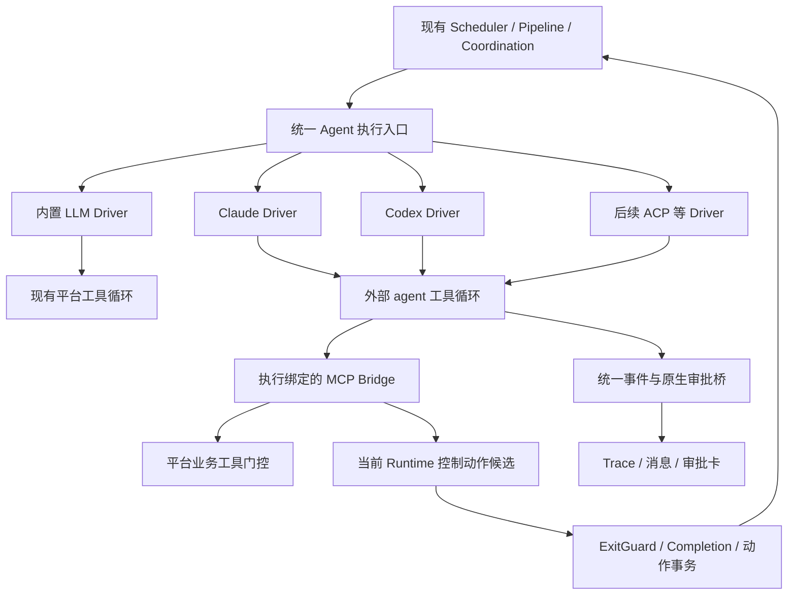

# 外部 Code Agent 接入方案

状态：已完成（单宿主本地阶段 A–D）。只读 CLI、双向审批、Runtime MCP、持久进程恢复、编码 worktree、固定审查快照和可选会话续接已实现并通过自动验收。真实 SDK/MCP、SDK 会话保存/恢复与 Codex MCP 协议检查通过；真实供应商模型 smoke 仍待账户配置后人工验证。当前能力见 [阶段 A](../architecture/external-code-agent-phase-a.md)、[阶段 B](../architecture/external-code-agent-phase-b.md)、[阶段 C](../architecture/external-code-agent-phase-c.md)、[阶段 D 架构](../architecture/external-code-agent-phase-d.md)及[阶段 D 验收](../reports/external-code-agent-phase-d-acceptance.md)。远程 worker/ACP/多租户容器为后续扩展。

调研证据见 [Clowder AI 外部 Code Agent 接入源码调研](../research/clowder-external-code-agent-integration-research.md)。现有 [Runtime Agent API v2](../architecture/runtime-agent-api-v2.md)、[Completion Engine](../architecture/runtime-completion-engine.md)、[运行策略](../architecture/runtime-run-policy.md) 继续约束未来接入。

## 1. 目标与首个场景

让已有角色选择内置 LLM 执行或外部 agent 执行，在同一平台中参与任务、审查、协作和追问。

首个可验收的编码场景：平台调度 Coder 在注册 Git 仓库的受控工作区修改文件并运行测试，把 diff、测试证据和摘要送给 Reviewer；Reviewer 可使用另一外部 agent，平台仍负责 PASS/FAIL、返工、审批和 Run 完成判定。

按接入成熟度分别声明能力：只读分析可用不代表写入/审批/恢复均可用。

## 2. 执行边界



平台负责调度、执行授权、上下文来源、工作区策略和终态；外部 agent 负责单次任务内的原生推理与工具循环。外部 agent 原生执行已产生的工具事件是观测，不重新进入 `executeToolOnce()` 执行。

`runAgentTurn()` 的上层入口可保留名字以减少调用点迁移，但内部必须按 backend 分流。现有 LLM 工具循环作为内置实现，不把完整外部回合伪装成一次 `LLMProvider.chat()`。

`chatOnce()`、review step、快速追问和规划模型也要审计。协调规划/任务拆解等纯模型调用应继续使用明确的模型 Provider；不能因角色选择外部 backend 就隐式启用带写工具的规划调用。

## 3. Driver 选择

| 后端 | 适用阶段 | 关键能力与边界 |
|---|---|---|
| Claude CLI `-p stream-json` | 只读原型、用户本机 CLI 接入评估 | 与 Clowder 默认载体相近；输出流本身不足以实现平台双向审批 |
| Claude Agent SDK | 正式 Claude 执行后端候选 | 官方提供同源工具循环、session、hooks、权限回调；产品化使用按官方认证要求配置 |
| Codex `exec --json` / TypeScript SDK | 只读原型、受控批处理 | 可捕获事件与恢复会话；不假定拥有 app-server 的全部双向控制 |
| Codex app-server（stdio） | 正式 Codex 后端候选 | 官方面向自定义客户端的审批、会话、流式事件与中断接口 |
| ACP | 后续扩展 | 必须逐 agent 验证 session、permission、cancel 和 usage，不能只验证协议能连接 |

采用 Clowder 的接口分层，而不是一次性复制其全部载体和恢复代码。Codex 第一版不启用远程 WebSocket；使用本机 stdio 并固定经过验证的 CLI/协议版本。

官方依据：[Codex SDK](https://learn.chatgpt.com/docs/codex-sdk)、[Codex app-server](https://learn.chatgpt.com/docs/app-server)、[Claude Agent SDK](https://code.claude.com/docs/en/agent-sdk/overview)。

## 4. 配置与类型草案

角色、模型、执行引擎、账户分别表达。旧角色缺少 execution 字段时默认内置 LLM；更新 backend 与策略时递增版本并冻结到新 Run 成员快照。

```ts
// 后续完整配置的设计示意。当前实现 kind/driver/nativeTools/platformTools/sessionPolicy，模型仍在角色顶层。
// accountRef/policyRef 尚未开放；实际会话策略为 turn/run/conversation，旧配置缺省 turn。
type AgentExecutionConfig =
  | { kind: 'builtin-llm' }
  | {
      kind: 'external';
      driver: 'claude-cli' | 'claude-sdk' | 'codex-exec' | 'codex-app-server';
      model: string;
      accountRef: string;
      sessionPolicy: 'run' | 'conversation';
      policyRef: string;
    };

interface AgentDriver {
  describeCapabilities(): DriverCapabilities;
  start(input: AgentExecutionInput): Promise<AgentExecutionHandle>;
}

interface AgentExecutionHandle {
  executionId: string;
  events: AsyncIterable<AgentExecutionEvent>;
  interrupt(reason: string): Promise<void>;
  respondApproval(requestId: string, decision: ApprovalDecision): Promise<void>;
}
```

输入包含：平台生成的 Run/Dispatch/Attempt/executionScope、已冻结 Agent 配置、解析后的 cwd、system instructions、任务上下文、允许的工具及权限策略、AbortSignal、预算与已验证的 session binding。

账户记录保存认证模式和安全存储引用，不把密钥放在角色 prompt、运行快照或 trace。Driver 命令来自服务端受控注册表；第一版不把任意 executable/args 作为普通角色字段开放。

`DriverCapabilities` 至少区分：文本增量/快照、原生审批、工具使用前门控、取消、resume、MCP、结构化结果、usage 与当前上下文用量。调度器按当前 Run 策略检查能力，缺失能力时拒绝准入。

## 5. 事件与观测

| 统一事件 | 消费方式 |
|---|---|
| session.bound | 保存 provider session 与宿主绑定，不创建第二条用户消息 |
| text.delta / text.snapshot | 按 message/item ID 追加或替换；最终只落一份正文 |
| native_tool.started / completed | 原生工具 span，记录来源、调用 ID 和状态，不再执行 |
| approval.requested | 生成与当前 Attempt 绑定的审批卡并等待原生响应 |
| usage.updated | 幂等记账，区分单 turn 用量与累积估算 |
| control.proposed | 形成当前回合的 Runtime 动作候选 |
| execution.completed / failed / interrupted | 单次外部执行终态，随后由平台裁决业务状态 |

现有 `llm.delta` 只有 append 语义。可以保留内置路径兼容，但外部路径需新增有 message/item ID 和 append/replace 模式的事件及前端投影，避免完整快照重复追加。持久化原生事件 ID/序号，重连与恢复不能重复落消息或 usage。

只观察到工具活动、thinking 或 stdout 后退出，均不能当作成功。有正文、原生终态和当前业务完成义务分别校验。原始输出归档与用户展示分离，并清理凭证；不承诺保存所有上游内部信息。

## 6. 权限适配

现有 [`checkPermission()`](../../apps/server/src/tools/types.ts) 语义：readonly 拒绝写入；auto 只允许白名单；confirm 允许只读/白名单，其余进入审批。外部 native 工具需要额外的策略编译，不能直接把平台工具名传给 CLI。

| 平台模式 | 外部执行要求 |
|---|---|
| readonly | 原生写入/副作用能力禁用，读工具按边界准入；不只靠 prompt 或 `plan` 标签 |
| confirm | 在实际需要批准的原生操作前接到审批请求，平台批准后才回传；业务 MCP 工具仍走现有审批 |
| auto | 编译明确的工具/操作/路径规则；不支持忠实映射时拒绝配置，不降级为全放行 |

Claude SDK 的 `canUseTool` 只接收前序规则没有放行的调用。全调用策略检查应使用 `PreToolUse` 等已验证 hook，再按需要调用审批服务。不能同时使用 broad allowedTools 或 bypass 模式，并声称所有调用都会经过 callback。[官方权限顺序](https://code.claude.com/docs/en/agent-sdk/permissions)。

Codex app-server 的原生审批由 sandbox 和自身策略决定，能把它发出的 request 接到平台审批卡；这不自动等同于平台对每次 shell 命令做检查。需要严格白名单且 runtime 无法完整执行时，采用更受限工具面或拒绝运行。[官方审批协议](https://learn.chatgpt.com/docs/app-server#approvals)。

普通工具与“询问用户”的控制请求分别处理，避免把需求澄清误记成 shell 审批。取消、超时或代际变化后不再接受旧 request 的批准。

## 7. 执行绑定的 MCP Bridge

新增反向 MCP 服务，供外部 agent 调用平台已有能力。当前 MCP client 和只读 Capability Registry 服务可以复用组织方式，但不能替代此桥。

建议以 `agent_complete / agent_handoff / agent_consult / agent_hold` 等 MCP 名称注册，在桥内显式映射已有 v2 语义；参数 schema 与当前冻结 Runtime Contract 保持一致。

1. 服务端签发执行凭证，绑定 owner、Run、Attempt、Agent、workspace、policy 和 custody generation。
2. stdio bridge 从运行环境读取凭证，经本机 callback API 发起调用；模型参数不接受这些权威身份字段。
3. API 从凭证恢复执行上下文，校验当前执行仍 active、持有责任且策略允许。
4. 业务工具按现有门控和执行账本处理；使用平台生成的调用幂等键。
5. 控制工具形成当前回合动作候选，并结束或中断原生回合；与现有 ExitGuard、责任转换和动作事务合流。

控制工具响应不应在外部进程仍任意写入时偷偷提交责任转移。先收敛原生执行，再按现有事务边界接受候选；重复请求、失效代际和并发矛盾处置必须明确拒绝。

同一回合接受一个最终处置；不能由 MCP Server 自建另一套派发、Hold 或 completed 状态。后续若复用外部长驻进程，需要轮换每次执行的凭证及 fence；第一版先每次执行独立 bridge。

## 8. 会话与上下文

默认采用 `sessionPolicy=run`，与现有任务边界对齐。Conversation 级持续会话作为显式配置，在增量上下文契约验证后启用。

绑定至少包含 owner、conversation、agent、driver、account、workspace、policy revision 和原生 session ID。模型/配置变化按明确规则继续或重新建立会话，不能仅凭相同聊天室自动 resume。

冷启动发送完整平台上下文；热恢复只发送新增任务/消息、控制结果和必要变更，记录已经投递的消息或 context revision，避免外部 session 已保存历史时再次灌入整段历史。热恢复失效时生成可审计冷启动，并在有副作用的中断执行上禁止无条件重放。

把“当前任务是全新开始”的现有 `SESSION_BOUNDARY_DIRECTIVE` 适配到真实会话策略，不能在持续 session 中反复声称没有历史。

会话绑定保存 runtime 宿主与持久状态位置。宿主重启、容器替换或目录消失时，先验证原生 session 是否可恢复；不把保存 ID 作为恢复成功的证据。初期不根据 stdout 文本推断 compact 或强行写入模型窗口值。

## 9. 工作区与停止

复用 `workspaceRootDir()` 解析工作目录，但重新验证以下事实：

- cwd 必须可访问、满足仓库/工作区要求，并与 session binding 一致；注册路径与平台数据目录不能混淆。
- cwd、realpath 校验和 Git worktree 都不是 OS 权限隔离。原生工具须依赖 runtime sandbox 或容器/OS 权限，配置其实际可读写范围。
- `shared/` 与 `archive/` 的平台虚拟前缀并不会自动存在于原生 agent 的文件系统；显式提供映射并限制写入。
- 同一 Agent/Conversation 串行不等于不同 Agent 写同一 Git 仓库安全。编码任务采用工作区写租约或独立 Git worktree；Reviewer 对待审变更采用固定快照/只读工作区。
- 当前 Coordination 的 scope 子目录只隔离产物；它不自动包含注册根仓库的源码，不能直接当成完整编码仓库。

Stop 流程：撤销当前执行权限 → 请求原生 interrupt → 等待有限宽限期 → 必要时终止进程树 → 收敛 trace、审批和 Attempt。与取消竞态到达的工具请求或迟到输出不再产生业务写入。

服务启动恢复时识别旧子进程所有权，避免旧 worker 还在写文件时开启第二个 worker。跨平台终止方式单独验证；不依赖只杀一个 PID 或只丢弃最终文本。

## 10. 持久化、恢复和预算

建议新增 execution/session/native-event 数据，关联已有 Attempt，不替代现有 Run 或 Runtime Subject：

| 数据 | 关键内容 |
|---|---|
| external_agent_executions | executionScope、Attempt、driver/版本、宿主、状态、session、策略快照、恢复处置 |
| external_agent_sessions | 当前 binding、session ID、宿主状态引用、已投递 context revision |
| external_agent_events | native event/call ID、幂等序号、类型、脱敏载荷 |
| native approval 关联 | 平台 approval ID 与 native request ID、Attempt、状态和有效范围 |

启动前记录执行意图；原生绑定后记录 session；消费终态后幂等提交当前结果。崩溃点位于“外部写入发生、平台没收到终态”时标记状态不确定，通过原生记录、diff、测试证据和进程状态恢复；不能假装数据库事务已经实现外部副作用 exactly-once。

平台 MCP 工具继续使用现有执行账本。原生 shell/file-change 不因为日志出现而获得可重放资格。

Usage 区分 turn 增量、session 累积和缺失。Claude 恢复时返回的累计成本不能每轮全额累加；订阅模式的估算不能直接当实际额外账单。未知值显示未知，避免成本为 0 时被当成无预算消耗。

没有实时用量的载体只能在 turn 结束后准确记账，token/cost 阈值可能越过。需要硬限制时按能力拒绝或采用 runtime 可验证的限制；wall time、进程数量、dispatch 预算由平台实时执行。

## 11. 改动清单

| 位置 | 计划改动 |
|---|---|
| `packages/shared/src/agent.ts` | execution 配置、Driver 能力和角色选项，保持旧配置兼容 |
| `apps/server/src/agents/`、DB schema | 校验、版本、快照及账户/Driver 配置引用 |
| `apps/server/src/orchestration/agentStep.ts` | 统一入口与内置/外部 Driver 分流、统一退出候选 |
| 新 `apps/server/src/execution/` | Driver 注册、执行 handle、事件消费、会话、进程管理与策略编译 |
| 新 `apps/server/src/execution/drivers/` | Claude、Codex 适配实现与版本探测 |
| 新 execution MCP/callback 模块 | 执行鉴权、平台业务工具和控制候选桥 |
| `apps/server/src/hitl/approvals.ts` | 原生审批关联、回应、取消和失效处理 |
| `apps/server/src/runtime/` | 通过已有控制/完成入口接入，不自建状态机 |
| `apps/server/src/runs/recovery.ts` | 外部执行存活确认、恢复边界与不确定状态处理 |
| `packages/shared/src/events.ts`、Web | item 级流式投影、执行/登录诊断、原生工具轨迹 |
| `apps/server/src/workspaces/` | 编码工作区写租约/worktree 与固定审查快照 |

配置界面分别显示执行后端、模型、认证配置、支持的权限模式及本机可用性。区分 CLI 未安装、认证不可用、模型调用失败与协议不兼容；CLI 存在不代表模型请求有权限。

## 12. 分阶段验收

### 阶段 A：只读纵向链路

实施状态：只读流水线、房间追问、Driver 检测、执行/session 记录、文本去重、Trace、停止与超时已交付；专项假 CLI 测试通过。当前采用每 AgentTurn 新会话，后续再引入可验证的 run 级 resume。真实供应商分析任务未执行，见验收记录的验证边界。

实现 Driver 接口和 CLI 检测，Claude/Codex 至少各完成一个只读仓库分析任务，事件、session、终态和 Stop 可观测。采用实际只读边界和工具配置；不启动编码写入。

验收：缺少二进制/认证/非法 JSON/半行 JSON/非零退出可辨别；文本增量与最终快照不重复；并发房间没有 session 污染；停止后无孤儿进程。

### 阶段 B：双向执行与审批

实施状态：Claude SDK 0.3.288 与 Codex app-server 0.159.2 已接入。Pipeline 和内置 Supervisor worker/reviewer、单次原生审批、取消/超时、Git/测试证据及 FAIL → 返工 → PASS 的离线验收通过；真实 Codex initialize/thread-start 检查通过且未调用模型。SDK 与 Codex 的真实模型编码 smoke 尚未执行。权限差异、独立认证目录、工作区互斥与实际限制见[阶段 B 架构与使用](../architecture/external-code-agent-phase-b.md)。

接入 Claude SDK 和 Codex app-server，编译可支持的权限策略。用隔离的测试仓库验证写入、shell、测试、批准、拒绝与取消；此时可以支持 Pipeline 和 Supervisor worker/reviewer。

验收：批准前没有对应写入；拒绝后原生 agent 得到明确反馈；不支持的模式被准入拒绝；实际 diff 和测试结果进入证据，PASS/FAIL 使用当前结构化审查契约。

### 阶段 C：Runtime 协作控制

实施状态：两个双向后端已通过执行绑定 MCP Bridge 接入当前冻结的 v2 控制工具，可与内置 Agent 混合协作。同一 Attempt 有限纠偏、业务工具审批/账本、重复回调去重、责任代际失效、原生进程收敛后交接、用户/定时 Hold 唤醒均通过专项验收。真实 Claude SDK 使用本地 Messages API fixture 验证工具前检查、MCP 调用和中断；真实 Codex 验证 MCP 配置、环境传递和工具发现，均未调用真实模型。权限与预算的具体边界见[阶段 C 架构与使用](../architecture/external-code-agent-phase-c.md)。

暴露当前 v2 MCP 控制工具，接入 complete/handoff/consult/hold 及同一回合有限纠偏。验证两种外部后端和内置后端混合协作。

验收：stdout 完成不能越过 Completion Engine；模型无法伪造权威 ID；回调重试不重复派发；handoff/hold 后原生工具执行停止；过期执行的回调被拒绝。

### 阶段 D：持久化与编码隔离

实施状态：单数据库服务 owner、持久资源围栏、登记后授权 spawn 的 Guardian、SIGKILL 恢复和不确定副作用防重放已完成；默认编码 worktree 包含用户脏基线，Reviewer 固定快照与补丁下载已交付。SDK/Codex 的 run/conversation 策略、增量原文投递、跨进程完成会话恢复和 turn 前安全冷启动通过专项测试；真实 SDK JSONL/元数据/新进程恢复通过本地 API 协议检查。当前限制与验证证据见[阶段 D](../architecture/external-code-agent-phase-d.md)。

按真实部署需要再接远程执行 worker、ACP 或进程池；它们不包含在本次单宿主交付中。

验收：在启动、首个写入、等待审批、终态提交等边界模拟崩溃，无重复外部写入或双 worker；跨 Run 热恢复无整段历史重复；不同编码任务无文件相互覆盖。

所有实施阶段保留现有相关运行时验证及 `pnpm typecheck`。专项测试使用假 CLI、伪 JSON-RPC server、可控 SDK seam 和一次性 Git 仓库；真实模型 smoke test 作为另一次明确授权的验证，不用于常规 CI。

## 13. 实施前的产品选择

默认草案以服务端单宿主本地执行为起点，因为当前工作区注册已经面向本机目录。若未来平台部署在云端、代码仍在用户电脑，需要独立本地 worker；云端 server 的 spawn 无法直接控制用户电脑 CLI。

正式编码第一版优先验证 Claude SDK API key 和 Codex app-server。用户本机已有 CLI 身份的使用，需按对应官方产品机制分别明确，避免把 Clowder 的订阅分支作为所有产品的统一认证契约。

第一批 backend 仅提供经过验证的策略模式。先完成一条 Coder → Reviewer → 返工/通过的纵向链路，再扩展多载体和高级会话能力。
