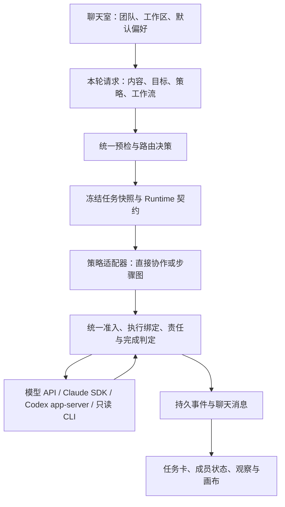

# 编排入口收敛实施计划（实施中）

状态：**实施中。用户已授权实施 O1–O3；三阶段本地实现完成，O4–O7 尚未启动。**
日期：2026-10-06。阶段编号采用 **O1–O7**，避免与已实施的外部 Agent A–D、账户 E1–E4、历史 Collaboration 阶段编号混淆。

## 1. 评审摘要

建议把现在的“创建聊天室时选一种永久协作模式”改成：**聊天室管理团队与工作区，每轮消息选择参与者、执行策略和可选工作流；服务器通过统一提交服务生成执行决策，现有 Runtime 负责派发、等待、恢复与完成。**

用户日常只需选团队、输入任务并发送。需要明确安排时，可以 `@成员`，或为本轮选择“并行分析”“顺序接力”；涉及代码交付时，选择“开发与评审”等工作流。Claude Code SDK、Codex app-server 与模型 API 成员共同参与，准入由能力决定。

这项工作包含服务器收敛、外部 Agent 执行绑定、交互改版和迁移。只把模式选项重新命名，会留下后续消息路由、外部 Agent 规划禁用、审批权限和完成状态不一致的问题。

交互评审入口：[可点击原型](../prototypes/orchestration-entry-review.html)。原型全部使用模拟数据，任何“发送”“审批”“重试”都不会调用模型或修改项目文件。

### 建议批准的产品决策

| 决策 | 推荐方案 | 评审时可以调整的部分 |
|---|---|---|
| 聊天室属性 | 团队、工作区、默认偏好；协作模式改为任务属性 | 是否在高级设置提供聊天室默认策略 |
| 默认体验 | 本轮“自动”，可以明确指定成员；候选团队不等于全员调用 | 自动路由说明的展开程度 |
| 策略选项 | 自动、并行分析、顺序接力；单人由目标数量体现 | 名称与位置 |
| 工作流选项 | 常规协作、分析与汇总、开发与评审、主管拆解、固定轮次辩论 | 首批是否只公开前三项 |
| 外部成员 | SDK/app-server 可作执行者、评审者；首批主管仍要求模型 API 的协调能力 | 原生 Agent 当主管留到后续专项 |
| 本轮偏好 | 发送后回到聊天室默认策略；“设为默认”由用户显式操作 | 是否记住上轮策略，但必须显示作用范围 |
| 忙碌处理 | 同成员排队；独立成员在工作区权限允许时并行 | 首批灰度是否先保留聊天室串行 |
| 复杂任务 | 首次执行前确认计划；改人、改工作区、改流程后重新预览 | 低风险计划是否允许用户开启自动确认 |
| 已有聊天室 | 原模式转换为可见默认偏好；已有 Run 保留冻结契约 | 是否提示用户一键切换为“自动”默认 |

## 2. 调研基线与可借鉴边界

agent-gand 基线是当前工作区：HEAD `883a3e9` 加尚未提交的 A–D、E1–E4 与交互修复。以下“现状”以代码为准，历史实施计划不视为当前完整规格。

Clowder 基线固定到 `6860fe8616240e5400c92782294cbb25a5e47f9d`，完整核对见[源码调研报告](../research/clowder-collaboration-dispatch-research.md)。它提供的主要启发是：**会话候选团队、当轮路由、协作控制、工作流阶段和执行后端分别管理。**

| Clowder 已核对行为 | 本项目拟采用的做法 | 边界 |
|---|---|---|
| `IntentParser` 识别 ideate/execute，`AgentRouter` 决定 parallel/serial | 当轮意图与策略独立于聊天室 | 不能据此声称它会自动产生任意任务 DAG |
| 显式 @ 优先，候选团队与实际调用目标不同 | 团队与“本轮交给谁”分别显示 | 多选团队不自动调用所有成员 |
| 串行 Worklist 支持接力，parallel 独立调用 | 支持接力、并行分析和明确的汇总步骤 | 并行分析默认没有自动汇总结论 |
| 工作流 SOP 记录阶段、持棒人、检查项、恢复说明 | 任务卡展示阶段、当前负责人、下一步、验证记录 | 开发流程按风险选择步骤，不把所有流程强制串成一条链 |
| Turn Custody 区分交接、等待、完成 | 继续使用本项目的 Subject/Custody、Hold/Wake、ExitGuard | “我做完了”的文本不能直接改变 Run 完成状态 |
| `AgentService.invoke` 统一多后端调用 | 统一执行绑定与 BackendInvoker，保留各后端能力差异 | Clowder 当前 Claude 默认 CLI，不能称其默认使用 Claude SDK |

参考源码：[意图解析](https://github.com/zts212653/clowder-ai/blob/6860fe8616240e5400c92782294cbb25a5e47f9d/packages/api/src/domains/cats/services/context/IntentParser.ts#L82)、[路由](https://github.com/zts212653/clowder-ai/blob/6860fe8616240e5400c92782294cbb25a5e47f9d/packages/api/src/domains/cats/services/agents/routing/AgentRouter.ts#L1407)、[开发 SOP](https://github.com/zts212653/clowder-ai/blob/6860fe8616240e5400c92782294cbb25a5e47f9d/sop-definitions/development.yaml#L4)。Clowder 的部分 Worklist、多目标响应收集保存在内存，本项目已经具备持久 Runtime，应继续沿用自己的恢复契约。

## 3. 当前入口与必须处理的差距

| 当前入口/能力 | 现状 | 收敛要求 |
|---|---|---|
| 新建聊天室 | 智能匹配、自由协作、主管委派、顺序流水线四种选择；创建即绑定模式并发起任务 | 建房和发任务可以分开；选择团队不会改变策略 |
| 发送后续消息 | 基于 `conversation.mode` 与追问规则决定执行路径 | 根据本轮明确请求决定，覆盖 @、回复、全队、普通追问 |
| Coordination Preview/Plan | 多个协议名；预览和编译整体拒绝外部 Agent | 根据每个步骤与执行后端能力逐项准入 |
| 直接 Run API | 保留单独的创建入口 | 成为统一提交服务的兼容入口 |
| Dispatcher | Coordination、Collaboration、fast path、pipeline、supervisor 分支 | 共用提交、准入、执行权限和完成判定，策略只决定参与者与依赖 |
| 动态协作协议 | `dynamic_collaboration` 编译回退为单成员响应 | 接入真正的 Collaboration 调度，不保留名称与执行语义不一致的路径 |
| 主管 DAG | 当前模板主要是固定 plan/execute 步骤 | 完成真实步骤图适配后再公开“主管拆解”完整能力 |
| 共识/投票 | 注册协议，但没有可执行 runtimeMode | 首批不作为可运行工作流公开 |
| 外部 Agent 权限 | Collaboration 绑定 Runtime；其他路径查询 `task_attempts`，Coordination 使用另一类 attempt | 建立可辨识的执行绑定，不能仅删除“拒绝外部成员”判断 |
| 状态显示 | 聊天室/Run 模式影响顶部、侧栏、观察、画布标签 | 显示本轮任务策略、工作流与真实责任状态 |

关键代码：前端 [RunView](../../apps/web/src/components/views/RunView.tsx)，服务器 [routes](../../apps/server/src/api/routes.ts)、[dispatcher](../../apps/server/src/conversations/dispatcher.ts)、[Coordination service](../../apps/server/src/coordination/service.ts)、[协议](../../apps/server/src/coordination/protocols.ts)、[外部执行器](../../apps/server/src/execution/runner.ts)、[执行权限](../../apps/server/src/execution/authority.ts)。

## 4. 范围与完成标准

### 纳入本次

1. 所有任务创建入口经过一个服务器提交边界；预览与执行使用同一份规范化请求。
2. 团队、当轮参与者、策略、工作流、后端五个维度在代码和 UI 中分开。
3. Claude SDK、Codex app-server 能参与已实现的自动路由、顺序步骤、并行只读步骤、开发评审；每种组合有验证。
4. 不适用的组合在执行前解释原因，并提供可执行的调整方式。
5. 任务级队列、交接、等待、审批、恢复、停止和评审返工形成一致交互。
6. 迁移旧聊天室与旧草稿，保留正在运行的冻结策略；逐步去除业务依赖 `conversation.mode` 的分支。
7. 更新观察/画布与测试，提供真实后端最小验收入口。

### 暂不纳入

新增账户功能、Base URL 直接选择器、全新外部 Agent 驱动、外部 Agent 担任主管、投票/共识协议、自动合并工作树、自动提交/推送/部署、任意任务执行中即时注入消息。它们不是收敛入口的前置条件。

### 最终完成标准

同一份规范化请求，无论来自建房、消息框、@、回复、工作流面板或旧 API，都得到相同的路由决策与冻结执行契约。每个执行事件、审批和完成候选都能对应有效的任务责任与 attempt。界面可以回答：**谁在处理、为什么分给他、下一步是什么、在等什么、用户现在可以做什么。**

## 5. 产品模型：一间房、多轮任务



### 5.1 聊天室

保存团队、已注册工作区、默认偏好、可选默认主管/评审者。团队是候选范围，不等于每轮全部调用。新建可以只建房，空房不会生成 Run 或消耗模型额度；也可以一次性“创建并发送”。

选中“鸡腿”只把它加入候选团队，不改变模式、不改变布局宽度、不立即调用账户。已有角色、账户模块继续使用当前能力。

### 5.2 本轮请求

至少包括内容、目标成员、回复关系、策略、工作流、约束、客户端请求 ID。界面明确显示“仅本轮”，默认从聊天室偏好初始化。发送后恢复默认；修改默认是单独操作。

单人任务不需要额外选一种“单人模式”。`@鸡腿` 指定本轮目标；多成员独立分析可以选“并行分析”；需要先后关系时选“顺序接力”并排列接力顺序。

### 5.3 策略与工作流

| 层级 | 对用户显示 | 对执行的影响 |
|---|---|---|
| 策略 | 自动 | 服务端结合明确目标、任务约束与可用能力决定参与者和依赖，并解释决策 |
| 策略 | 并行分析 | 多成员读取同一输入独立输出；默认只读，无隐式汇总 |
| 策略 | 顺序接力 | 明确顺序；下游消费上游输出或制品，失败阻断依赖步骤 |
| 工作流 | 常规协作 | 直接答复或 Runtime 接力/咨询；不强制加入评审 |
| 工作流 | 分析与汇总 | 明确并行分析成员及汇总者，全部必要分支结束后汇总 |
| 工作流 | 开发与评审 | 执行、制品快照、独立评审、失败返工、重新评审、完成门禁 |
| 工作流 | 主管拆解 | 合法主管提出有依赖的步骤计划，经确认后执行；依据实际 DAG 支持范围展示 |
| 工作流 | 固定轮次辩论 | 明确参与者、轮次、结束条件与可选总结者，遵守轮次/预算限制 |

工作流决定必要结构；策略只能在其允许的范围内调整。例如开发评审的“执行→评审”依赖不能因为选择“并行分析”而消失。互斥选项直接禁用并解释，不接受后再偷偷换模式。

### 5.4 路由优先级

1. 安全、账户配置、权限和后端能力属于硬约束。
2. 显式工作流决定必要角色和步骤；与显式目标冲突时先给出修正卡。
3. 显式策略、成员及接力顺序优先于自动推断。
4. 自动策略处理任务明确约束，再参考健康信息、近期上下文、团队偏好。
5. 简单任务用确定性规则；复杂拆解可以调用具备协调能力的模型 API planner。

`@` 只解析有效成员提及，不把正文偶然出现的人名当指派。团队外成员需要显式确认加入并更新团队版本。回复某条消息可提供上下文，但不暗中修改正在执行的冻结计划。

多目标且任务是独立只读分析时，自动策略可建议并行；包含写文件或依赖关系时，建议顺序/隔离工作树，并明确展示安排。无法判断时只问最关键的一项，例如“需要独立分析，还是接力修改？”。SDK-only 团队的单人或常规接力不依赖模型 API 主管；需要复杂主管拆解时才要求合适的协调成员。

## 6. 外部 Agent 的准入矩阵

以下是**目标矩阵**，不是现有功能宣告。能力由服务器依据驱动、角色声明、账户配置和实际执行政策计算，界面不能自行放开。

| 场景 | 模型 API | Claude SDK | Codex app-server | 只读 CLI |
|---|---|---|---|---|
| 自动选择作执行成员 | 支持 | O2/O4 验证后支持 | O2/O4 验证后支持 | 仅已实现的明确只读任务 |
| 顺序步骤 | 支持 | 支持；验证 attempt 绑定与制品 | 支持；验证 attempt 绑定与制品 | 只读简单步骤，受现有准入约束 |
| 并行分析 | 支持 | 只读策略有效时支持 | 只读策略有效时支持 | 首批不默认加入复杂工作流 |
| 开发实现 | 按工具权限 | 注册 Git 工作区、写锁、审批 | 注册 Git 工作区、写锁、审批 | 不支持写入 |
| 独立评审 | 评审能力、只读快照 | 评审能力、只读快照 | 评审能力、只读快照 | 首批不承诺结构化评审与恢复 |
| 主管/复杂规划 | 具备 coordinate 能力 | 本期不支持 | 本期不支持 | 不支持 |
| 动态接力/咨询 | Runtime 控制工具 | 现有双向控制通道 | 现有双向控制通道 | 不支持双向控制 |
| 等待与恢复 | 按冻结契约 | 按驱动可恢复能力与会话绑定 | 按驱动可恢复能力与会话绑定 | 不承诺原生会话恢复 |

“账户已配置”与“真实服务已验证可用”分别显示。预览不主动 ping 供应商。真实额度、模型权限、401/403 等仍可能在实际调用时失败，失败应绑定到任务和成员，并给出账户修正入口。

需要严格 token 上限的请求，只能交给能够落实该限制的组合；外部后端无法准确执行时不得把硬限制悄悄降为估算。截止时间、轮次、审批和工具权限继续执行现有政策。

## 7. 服务器契约与执行收敛

### 7.1 拟新增的领域对象

名称用于指导实现，字段在 O1 评审后落地；不把 `auto` 加入旧 `RunMode` 联合类型。

| 对象 | 核心内容 | 生命周期 |
|---|---|---|
| `OrchestrationRequest` | 来源、room、内容、目标、策略、工作流、约束、回复、clientRequestId | 规范化后不可变 |
| `CapabilitySnapshot` | 角色版本、驱动、可执行动作、工具/写入/恢复限制、账户配置版本 | 预览及运行快照；不保存明文密钥 |
| `OrchestrationDecision` | 目标、原因、协议/步骤、必要评审、阻塞项、确认要求 | 预览结果 |
| `RunOrchestrationSnapshot` | request/decision、模板版本、能力摘要、workspace binding、冻结引用 | 新 Run 的编排权威 |
| `ExecutionBinding` | attempt 来源、原记录 ID、subject、custody generation、contract/plan revision、lease、workspace、session scope | 每次执行与恢复 |

预览指纹覆盖任务内容、团队版本、角色与账户配置版本、能力摘要、工作区和模板版本。发送时原子复核；过期返回需要更新的预览，不能沿用旧参与者继续执行。

### 7.2 统一提交与预览

拟新增服务 `orchestration/service.ts`、`resolver.ts`、`capabilities.ts` 与策略适配器；现有同目录编排代码逐步通过此服务调用。

| API | 目标行为 |
|---|---|
| `POST /api/orchestration/preview`（拟新增） | 规范化与能力检查、生成决策草稿；无执行派发，无原生 Agent 调用 |
| `POST /api/conversations/:id/requests`（拟新增） | 提交本轮请求，必要时附已确认预览；返回 request/run、排队状态与决策 |
| `POST /api/conversations`（扩展） | 新格式 `entryVersion: 1` 支持团队/工作区/默认偏好和可选 initialRequest；旧 goal/mode 输入走兼容转换 |
| 旧 messages、runs、coordination 接口 | 保留对外契约，通过同一提交/预览服务；记录 legacy 来源供迁移观察 |
| pause/resume/cancel 等动作 | 进入任务级动作服务，验证 run/subject/decision/generation；旧接口仅包装 |

用户请求的幂等键按聊天室限定。相同键且相同载荷返回既有结果；相同键但内容不同返回 409。Run、用户消息、编排快照和必要初始记录在事务中写入，提交后调度；进程重启从持久状态恢复。预览不创建 pending Run，也不占执行槽。

默认预览使用规则和已配置模板，不消耗模型额度。复杂任务的“生成详细计划”是单独、明确的操作，界面提示可能调用模型 API planner 并消耗额度；该调用只生成版本化草稿，不派发执行成员。草稿确认后的执行仍要重新检查指纹、权限和能力。

### 7.3 执行绑定解决外部成员接入

不能只移除 Coordination 对外部 Agent 的拒绝判断。当前权限判断在非 Collaboration 路径查 `task_attempts`，但步骤执行来自 `coordination_step_attempts`；审批与 MCP 也依赖这个权限判断。

O2 新建可辨识的绑定来源：`collaboration_attempt`、`coordination_step_attempt`、`task_attempt`。绑定引用**现有一条 attempt 记录**，不复制 attempt，不建立第二套状态机或任务队列。必要的映射元数据必须具有唯一约束，并与原记录同事务保存。

统一绑定校验供模型调用、原生事件、MCP、审批恢复、会话恢复和完成候选使用。每次检查来源、租约、责任代次、冻结版本、工具权限与工作区；未知或已失效绑定拒绝执行。过期事件不能续写消息、产生审批或完成旧任务。

Coordination 的图依赖和步骤领取继续由现有协调器管理，步骤/Run 完成继续交给共享 Runtime。步骤内接力不能越过图约束、改派必需评审或跳过完成门禁；需要改图时经过 PlanRevision。

### 7.4 调度与完成

策略适配器只决定目标、步骤、依赖、允许的控制动作；共享准入和执行绑定负责启动后端。简单单人、顺序和旧 fast path 最终都通过一致的责任契约与终态提交。

复用已有 Subject/Custody、CompletionCandidate、EvidenceBundle、DurableHold/Wake、租约与原子终态 CAS，参见[Run policy](../architecture/runtime-run-policy.md)、[Coordination kernel 闭环](../architecture/runtime-coordination-kernel-closure.md)、[责任快照](../architecture/runtime-responsibility-snapshot.md)。不重建 Runtime，不恢复已经退出新任务路径的 Collaboration shadow/atomic_compat profile。

现有聊天室整 Run 串行锁在 O3 分两步收敛：先保证所有路径使用统一准入；再按“聊天室 + 成员”持久执行槽放开独立成员并发。槽负责互斥和租约，待执行工作仍来自已有持久 Run/Subject/Step。相同成员按入队顺序执行；步骤依赖不能因抢到槽而提前开始。根任务是否可同时推进还要通过工作区锁和模板约束。

所有必要分支与评审满足完成条件后，才能提交 Run 终态。失败、等待、超时和仅输出 ACK 都不算完成。已失败的必要分支不能被汇总文本掩盖；“接受部分结果”必须由用户明确确认，并记录哪些目标未达成。

接受部分结果不能修改已经冻结的 requiredSubjectKeys，或把失败分支伪装为成功。旧任务按实际结果收尾并记录用户接受的范围；如需缩小目标后继续汇总，创建关联的新请求与新契约，复用被验证的已有证据。首批未完成这套范围修订时，只开放“查看部分结果”和“重试失败分支”。

### 7.5 工作区、会话和制品

区分真实编码目录与制品命名空间。Coordination 的 plan scope 不能随意改变编码 cwd，绕过“注册 Git 根目录”的准入。`workspace binding` 应包括注册根目录、实际工作树、基线、读写模式、锁与制品范围。

只读分析可共享读取；同一工作树的写任务互斥。真正并行写入需要已有 managed worktree 隔离，不自动合并。评审绑定不可变制品快照；返工产生新快照，旧 PASS 不再覆盖新内容。

账户、角色、工具、工作区和会话范围继续冻结。账户换 Key 后，历史 Run 不悄悄切换到新凭证；重试按照兼容恢复条件产生新执行代次或新的任务，并留下可追溯关联。未知写入中断先检查工作树和证据，不能盲目重放。

## 8. 预期交互与完整用户旅程

### 8.1 新建聊天室

1. 点“新建聊天室”，填写名称、选择舰队成员和已注册工作区。
2. 成员卡显示执行/评审/协调能力、账户配置状态。模型名和驱动在详情中，主界面不暴露内部路径。
3. 默认偏好折叠：自动策略、可选评审者；选中外部成员不切换策略。
4. “创建聊天室”进入空房；“创建并发送”在填写首个任务后启用。

```text
新建聊天室
名称 [项目协作                         ]
工作区 [agent-gand                     v]
舰队成员 [Planner ✓] [Coder ✓] [鸡腿 ✓] [Reviewer ✓]
  成员是候选团队，每轮可以只指派其中一位。
高级：默认偏好（折叠）
                              [创建聊天室]
```

### 8.2 日常自动任务：明确使用 Claude SDK

输入 `@鸡腿 检查登录失败的原因`，保持“自动 / 常规协作”，点发送。任务卡显示“鸡腿处理 · 你明确指定了成员 · 只读检查”，随后显示正在处理/结果。不会因它是 SDK 切到流水线。

未 @ 时服务器从候选团队选择执行成员，并给出简短原因。用户可以展开“查看安排”，看到未调用全队的理由；更改本轮目标后重新发送。

### 8.3 多人分析与汇总

选“并行分析”，本轮目标选鸡腿和 Reviewer，发送接口方案比较。两条输出独立展示，顶部显示完成数。没有选择汇总者时，不额外调用主管。

若选“分析与汇总”工作流，则配置两个分析成员及一个汇总者，预览显示“2 个分析步骤 → 1 个汇总步骤”。一个分析失败时，汇总等待；用户可以重试该分支或明确接受部分结果。

### 8.4 顺序接力

选“顺序接力”，排列 `鸡腿 → Coder`，展示“先检查，再根据检查结果处理”。每步显示负责人、输入来源和结果。失败阻断后续；重试有效失败步骤不会重新执行已确认的成功步骤。涉及未知写入时先展示工作区检查结果。

### 8.5 开发与评审

1. 选择“开发与评审”，实现者选鸡腿，评审者选 Reviewer，确认工作区和权限。
2. 计划预览：实现 → 测试/制品快照 → 独立评审 → 必要时返工与复审。测试按任务风险与现有工具能力确定，不强制执行无关检查。
3. 用户确认计划后启动。代码写入及原生危险工具仍按当前政策审批。
4. 评审 FAIL：任务卡显示具体问题和待返工负责人；接力给实现者，不能直接宣布完成。
5. 新快照复审 PASS 且必要证据齐备后显示完成；展开查看文件差异、测试结果、评审结论。
6. 提交、推送、合并和部署不隐含在“完成”按钮中，沿用用户明确授权规则。

### 8.6 主管拆解与辩论

主管拆解要求可协调的模型 API 角色。预览展示真实有依赖的任务图及必需步骤；用户可调整参与者，再确认。图修订必须生成新版本并验证旧步骤的失效边界。

辩论配置参与者和固定轮次，清楚显示当前轮次、剩余预算、结束条件和是否需要总结者。不能只在提示词中写“辩论”，却实际执行单人响应。

### 8.7 成员忙碌与新消息

鸡腿执行任务 A 时，发给鸡腿的新任务 B 显示“排队，前方 1 个任务”；不会停止 A。发给空闲 Reviewer 的独立只读任务 C，在权限允许时可以同时推进。成员条显示忙碌任务与队列数量。

消息框默认“新任务”。“补充当前任务”只在任务等用户回答，或用户选择暂停并修订到安全边界时出现。普通回复默认新建带上下文的请求，不承诺对原生进程即时注入。

### 8.8 等待、审批、恢复与失败

| 状态 | 界面 | 用户动作与结果 |
|---|---|---|
| 等待用户澄清 | 任务卡内显示一个明确问题、输入框 | 回答绑定原 decision/subject/generation，继续原任务，不另建孤立 Run |
| 等待工具审批 | 独立审批卡：动作、工作区、影响 | 批准/拒绝进入现有审批政策，审批事件可追溯 |
| 等待队列/依赖 | 排队原因、前置步骤、负责人 | 可以取消本任务；不影响其他任务 |
| 已暂停 | 暂停原因、当前安全边界 | 恢复校验冻结配置与 lease，必要时先检查制品 |
| 账户认证失败 | 显示成员及账户名称、错误分类 | 前往账户模块修复；重试产生可追溯执行，不显示完整 Key |
| 超时/中断 | 显示已知输出及工作区状态 | 无写入可安全重试；未知写入先检查，禁止盲目重复副作用 |
| 部分失败 | 分支成功/失败明细 | 重试失败分支或明确接受部分结果；不能自动标为全量成功 |
| 已停止 | 仅指定任务停止、收尾证据 | 清理其有效责任与原生调用；其他任务继续 |

### 8.9 页面布局与观察

聊天室顶部只显示名称、团队与工作区。每张任务卡显示策略、工作流、负责人、阶段和状态。观察与画布按 task/run 筛选，显示同一份持久快照，不自行根据聊天室旧 mode 推断。

桌面消息区域固定最大宽度，成员详情/错误/预览在内部展开，保留滚动条空间；窄屏策略区域换行，任务详情可折叠。选中或取消鸡腿、SDK 错误出现、任务卡展开时，主内容宽度不变化。

## 9. 阶段实施与交付门禁

各阶段结束必须提供变更说明、验证报告和可验收入口。除 O5 原型工作可提前并行设计外，执行能力按 **O1 → O2 → O3 → O4 → O5 → O6 → O7** 合入；不能先打开 UI 开关再补执行权限。

### O1：统一请求契约与入口盘点

状态：已完成本地实现与专项验证。契约与实际边界见[O1 架构](../architecture/orchestration-entry-phase-o1.md)，验证见[O1 验收报告](../reports/orchestration-entry-phase-o1-acceptance.md)。本阶段比较建议不改变旧执行权威。

**交付**：shared 的请求/决策/能力快照协议；统一规范化、预检与幂等服务；所有旧入口映射清单；数据库增量迁移设计；现状与目标能力矩阵；纯预览接口。先以比较模式验证新决策，不改变已有执行行为。

**涉及**：`packages/shared/src`、`api/routes.ts`、`orchestration`、`coordination/service.ts`、`agents/preflight.ts`、数据库迁移。

**验收**：相同请求从建房/消息/@/回复/旧 Run API 规范化得到相同关键字段；预览没有派发副作用；幂等冲突 409；角色/团队变化使预览失效；旧接口返回契约不破坏。

### O2：执行绑定与外部成员步骤准入

状态：已完成本地实现与 fixture 验证。具体准入、执行绑定、工作区/评审、暂停及恢复边界见[O2 架构](../architecture/orchestration-entry-phase-o2.md)，证据见[O2 验收记录](../reports/orchestration-entry-phase-o2-acceptance.md)。真实供应商连接未在本阶段验收。

**交付**：ExecutionBinding、统一权限查询；SDK/Codex 步骤执行与评审适配；工作区/会话/审批/MCP 绑定；能力驱动的错误说明。按已验证组合逐项移除外部成员 blanket rejection。

**涉及**：`execution/authority.ts`、`runner.ts`、原生驱动、Coordination runtime、工作区、审批、sessions。

**验收**：API、SDK、app-server 的单步和评审本地 fixture；Coordination attempt 不再被当成 task attempt；失效 generation、lease、revision 不能执行；暂停/审批/重启恢复正确；只读 CLI 和外部主管限制仍准确。

### O3：调度与终态入口收敛

状态：已完成本地实现与专项验证。兼容 TaskAttempt 适配、成员 FIFO、终态与动作边界见[O3 架构](../architecture/orchestration-entry-phase-o3.md)，验证见[O3 验收记录](../reports/orchestration-entry-phase-o3-acceptance.md)。真实供应商验收、原生写入工作树重试迁移及完整前端任务卡仍按后续阶段执行。

**交付**：策略适配器共用执行准入；直接任务、fast path、旧 pipeline/supervisor 收敛至有效 Runtime 契约；同成员持久互斥与 FIFO；独立成员并发；任务级动作服务和一致终态提交。

**涉及**：`conversations/dispatcher.ts`、`orchestration/agentStep.ts`、pipeline/supervisor、Runtime admission/leases、终态提交。

**验收**：一个成员不同时执行两个冲突任务；多个成员可独立只读；写锁不会被跨 Run 绕过；重复回调/完成只提交一次；空输出和 ACK 不造成假完成；取消 A 不取消 B；重启恢复队列不重复调用。

### O4：策略解析与工作流执行闭环

**交付**：确定性路由、可选复杂 planner、版本化模板；常规动态协作接现有 scheduler；明确分析/汇总；开发评审/返工；真实主管 DAG；固定轮次辩论。未实现协议继续不公开。

**涉及**：resolver、Coordination protocols/compiler/planner/runtime、Collaboration scheduler、PlanRevision、能力快照。

**验收**：SDK/app-server 不再因“自动”整体被禁用；单人、多目标、写任务、显式策略优先级正确；动态协作不退化为单人 fallback；汇总依赖和评审门禁有效；主管图真实执行；轮次与预算确实限制执行。

### O5：前端统一入口与任务交互

**交付**：建房/首轮/后续同一消息组件；团队与本轮目标；策略/工作流控件；计划确认；任务卡/队列/等待/审批/返工；观察/画布标签；v2 草稿迁移。

**涉及**：RunView/RoomComposer（可抽取）、roomDraft、API service、App、SideNav、Observe/Canvas、公共任务状态投影。

**验收**：完成第 8 节旅程；选择鸡腿不换模式且宽度稳定；控制台无错误；键盘可操作；390px、768px、1440px 无横向溢出；用户明确知道本轮目标、默认偏好、当前任务和操作影响。

### O6：迁移、兼容和故障恢复

**交付**：新增表/字段版本化迁移；旧 mode 默认偏好映射；旧草稿安全升级；旧 API 包装；灰度开关；迁移审计及回滚说明；跨进程故障验证。

**验收**：旧终态记录可读取；旧活跃 Run 不重新规划；回滚关闭新任务入口，已有新契约由兼容 worker 继续收尾；不删除新状态或降级契约；重复升级不产生重复任务；未知副作用必须经过检查。

### O7：整体验收与收尾

**交付**：本地服务、演示脚本与测试报告；用户指定账户的最小真实测试；文档与 API 迁移说明；弃用入口统计及清理清单。

**验收**：自动/接力/分析/开发评审/等待恢复分别通过；至少一条真实 Claude SDK 与一条真实 Codex app-server 任务在用户账户环境验收；真实服务失败与本地契约通过分别报告；用户确认后再清理兼容分支。

没有真实账户可用时，不能把 fixture 通过写成真实供应商验收通过；本地功能与真实后端状态分别标记。

## 10. 数据迁移与灰度策略

1. **增量添加** request/decision/snapshot、execution binding 引用和任务偏好；字段带版本，旧数据保持可读取。不直接把 SQL `mode` 列换成新枚举。
2. **旧聊天室映射**：collaboration → 自动/常规协作；pipeline → 顺序接力默认；supervisor → 主管拆解默认，但没有合适主管或模板未启用时显示需要配置。映射展示给用户，不自动重跑历史。
3. **旧任务不变**：已经创建的 Run、Runtime profile、PlanRevision、账户/会话版本继续冻结。新入口只影响新请求。
4. **旧草稿升级**：保存名称、内容、成员、工作区和明确模式偏好；新字段从兼容规则补齐。坏草稿给恢复提示，不能静默丢失用户输入。
5. **灰度顺序**：预览比较 → 模型 API 任务 → SDK → app-server → 只读 CLI 已验证子集。允许按新提交入口、模板、驱动设开关；所有新任务采用有效执行契约，不使用退役 shadow profile 承接新执行。
6. **回滚**：关闭新请求接入、保留既有任务对应的 worker；不能让旧二进制盲读它不认识的新契约。提供受支持版本回滚范围、数据库兼容检查与活跃任务清单。
7. **清理条件**：各入口调用统计、旧格式调用方清单、迁移核对完成且用户验收。旧 API 弃用通知早于移除；不能仅因 UI 已切换就删除接口。

## 11. 验证矩阵与质量门禁

| 范围 | 必须证明的行为 |
|---|---|
| 请求/路由 | @、无目标、多目标、团队外成员、回复、全队、显式顺序、策略冲突、能力不足、预览过期 |
| 幂等/事务 | 同键同内容返回同任务；不同内容 409；事务失败无半条任务；并发重复提交只派发一次 |
| 后端 | API/SDK/app-server 各自执行与评审；CLI 受限行为；账户隔离；native result/error 分类 |
| 权限 | 租约失效、旧代次、旧 plan revision、暂停/取消后事件、审批回调与 MCP 的失效拒绝 |
| Runtime | handoff/consult/hold/complete、空输出、必需分支失败、评审 FAIL/PASS、完成 CAS |
| 并发 | 同成员 FIFO、不同成员并行、共享只读、独占写锁、独立工作树、依赖未满足不领取 |
| 故障 | 领取前/后崩溃、发送调用后未记结果、审批等待重启、返工途中暂停、未知写入中断 |
| UI | 建房与发送分离、SDK 目标不换策略、稳定宽度、移动端、键盘、任务动作范围、持久结果刷新 |
| 迁移 | 旧活跃/终态任务、旧 draft、旧 API、升级重复执行、关闭灰度后的已有任务收尾 |

增加与行为相关的 fixture/集成测试，沿用已有 Runtime 与外部 Agent 验证脚本。每阶段运行适用检查、类型检查与相关验证；最终运行项目要求的构建/文档检查。UI 原型只验证交互规格，不能替代业务测试。

真实后端测试先检查账户、工作区、审批与额度，由用户已有授权范围启动最小请求；使用临时受管理工作树验收写入。测试报告不得保存完整 Key、Token 或敏感账户响应。

## 12. 可观测性、风险和评审交付

任务事件统一关联 requestId、runId、subjectId、attempt origin/id、generation、plan revision 和 driver；页面只展示用户需要的解释，内部标识放诊断详情。监控提交去重、预览失效、队列等待、失效事件拒绝、审批恢复失败、重复终态和未知副作用。

| 主要风险 | 处理与完成条件 |
|---|---|
| UI 收敛但服务器仍走不同分支 | O1 完成入口清单，O3 逐条对照契约测试；旧 API 同样验证 |
| 放开 SDK 后 attempt 权限不匹配 | O2 先落执行绑定，再打开准入；审批/MCP 与普通事件一起验证 |
| 并行写入或旧事件产生副作用 | 工作区锁、generation/lease 校验、快照评审；未知写入先检查 |
| 自动路由与用户意图冲突 | 显式策略与目标优先；不能兼容时预览阻塞并解释 |
| “动态/主管/辩论”名称大于实际能力 | 模板公开前通过真实执行语义测试；未完成协议不出现在菜单 |
| 跨版本运行与回滚破坏恢复 | 任务冻结版本，保留兼容 worker；回滚不降级活跃契约 |
| 工期扩大 | O1/O2/O3 先完成基础；O4 按模板逐项启用，O5 按已通过组合呈现 |

本方案不承诺固定日历工期。评审通过后先做 O1，阶段结束给出实际差距与下一阶段工作量；每个阶段都可独立验收，不能以页面完成代替 Runtime 收敛。

后续交互评审重点：团队/本轮目标分离是否符合使用习惯；策略与工作流的名称是否清楚；默认偏好是否需要记忆；开发评审是否必需独立成员；忙碌时排队/并行是否符合预期；首批公开哪些模板。原型继续供 O5 交互评审，具体执行阶段按用户后续授权启动。
