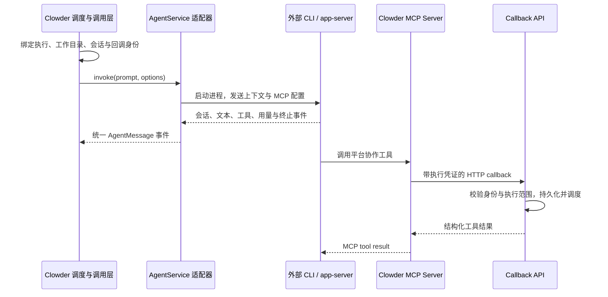

# Clowder AI 外部 Code Agent 接入源码调研

本报告研究外部项目的实现与对 agent-gand 的适用性，不是已生效架构规格。实施建议见 [外部 Code Agent 接入草案](../plans/external-code-agent-integration-plan.md)。

## 1. 基线与结论

- Clowder AI：公开仓库默认分支下载后的 [`b1fe2966fa0a97d1e3cd2e174ed59fd1477b4fc4`](https://github.com/zts212653/clowder-ai/commit/b1fe2966fa0a97d1e3cd2e174ed59fd1477b4fc4)。下文源码链接固定到这个提交，避免把网页缓存或旧报告当作当前实现。
- agent-gand：本地干净工作树，分析基线 `58479368be3e8fe33bf135499d3ad17ba219894d`。
- 方法：静态阅读源码并核对官方文档，没有安装或执行 Clowder 的依赖，没有运行真实 agent 或消费模型额度。

**Clowder 把外部编码 agent 当作完整执行引擎接入。默认 Claude 路径是 `claude -p`，默认 Codex 路径是 `codex exec --json`；平台提供上下文、工作目录、会话绑定、取消信号和 MCP 回调，适配器把原生输出归一化为平台事件。**

因此，agent-gand 应增加与现有 LLM 工具循环并列的执行后端。只在 `llm/router.ts` 加一个模型前缀，不能保留外部 agent 的会话、原生工具执行、双向审批和中断恢复语义。

## 2. 一次调用如何走通



这里存在两个独立的数据通道：原生 agent 的输出流用于观察执行；MCP 回调用于向平台提交消息、协作请求等操作。读取 stdout 不等于拥有工具执行前的审批能力。

主要入口证据：

- [服务组装 `index.ts`](https://github.com/zts212653/clowder-ai/blob/b1fe2966fa0a97d1e3cd2e174ed59fd1477b4fc4/packages/api/src/index.ts#L1960)：ACP 配置先于 `clientId` 分支解析；其余分支装配 Claude、Codex、Gemini、Kimi、OpenCode 等服务。
- [接口 `types.ts`](https://github.com/zts212653/clowder-ai/blob/b1fe2966fa0a97d1e3cd2e174ed59fd1477b4fc4/packages/api/src/domains/cats/services/types.ts#L988)：核心是 `invoke(prompt, options): AsyncIterable<AgentMessage>`，另有按能力声明的原生控制接口。
- [调用层 `invoke-single-cat.ts`](https://github.com/zts212653/clowder-ai/blob/b1fe2966fa0a97d1e3cd2e174ed59fd1477b4fc4/packages/api/src/domains/cats/services/agents/invocation/invoke-single-cat.ts#L1538)：创建执行身份，合并超时/取消信号，注入回调环境，处理会话、账户、上下文和输出。

## 3. Claude Code 接入

### 3.1 默认载体

[`ClaudeAgentService.ts`](https://github.com/zts212653/clowder-ai/blob/b1fe2966fa0a97d1e3cd2e174ed59fd1477b4fc4/packages/api/src/domains/cats/services/agents/providers/ClaudeAgentService.ts#L448) 组装的主要参数为：

```text
claude -p --output-format stream-json --include-partial-messages --verbose
       --model <effectiveModel> --effort <level>
       --permission-mode <mode>
       [--resume <sessionId>]
       --system-prompt-file <L0 file>
       [--append-system-prompt-file <context file>]
       [--mcp-config <configuration> --strict-mcp-config]
```

这是源码行为概括，省略了条件参数，不能直接当作 agent-gand 的默认启动命令。

主任务从 stdin 传入，避免长上下文触发命令行长度限制。稳定身份/治理指令和动态上下文分别使用原生 system prompt 文件。子进程收到实际工作目录及 AbortSignal。[启动位置](https://github.com/zts212653/clowder-ai/blob/b1fe2966fa0a97d1e3cd2e174ed59fd1477b4fc4/packages/api/src/domains/cats/services/agents/providers/ClaudeAgentService.ts#L830)。

Clowder 在调用时组装启用的 MCP 服务，并注入调用身份。使用严格 MCP 配置控制最终生效集合，同时按规则合并用户项目的服务配置。

### 3.2 输出解析

[`claude-ndjson-parser.ts`](https://github.com/zts212653/clowder-ai/blob/b1fe2966fa0a97d1e3cd2e174ed59fd1477b4fc4/packages/api/src/domains/cats/services/agents/providers/claude-ndjson-parser.ts) 处理以下事件：

| 原生事件 | 平台语义 |
|---|---|
| `system/init` | 保存 `session_id`，产生 `session_init` |
| `stream_event` 文本增量 | 流式文本 |
| `assistant` 的 tool_use/content blocks | 工具活动与完整文本回退 |
| `result` | 用量、成本估算、成功或错误判定 |

解析器按 message ID 跟踪已经发布的 partial text，避免再把完整 assistant 文本追加一次。thinking-only、工具事件和有正文输出也分别处理，不能用“收到过 stdout”判断成功。

### 3.3 当前已有多种载体

[`claude-carrier-factory.ts`](https://github.com/zts212653/clowder-ai/blob/b1fe2966fa0a97d1e3cd2e174ed59fd1477b4fc4/packages/api/src/domains/cats/services/agents/providers/claude-carrier-factory.ts) 支持 `print_sdk`、`bg_daemon`、`interactive_pty` 等载体及健康降级。默认未配置且健康时走 `-p`。

注意：源码中的 `print_sdk` 是载体名称；这里的 `ClaudeAgentService` 直接管理 CLI 子进程，并不意味着项目已经用 TypeScript `query()` 替代了 subprocess。

### 3.4 认证与权限的适用边界

源码支持订阅身份与 API key 两种账户配置。订阅模式会清理可能误导认证路由的 Anthropic 环境变量；API key 模式则注入 key、base URL 和模型配置。

当前 `ClaudeAgentService` 普通执行模式的 `PERMISSION_MODE` 常量是 `bypassPermissions`；特定 read-only 策略还会禁用原生工具和 MCP，并不是只传一个 `plan` 就结束。

这说明 Clowder 的默认命令不能原样满足 agent-gand 的 `readonly/confirm/auto` 契约。官方文档支持通过 Agent SDK 嵌入 Claude Code 的工具循环、会话和 hooks；工具被提前放行时不会进入 `canUseTool`，需要全调用门控时应使用 `PreToolUse` 并验证规则覆盖。[Agent SDK](https://code.claude.com/docs/en/agent-sdk/overview)、[权限求值顺序](https://code.claude.com/docs/en/agent-sdk/permissions)。

此外，官方 SDK 文档明确限制第三方产品提供 claude.ai 登录/额度，未获许可时应使用 API key。源码能复用本机订阅认证，不等于产品化 SDK 方案可以承诺复用用户订阅。[官方认证说明](https://code.claude.com/docs/en/agent-sdk/overview)。

## 4. Codex 接入

### 4.1 默认 exec JSON 路径

[`CodexAgentService.ts`](https://github.com/zts212653/clowder-ai/blob/b1fe2966fa0a97d1e3cd2e174ed59fd1477b4fc4/packages/api/src/domains/cats/services/agents/providers/CodexAgentService.ts#L1760) 区分新建和恢复：

```text
codex exec --json ... -- -
codex exec resume <sessionId> --json ... -- -
```

任务同样从 stdin 输入。配置包括模型、推理 effort、sandbox、approval policy、`developer_instructions`、MCP 服务和账户环境。恢复命令有不同的参数支持范围，源码通过 `--config sandbox_mode=...` 重放策略。

[`codex-event-transform.ts`](https://github.com/zts212653/clowder-ai/blob/b1fe2966fa0a97d1e3cd2e174ed59fd1477b4fc4/packages/api/src/domains/cats/services/agents/providers/codex-event-transform.ts) 把 `thread.started` 映射成会话初始化，把 command execution / file change / MCP 活动映射为工具事件，把 agent message 映射为文本。调用服务另从 `turn.completed` 提取 token usage。

`item.completed` 是一个输出项完成，不一定是整个业务任务完成；失败事件和整个 turn 的终态必须另行处理。[官方非交互文档](https://learn.chatgpt.com/docs/non-interactive-mode)。

### 4.2 可选 app-server 路径

当前源码不止 exec JSON 一条路径。[`codex-cli.ts`](https://github.com/zts212653/clowder-ai/blob/b1fe2966fa0a97d1e3cd2e174ed59fd1477b4fc4/packages/api/src/config/codex-cli.ts) 定义：

- 默认 `exec_json`；
- 成员级 `cli.carrier` 可覆盖环境配置；
- `CAT_CAFE_CODEX_CARRIER=app_server` 可启用 app-server。

[`CodexAppServerClient.ts`](https://github.com/zts212653/clowder-ai/blob/b1fe2966fa0a97d1e3cd2e174ed59fd1477b4fc4/packages/api/src/domains/cats/services/agents/providers/CodexAppServerClient.ts#L235) 执行初始化、线程建立/恢复和 `turn/start`，并把原生事件送回现有适配管线。另有 host pool、恢复和交互接口；适配器是否具备交互面取决于真实注入的能力，不能仅看类名。

OpenAI 官方将 app-server 定位为需要认证、历史、审批和流式事件的自定义客户端接口；stdio 使用逐行双向 JSON-RPC。它与“外部 agent 调用平台 MCP”是两个协议通道。[官方 App Server](https://learn.chatgpt.com/docs/app-server)。

### 4.3 对 agent-gand 的直接意义

Clowder 默认 Codex sandbox 是 `danger-full-access`，approval policy 为 `on-request`。它还有额外的 native effect guard 与平台回调鉴权，所以也不能把一个宽权限启动参数视为完整权限方案。

agent-gand 已有审批卡。正式接入优先考虑 app-server，把原生 approval request 关联到当前 Attempt 和平台审批决定，再返回原生响应。单向 exec JSON 流适合先验证任务执行和观测，不能单靠日志宣称实现了“编辑前等待平台审批”。

## 5. 会话与平台工具如何连接

### 5.1 会话不等于聊天室，也不等于一次进程

[`SessionManager.ts`](https://github.com/zts212653/clowder-ai/blob/b1fe2966fa0a97d1e3cd2e174ed59fd1477b4fc4/packages/api/src/domains/cats/services/session/SessionManager.ts) 以 `userId + catId + threadId` 保存原生 session ID，Redis 可用时持久化，否则使用有容量上限的内存 Map。

现代调用路径还结合 SessionChain、RuntimeSession 和锁检查决定是否继续绑定、封存或新建。只复制这个三元 key 和 `--resume`，会遗漏模型/账户/工作区变化、旧执行仍在写入和上下文容量等问题。

外部 session 文件仍由 CLI/runtime 保存在运行宿主。平台数据库保存一个 ID，不会自动把实际上下文迁移到另一台主机。

### 5.2 MCP 是把平台能力提供给 agent

[`collab.ts`](https://github.com/zts212653/clowder-ai/blob/b1fe2966fa0a97d1e3cd2e174ed59fd1477b4fc4/packages/mcp-server/src/collab.ts) 是 stdio MCP Server，注册消息、上下文、任务、权限等协作工具。工具经 HTTP callback 进入平台 API，而不是直接调用调度器内存对象。

[`callback-tools.ts`](https://github.com/zts212653/clowder-ai/blob/b1fe2966fa0a97d1e3cd2e174ed59fd1477b4fc4/packages/mcp-server/src/tools/callback-tools.ts#L193) 用 `x-invocation-id` 与 `x-callback-token` 发送调用身份；[`callback-auth-prehandler.ts`](https://github.com/zts212653/clowder-ai/blob/b1fe2966fa0a97d1e3cd2e174ed59fd1477b4fc4/packages/api/src/routes/callback-auth-prehandler.ts) 统一验证身份与工具策略。

[`InvocationRegistry.ts`](https://github.com/zts212653/clowder-ai/blob/b1fe2966fa0a97d1e3cd2e174ed59fd1477b4fc4/packages/api/src/domains/cats/services/agents/invocation/InvocationRegistry.ts) 把凭证绑定到具体执行，并检查 active/terminal 生命周期。对于池化进程，凭证更新还需要会话文件等机制，不能在第一次 spawn 时永久冻结旧 token。

### 5.3 外部工具与原生工具分属不同权限面

平台可以在 callback API 阻止违规平台工具，但这不会自动阻止 Claude 的 Bash 或 Codex 的 shell 直接写宿主文件。相同地，设置 cwd 和 MCP 工作目录也不会建立 OS 沙箱。

[`cli-spawn.ts`](https://github.com/zts212653/clowder-ai/blob/b1fe2966fa0a97d1e3cd2e174ed59fd1477b4fc4/packages/api/src/utils/cli-spawn.ts) 统一处理 stdin/stdout、NDJSON、超时、取消、进程终止和诊断；业务层再解释输出。这种分层值得复用，但实现时必须重新匹配 agent-gand 的权限与恢复契约。

## 6. 其他 agent 的扩展方式

Clowder 的服务组装包含 Gemini、Kimi、OpenCode、Antigravity 和 A2A 等专用适配器，并支持 [ACP 适配器](https://github.com/zts212653/clowder-ai/blob/b1fe2966fa0a97d1e3cd2e174ed59fd1477b4fc4/packages/api/src/domains/cats/services/agents/providers/acp/AcpAgentService.ts)。ACP 配置先于 provider 分支，说明它被作为传输协议处理。

对 agent-gand 的建议是保留能力驱动的 Driver 接口，后续再接 ACP。不要假设所有工具都有相同的 resume、usage、approval、compaction 或取消能力；不满足执行策略的 Driver 应在准入时被拒绝。

## 7. agent-gand 的现状与差距

| 已核实的当前实现 | 接入影响 |
|---|---|
| [`LLMProvider.chat()`](../../apps/server/src/llm/provider.ts) 返回文本、toolCalls 和 usage | 适合模型调用，缺少完整 agent 生命周期与双向交互 |
| [`runAgentTurn()`](../../apps/server/src/orchestration/agentStep.ts) 管理平台工具循环 | 外部 agent 已执行的原生工具只能记录，不能再次调用 |
| [`AgentDefinition`](../../packages/shared/src/agent.ts) 和 [配置校验](../../apps/server/src/agents/validation.ts) 以模型前缀路由 | 需要独立 backend 配置、能力快照、配置版本及兼容迁移 |
| [`tools/mcp/client.ts`](../../apps/server/src/tools/mcp/client.ts) 消费外部 MCP 工具 | 还需要反向的执行绑定 MCP Server；现有 client 不能替代它 |
| [`coordination/mcpServer.ts`](../../apps/server/src/coordination/mcpServer.ts) 提供只读能力查询 | 可借鉴服务组织，但当前不能提交协作控制或业务工具调用 |
| [`controlTools.ts`](../../apps/server/src/collaboration/controlTools.ts) 暴露 `agent.complete/handoff/consult/hold` | 应把这些已有语义通过 bridge 提供给外部 agent |
| [`exitGuard.ts`](../../apps/server/src/runtime/exitGuard.ts) 与 Completion Engine 负责完成裁决 | 原生 turn 完成仅是候选，不能直接将 Run 置为 completed |
| [平台工具权限](../../apps/server/src/tools/types.ts) 与 [工具执行账本](../../apps/server/src/tools/executions.ts) | 不覆盖外部 agent 原生副作用，需要新的策略编译与恢复规则 |
| [`workspaceRootDir()`](../../apps/server/src/tools/builtin/index.ts) 解析工作区 | 可复用 cwd 解析；它的边界检查只适用于经过平台工具的路径 |
| `shell.run` 只允许 echo/date/pwd | 尚未拥有外部 agent 那样的任意构建、测试和 Git 执行能力 |
| Collaboration 结束后检查取消/终态并丢弃迟到结果 | 新增进程取消才能停止外部文件写入；丢弃文本不足以停止副作用 |

## 8. 建议采用与延后采用的部分

优先采用：统一 Driver 与事件、执行范围内的 callback 身份、会话绑定、stdio 传输、日志与控制分离、超时取消、按能力准入。

优先重新设计：权限三档的映射、原生工具审计、Git 工作区写锁、控制动作到当前 Runtime 的事务接缝、跨进程崩溃后的副作用确认。

延后采用：Claude 多载体健康降级、PTY/tmux、app-server 进程池、复杂原生 compact 和跨会话迁移。第一版先实现单宿主、单次执行生命周期，再根据实际吞吐量扩展。

建议路线：CLI 只读验证 → Claude Agent SDK / Codex app-server 双向控制 → MCP 协作桥 → 持久恢复与隔离的编码任务 → ACP 等扩展。

详细改动点、配置示例和验收标准见 [实施草案](../plans/external-code-agent-integration-plan.md)。
